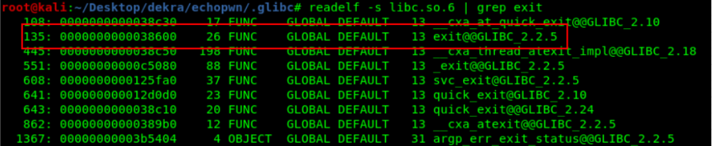

 
Echopwn is a simple binary that reads the user input twice and reflects it.

Using `checksec` we can see that most memory protections are enabled, including stack canaries and address randomization. Therefore we will need a memory leak to bypass these protections.

Reverse engineering the binary we can view the `doRead` function that is vulnerable against format string vulnerability and stack buffer overflow.

We can insert `%lx%lx%lx%lx%lx%lx%lx%lx%lx%lx%lx%lx%lx` in the first user input to read arbitrary memory exploiting format string vulnerability.

So doing this, the program reflects a memory leak containing useful information to continue with the exploitation process.

This is an example of a memory leak that we received sending the previous string:

55fb481636b1 0 **7f188b27a980** 55fb481636d8 0 0 7 6c25786c2578 6c2525786c2578 6c2578786c2578 6c25786c6c2578 6c25786c2578 6c25786c2578 **6ece5044a053bf00**

So we can leak a libc address (**0x7f188b27a980**) and a stack canary value (**0x6ece5044a053bf00**).

We use the libc address leak to calculate the offset from libc base address in order to bypass stack randomization.

`Offset to libc base = leaked_address - libc base = 0x394300`

Now we know the libc base address so we can exploit the binary with ret2lib attack. 

We use readelf against libc to extract the offsets of system and exit functions  about libc base address.

We use `strings` to extract the `/bin/sh` strings offset in libc.

This is a 64 bit binary so we need to search for a `pop rdi; ret` gadget in libc to put the `/bin/sh` reference in `rdi` before calling the system function.

This is a 64 bit binary, so we need to search for a `pop rdi; ret` gadget in libc in order to put the `/bin/sh` reference, and then calling the `system` function.

With all this information we can calculate the real addresses of `exit`, `system`, the `pop rdi; ret` gadget and `/bin/sh`.

**`system_address = leaked_address - offset_to_libc_base + system_offset_in_libc + alignment_offset`**

**`exit_address = leaked_address - offset_to_libc_base + exit_offset_in_libc + alignment_offset`**

**`bin_bash_string = leaked_address - offset_to_libc_base + bin_sh_offset_in_libc + alignment_offset`**

**`pop_ret_gadget = leaked_address - offset_to_libc_base + pop_ret_offset_in_libc + alignment_offset`**

Notice that we add an alignment\_offset in these all calculations because the real address is 0x21680 bigger than our results.

`alignment_offset = 0x21680`

In GDB we can search for a real addresses easily:

Now it’s time to put all pieces together and create our payload:

So we have to craft this payload and send it in the second user input:

**`12*”A” + 40*”B” + canary_leak + exit + pop_ret_gadget + bin_sh_string + system`**

Our exploit is able to calculate all these addresses on runtime bypassing randomization with the obtained memory leak and we exploit the second user input BoF vulnerability to successfully do a ret2lib attack and gain a shell.

