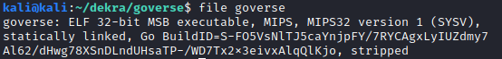
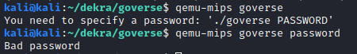
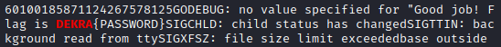
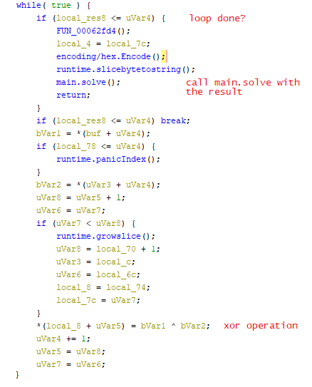
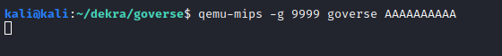
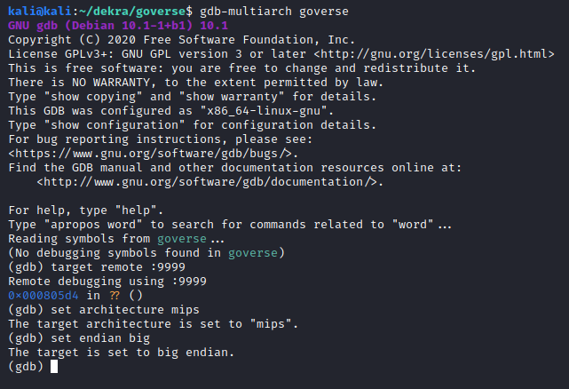
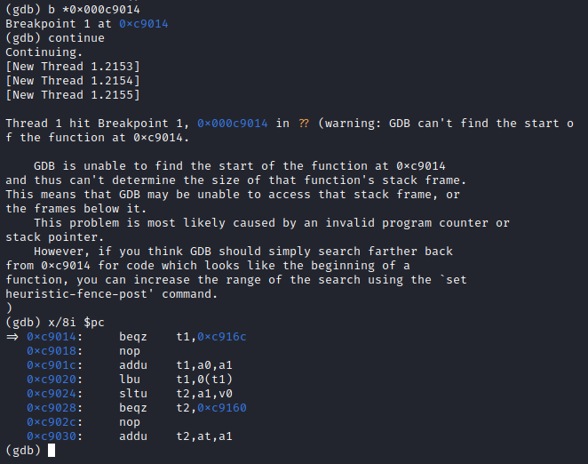
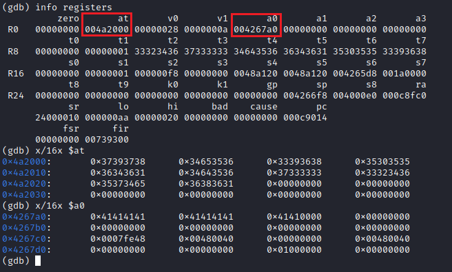
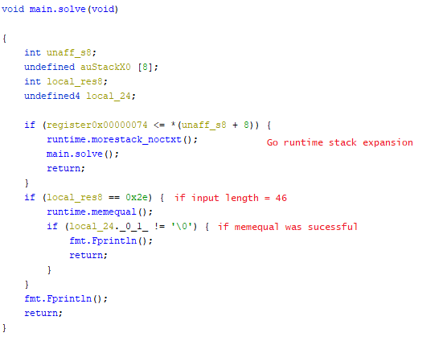
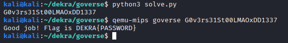

Goverse is a reversing challenge that got 11 solves. It MIPS binary written in Go.



It is statically linked with the Go runtime, so we can run the binary file with qemu without needing to install a complete MIPS kernel.



Our first attempt was to use strings on the file and grepping for the flag format:



So clearly the password we have to guess is the flag. To understand better the logic of the program we loaded it on Ghidra. Since this is a MIPS binary, the [gotools](https://github.com/felberj/gotools) plugin crashes and does not do much for us, as it is written to work on x86 binaries. [These Go scripts](https://github.com/getCUJO/ThreatIntel/tree/master/Scripts/Ghidra) for Ghidra however help quite a bit by renaming functions and identifying strings.

Once this is done, there are two functions worth examining: `main.dH` and `main.solve`. Inside `main.dH` there is a loop which seems to XOR two variables.



The decompiled code is not very revealing though, and function parameters are not properly shown, so we decided to debug the binary and inspect the assembly instructions on runtime. To do this we need to use `gdb-multiarch` in remote mode ([this StackOverflow answer](https://stackoverflow.com/questions/59906042/how-to-debug-mips-interactively) proved useful).

We also need to launch `qemu-mips` with the `-g` option; this opens a port to allow remote debugging. In a separate terminal, we can launch `gdb-multiarch` and connect to the debugging session.




Now, this is a stripped binary, so no symbols are available. Therefore, we need to work with program addresses to set breakpoints. The address 0xc9014 corresponds to the while statement at the beginning of the main.dH function. In MIPS assembly this is a beqz instruction (branch if equal to zero).



After going through this loop several times we noticed that there were two stack variables being used. At the beginning of the loop, the pointers to these variables are stored in the `at` and `a0` registers:



The data pointed to by `a0` is clearly our input password (a list of A’s), and the `at` data is the XOR key (this will be useful later). A few instructions below we can observe the XOR operation taking place for the first character in both the input and the key.

This xor instruction performs the bitwise xor operation between t1 and t2, and stores it back in t1 ([MIPS instruction set reference](http://www.mrc.uidaho.edu/mrc/people/jff/digital/MIPSir.html)). This is done for each character in the input. When the loop is done, `main.solve` is called, as can be seen in the first few lines of the decompiled `main.dH` function above.



`main.solve` is simpler that `main.dH`, but again function parameters are not shown. By checking the [Go documentation](https://golang.org/pkg/runtime/?m=all#memequal) we see that `runtime.memequal` takes 3 arguments, just like a regular `memcmp`: two pointers and the amount of bytes to compare. Note that even though the length is compared to 46 (0x2e), this is done on the hex-encoded input, so in reality our password will have 23 characters. 

Again, by using gdb we inspect the memory contents at runtime to see what our XORed password is compared to. This time we input 23 A’s, and we set a breakpoint at the `runtime.memequal` function call in `main.solve`.


So, XORing our input with the XOR key should result in the hardcoded value to obtain the correct password, and therefore the flag. We got the XOR key previously:
```
3739373834653536333936383530353536343631346435
```

And we just got the hex-encoded representation of our target result:
```
37303039343130623436313630363037363034643036303837393764373437613465373037323030303735373032
```

Therefore we need to decode the target, and then XOR both byte arrays. [This](https://gist.github.com/00xc/ad4100a6ddc789d77800ddda732a60df) is the Python script we arrived at to solve this challenge.


