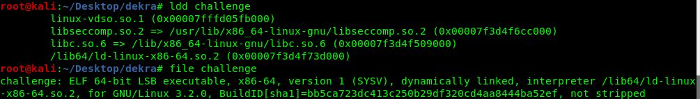
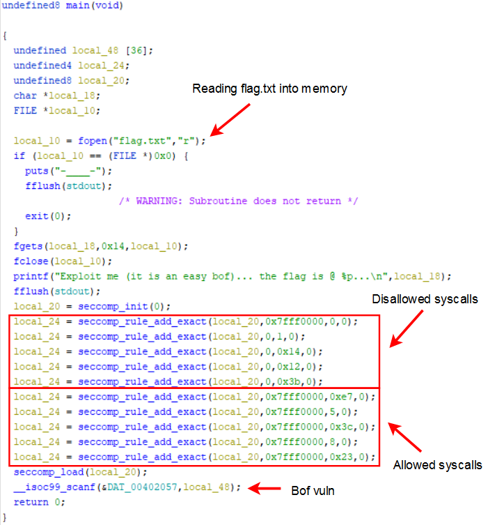
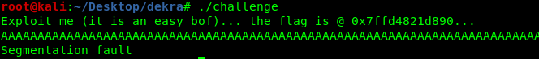
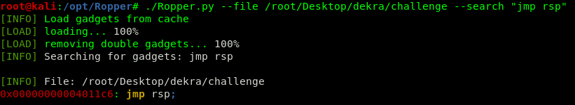
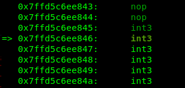
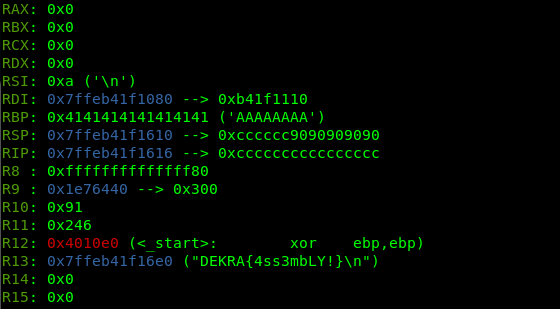
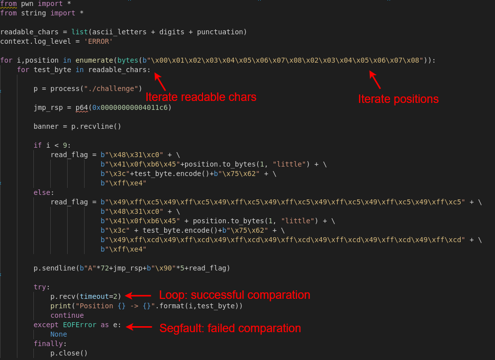
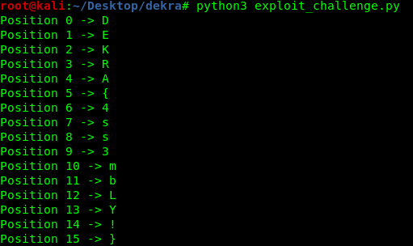

Weird Chall is an exploitable binary that uses [libseccomp](https://github.com/seccomp/libseccomp) to filter Linux syscalls. The difficulty, then, relies on bypassing these restrictions.



Let’s take a look at the main function of the binary:



After the rules are applied we can only execute `sys_exit_group`, `sys_fstat`, `sys_lseek`, `sys_exit` and `sys_nanosleep` so, although the flag is loaded into memory, it is not trivial to read it across the remote connection. 

Our solution to extract this flag is based on a simple time-based shellcode. We compare the flag to each possible character and we identify the correct one by observing the connection status. That is to say, if the comparison fails we jump to the final shellcode position in order to get a segmentation fault and terminate the program. If the comparison succeeds, we jump to the start of shellcode and we force a loop.

To start with the exploitation, the first step is to gain command execution. In this case it is very simple because there are basically no memory protections.

We can easily trigger a segfault writing more than 72 bytes. We then look for a `jmp rsp` gadget in the binary code, and we use it to overwrite the return address, gaining control of the execution flow.





With these two basic concepts we are able to gain a command execution, using the following payload:

**`72*"A" + jmp_rsp + "\x90"*4 + "\xCC"*10`**



At this point we see that the flag’s address is loaded into the R13 register



The only thing we have to do now is to implement a time based comparison shellcode to extract the flag byte by byte.

```
\# 48 31 c0            xor rax, rax
# 41 0f b6 45 01      movzx  eax,BYTE PTR \[r13+character\_offset\]
# 3c 6c               cmp al, requested\_byte
# 75 62               je # Continue execution until segfault
# ff e4               jmp rsp
```

We load the requested byte into `rax` and we perform a comparison between this byte and the requested byte. If the comparison succeeds we jump again to rsp and we enter in a loop. If the comparison fails the execution pointer will jump to the end of our shellcode, triggering a segmentation fault.



In addition, we have bad chars in the shellcode so we use `inc r13` and `dec r13` to retrieve all the chars avoiding this restriction.




