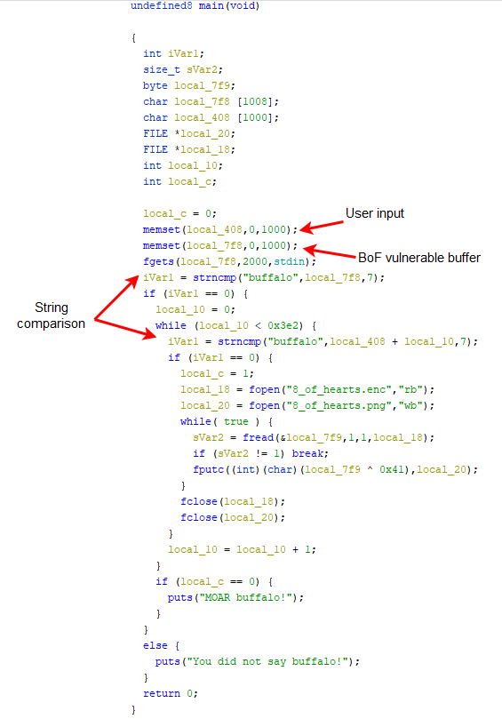

In this challenge our goal is to decrypt the flag using a binary called `8_of_hearts.elf`. Looking at this binary we see that there is an encryption routine where each byte is decoded with an XOR operation.

The challenge is to manipulate the input buffers to put the “buffalo” password, twice, in the right locations.  By exploiting the buffer overflow vulnerability in the call to `fgets`, we can  overflow the second buffer in order to write “buffalo” to it as well.

**Password:**

`buffalo"+"\x00"*1001+"buffalo"`

If we execute the binary passing the previous password to standard input we will obtain the image of the decrypted card. Another less elegant option would be to decrypt the encoded flag by XORing the ciphered file bytes with `\x41`.

