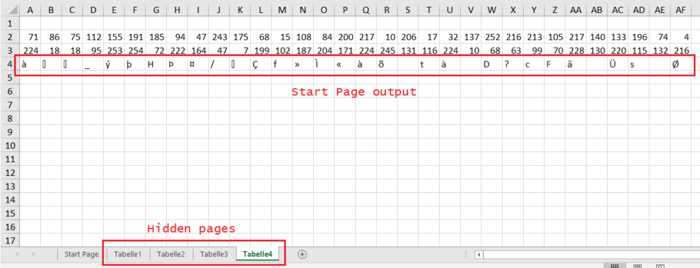
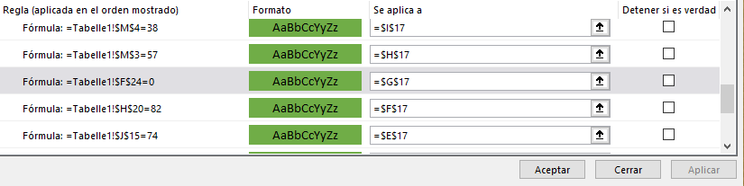

EXCELlent is a medium difficulty challenge that got 58 solves. It reads:
> Excellent CTFs need excellent business strategies, and what would be more appropriate than Microsoft ® Excel ™? Of course, you need the excellent Excel Gold subscription to be as excellent as hxp. But of course, that won’t be a problem for all the excellent hackers like you.

Upon downloading the attached Excel document, we found a main page that prompted us to enter a serial key.


Clearly, a correct serial code must be typed in the blank row in order to decode the flag. Upon introducing random characters, the serial status cells turn red or green with no discernable pattern. When looking at the code in the output cell, we noticed that it was just concatenating the results of cells in another Excel page. By right clicking on the “Start page” tab below, we can display the hidden pages.



Upon examining the output cells, we quickly realized that there was some complex cryptographic scheme in play, drawing from values in the other hidden pages. After some time trying to understand the cipher in play in order to maybe translate it to Python, we gave up on it, as it was too complex.

We then turned our attention to the serial status cells. After a bit of Googling, we noticed that the cells were turning on (green) or off (red) based on certain rules. On the main Excel menu, these can be seeing by clicking on Conditional formatting > Manage rules.



The first column shows the condition to be met, and the third one displays the cell that will have its color changed. For example, for G17 to turn green, **F24 on Tabelle1 must be equal to 0**. We can, then, examine the code for F24:

```
=-14+SUM(F3:F7)-SUM(F8:F11)+SUM(F12:F15)-SUM(F16:F20)
```

F3 through F20 contain the ASCII representations of the characters in E3 through E20, which in turn are the input characters. Essentially, the sums of the four groups in the input (separated by a hyphen) must meet:

```
-14 + group1 - group2 + group3 - group4 == `0
```

There are in total 21 rules, each with increasing complexity. Even though this problem is maybe brute-forceable (still unsure about this), given the 21 rules, we thought of constraint programming, and specifically we used the [python-constraint](https://labix.org/python-constraint) module. After a tedious process of examining each individual rule and translating it to Python, we arrived at [this](https://gist.github.com/00xc/f9b0a7734a3ec0f2c7cb6af7e523f9c6) script, which gave us the solution in just under 5 minutes of computation.


