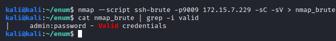
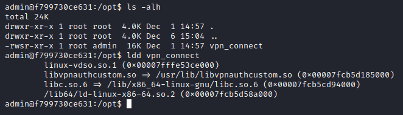
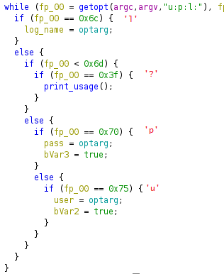
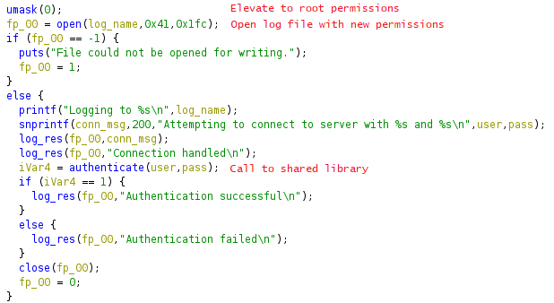
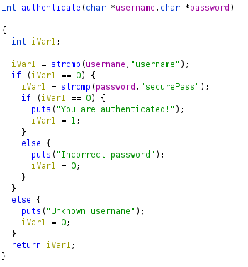
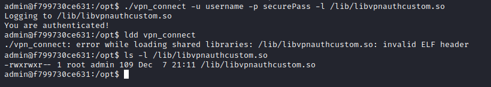
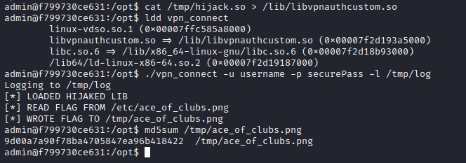
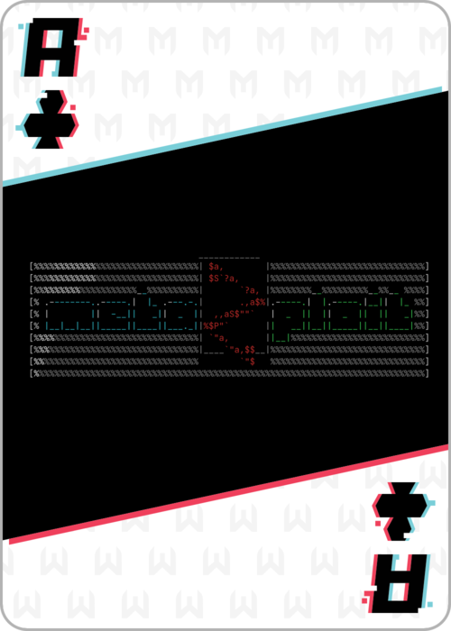

Port 9009 shows an OpenSSH service running. Our first step was to brute force the login, which resulted in us gaining access with the trivial user/password combination of `admin:password`.

After a bit of looking around we found both the flag in `/etc` (only readable by the root user) and an uncommon binary with the suid bit set.

We opened this executable in Ghidra to reverse engineer it. The main function is quite simple; it reads 3 arguments, `-u` for the user, `-p` for the password and `-l` for a log file.

It then elevates its execution permissions, and opens the log file. It later writes to it different strings depending on the result of the `authenticate` function.

The `authenticate` function is located in a shared library, `libvpnauthcustom.so`. This function just compares its two arguments to predefined values.

Given that we can create files with root permissions with the `-l` option, and that we can edit them afterwards, we can hijack `libvpnauthcustom.so` by creating a file with the same name in a shared library directory with higher precedence than `/usr/lib`, like `/lib`.

To do this, we just need a shared library file that exports the same function, authenticate, and inside that function read the flag and write it to a readable file. This is the code for said library, which we compiled with the `-shared` flag.

Obviously, after writing the fake library to `/lib` with the log output (just plain text), the `ldd` command fails, since the ELF header cannot be recognized. After this step, we can overwrite it with our custom library and finally read the flag.

{:height="300px"}
