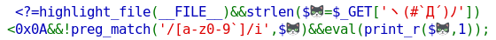
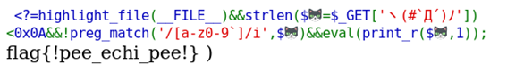

In this web challenge we have a short PHP code where it is possible to execute arbitrary code after bypassing two input sanitization filters.



First, we have an input length limitation protection so all inputs exceeding the maximum of 9 characters will be denied.

```php
``strlen($=$_GET['ヽ(#`Д´)ﾉ'])<0x0A``
```

The second check is a regex that denies any string that contains any alphanumeric character. Thankfully, this check is case insensitive.

```php
``preg_match('/[a-z0-9`]/i',$)``
```

`strlen` and `preg_match` functions are exclusive for strings so if we input the string as an array, we will be able to bypass these two protections. Fortunately, our input is printed with `print_r` instead of `print` so the array will be dumped and evaluated by `eval` function.

With this technique we can bypass all checks so we can execute code using `system`. Listing directories with `ls` we see the file `flag_de42537a7dd854f4ce27234a103d4362` that contains the flag.

By introducing this payload in the GET parameters we can print the flag:

```php
``/?ヽ(%23`Д´)ﾉ[]=system('cat /flag_de42537a7dd854f4ce27234a103d4362'))?>``
```


