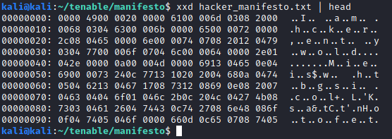
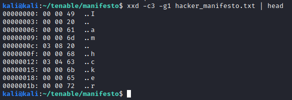
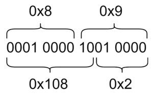

Hacker Manifesto is a 250 point reverse engineering challenge. It reads:
> We found this file on a compromised host. It appears to contain data, but we're not sure how to decode it. Maybe you can figure it out?

We are given a file containing what seems to be mostly binary data.



The beginning of the file seems to be the jumbled text “I am a hacker, enter my world”. A quick Google search reveals that this is a fragment from Loyd Blankenship’s [Hacker’s Manifesto](http://phrack.org/issues/7/3.html), as the challenge name suggests.

Upon further examination, we noticed that characters seem to be grouped in blocks of three bytes.



It seems that correctly placed characters (for example, the beginning “I am”) are preceded by two null bytes. When there are missing characters (the ” a” after “I am”), different numbers appear. Our first thought was a substitution scheme, where each preceding byte corresponded to a character to be placed in. In this case, the byte 0x3 would correspond to the space character, and the byte 0x8 would correspond to the ‘a’ character. By using the original text, we tried to reconstruct the text based on this kind of substitution, but we soon realized that it just did not work, as there was not a one-to-one correspondence between these bytes and the needed characters.

We then started thinking that this scheme could be some kind of compression. After reading on compression schemes such as LZ77, LZ78 and other variants, we thought that the first byte could be an offset to a back reference, and the second byte the number of bytes to copy from the reference.

Let’s take the first reference, which are the bytes 0x3 and 0x8, after the string “I am”. If we go back 3 positions, we are looking at the first space character. We know we are missing the ” a” string, in order to form “I am a”. Therefore, if we were to copy 2 bytes from the 0x3 backwards offset, we would form the correct string.

```
Character    Backwards offset
'I'          4
' '          3   <- Offset
'a'          2   <- Offset + (length-1)
'm'          1
```

However, our backwards reference is the pair (0x3, 0x8), not (0x3, 0x2). Our first try was dividing the second byte (the reference length) by 4 and trying to reconstruct the text from there. Trying this approach we were able to form the first few lines of the text, but after that, the text was still jumbled. Not only that, but we found that there were reference pairs where the second byte was not an even number (i.e, the pair (0x8, 0x9)), so the reference length byte could not be divided by 4.

After reading some more on LZ77 variations ([this overview](https://en.wikibooks.org/wiki/Data_Compression/Dictionary_compression) was a very useful resource), we came to the conclusion that the (offset, length) pair might not be formed by an (8 bit, 8 bit) pair, but maybe a (10 bit, 6 bit) one. Considering we are using little-endian, this is the resulting offset and length for the (0x8, 0x9) byte pair:



This would make sense, as the by 4 division we were performing earlier is equivalent to removing the 2 lowest bits on the reference length (i.e, a 2 bit shift). Calling the first byte ‘b0’ and the second byte ‘b1’, we can find the reference offset and length with the following operations:

```
offset = (b1 & 0b11) << 8 | b0
length = b1 >> 2
```

With all of this in mind, we wrote [this script](https://gist.github.com/00xc/ef410c5a79615eed8d0c7140e95e2068) to decompress the text, which yields the original manifesto with the following line added to it:
```
The flag is "flag{TheMentorArrested}".
```