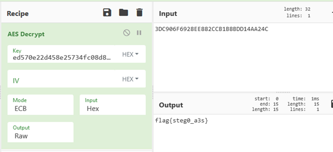

In this stego challenge we are given a password protected zip called `turtles128.zip`. After bruteforcing it we observe that there are 128 nested zips protected with “0” or “1” as their password. We suspect that the flag is hidden in the data obtained from the binary passwords.

Inside the last zip we find the `key.png` image that contains a password in hexadecimal. Observing the name of the challenge (A3S), the name of the zip (turtles128), the length of the key and the number of bits obtained when decrypting the zips, we deduce that the flag is encrypted with AES128, using the key in `key.png`.

`Data: 3DC906F6928EE882CCB1B8BDD14AA24C`  
`Key: ed570e22d458e25734fc08d849961da9`

We can obtain the flag with AES decryption using the image key and the bits obtained in the zip decryption process.

Flag: **flag{steg0\_a3s}**
