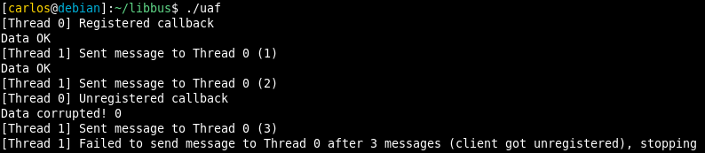

Recently I published a [blog post on libbus](https://scavengersecurity.com/posts/libbus/), a small library I wrote to handle distributed message passing between threads. The library makes use of atomic functions to ensure synchronism. These operations might seem simple to use at first glance; after all, most of [GCC’s atomic builtins](https://gcc.gnu.org/onlinedocs/gcc/_005f_005fatomic-Builtins.html) are things like read, write, increase or decrease some variable atomically. There are, nonetheless, some subtle pitfalls when using these functions. In this post I want to show a bug I introduced in libbus through inproper use of atomics, which could result in dereferencing a dangling pointer.

## Reviewing the code ##

There are two functions in the source code that are of interest to us, `bus_send` and `bus_unregister`, both in the [bus.c](https://github.com/00xc/libbus/blob/64560b08f15600a8723f7b5814ff437d639ef058/src/bus.c) file. In libbus, clients can register their callbacks, which will get executed whenever a message is sent to them.

`bus_send` has two modes of operation, individual and broadcast. Individual calls a single client’s registered callback. Broadcast does the same, but for every registered client. Both are quite similar, so lets focus on the individual mode.

```c
int bus_send(Bus* bus, ClientId id, void* msg, int broadcast) {
    if (broadcast) {
        ...
    } else {
        ...

        __atomic_load(&(bus->clients[id]), &client, __ATOMIC_SEQ_CST);
        if (client.callback == NULL)
            return 0;
        client.callback(client.ctx, msg);
    }
}
```

This code copies the client with the selected ID from a heap-allocated array, `bus->clients`, into `client`; if its callback is set (meaning that it is a registered client), it will be called with the client’s context and the message. The client’s context is a pointer to some opaque data that will be passed to the callback; it is usually owned by whomever registered that callback. Reading the client is atomic, meaning that there are no race conditions in which that client is copied from memory at the same time as that client’s information being freed; in other words, we are guaranteed that right after calling `__atomic_load`, `client` contains valid data.

`bus_unregister` does what you would expect; it deletes a client’s entry in the `bus->clients` array. This way, no more messages can be sent to it, since the callback will be set to `NULL`.

```c
int bus_unregister(Bus* bus, ClientId id) {
    ...

    BusClient null_client = {0};
    __atomic_store(&(bus->clients[id]), &null_client, __ATOMIC_SEQ_CST);

    return 1;
}
```

Again, the store is atomic, meaning that it cannot happen at the same time as the load we have seen in `bus_send`. In an environment with two threads, the following sequence of actions would not be problematic:

```
Thread 1                    |   Thread 2
----------------------------|----------------------------
bus_register(id=t1)         |
                            |   bus_send(id=t1, msg)
                            |   t1callback(..., msg)
bus_unregister(id=t1)       |
```

Thanks to atomic operations, we know that the load in `bus_send` and the store in `bus_unregister` cannot happen at the same time. But consider the following example:

```
Thread 1                        |   Thread 2
--------------------------------|----------------------------------
t1ctx = malloc()                |
bus_register(ctx=t1ctx, id=t1)  |
                                |   bus_send(id=t1, msg)
                                |   bus_send:__atomic_load()    // loads t1ctx and t1callback
bus_unregister(id=t1)           |
bus_unregister:__atomic_store() |
free(t1ctx)                     |
                                |   t1callback(t1ctx, msg)      // t1ctx points to a freed block on the heap
```

In this case, even though `__atomic_load` and `__atomic_store` cannot happen at the same time, we got a race condition. Thread 2 loaded a pointer to `t1ctx` atomically, but the contents of that pointer got freed by Thread 1 before Thread 1’s callback (`t1callback`) got called. If this callback dereferences the pointer passed to it, it will result in an use-after-free.

## Fixing the bug ##

There are several possibilities to solve our issue. The most straightforward one would be to use mutexes to lock the access to each client; this way, a client cannot be unregistered while it is being used. In an effort to only use atomic operations, I though of a different approach.

Instead of simply unregistering a client when `bus_unregister` is called, we are going to keep an atomic counter for all active callbacks being executed at any point, sort of like a reference counter. Whenever the callback for a specific client is called, that client’s refcount will be increased by one; once the callback is done, the refcount will be decreased by one. If a client asks to be unregistered, we loop until that reference counter is zero, and only then unregister it.

This seems simple enough, but it does not prevent race conditions yet. In order to increase a reference counter, we must check that said client is registered. We would normally do this in the following way:

```c
if (client.registered){
    ++(client.refcount);
    client.callback(...);
}
```

There are atomic arithmetic operations provided to us (such as `__atomic_add_fetch`), but we cannot blindly increase the reference count and go on to call the client’s callback: there is no single atomic function that implements `if (condition) value += 1`. Checking if the client is registered and then increasing the reference count (in two separate atomic operations) is also not an option, as the client might get unregistered before jumping to the callback (after step 2):

1. Load the client
2. Check if it is registered
3. If it is registered, increment refcount.
4. Invoke callback.

However, there is what is known as CAS (Compare And Switch). CAS is an atomic operation that does the equivalent of the following function:

```c
bool CAS(type* destination, type* expected, type* desired) {
    if (*destination == *expected) {
        *destination = *desired;
        return true;
    } else {
        *expected = *destination;
        return false;
    }
}
```

If `destination` and `expected` have the same value, `destination` is updated with desired. Otherwise, the actual value of `destination` is copied into `expected`. In order to increase the refcount using CAS, we need to use the following function (now implemented in bus.c):

```c
/*
 * Attempts to call a client's callback to send a message. Might fail if such client gets
 * unregistered while attempting to send the message.
 */
static int attempt_client_callback(BusClient* client, void* msg) {
    BusClient local_client, new_client;

    /* Load the client we are attempting to communicate with */
    __atomic_load(client, &local_client, __ATOMIC_SEQ_CST);

    /* Loop until we update the refcount or the client becomes unregistered */
    while (local_client.registered) {

        /* Our desired refcount is the current one + 1 */
        new_client = local_client;
        ++(new_client.refcount);

        /*
         * If CAS succeeds, the client had the expected refcount, and we updated it successfully.
         * If CAS fails, the client was updated recently. The actual value is copied to `local_client`.
         */
        if (CAS(client, &local_client, &new_client)) {

            /* Send a message and decrease the refcount back */
            local_client.callback(local_client.ctx, msg);
            __atomic_fetch_sub(&(client->refcount), 1, __ATOMIC_SEQ_CST);

            return 1;
        }
    }

    /* Client was not registered, or got unregistered while we attempted to send a message */
    return 0;
}
```

The loop in `bus_unregister` is similar, except we loop until the reference count is zero or the client gets unregistered from another thread.

## Proof of concept ##

I wrote a quick proof of concept you can find [here](https://gist.github.com/00xc/f10a2f99e22eb3f85f29ab35efd80de9). The program spawns two threads; the first one registers a callback with a heap-allocated context, waits 2 seconds, unregisters the callback and frees the context. The second one keeps sending messages to the first thread’s callback. The heap-allocated context is an integer containing the value ‘1’. If its value changes due to the memory being freed, the callback will print a message. Running it with the previous version of libbus (commit 7ddda30) should produce something like the following output:



## Final remarks ##

Clearly, using atomic operations is not straightforward. One has to make proper use of primitives such as CAS and atomic memory access to ensure proper synchronization. I hope this post serves as a reference on a common pitfall when using atomics. Again, if you have any suggestions or improvements for libbus, do not hesitate to open an issue or a pull request on GitHub.