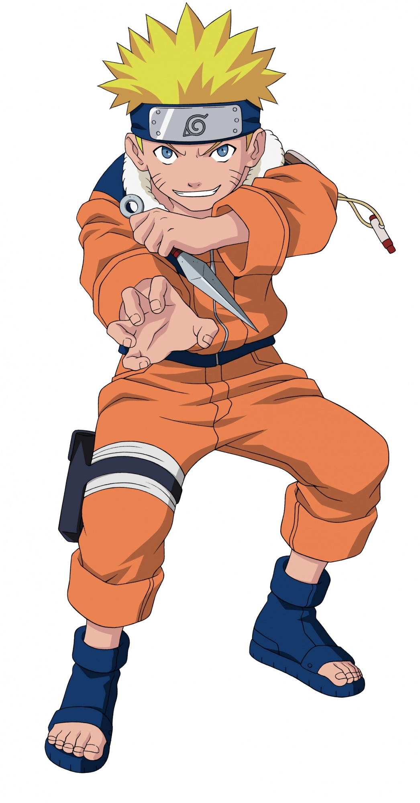
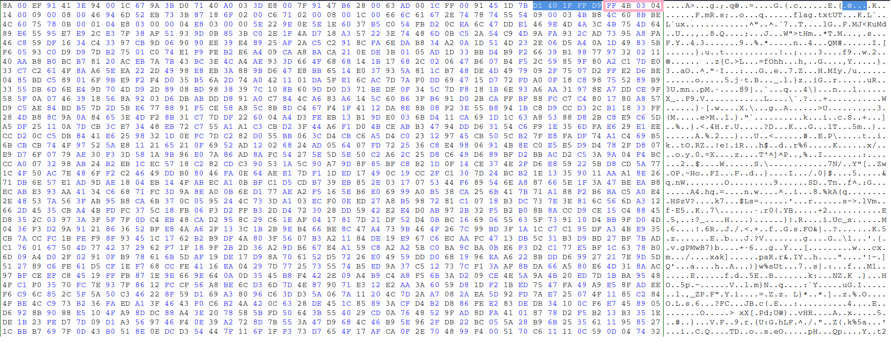
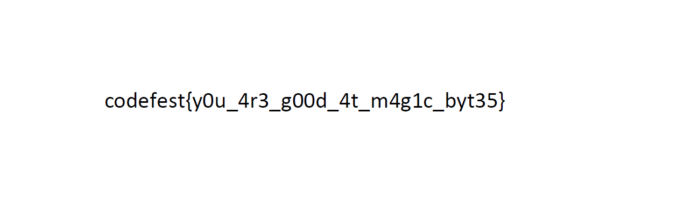

Anime is love was one of the forensics challenges in Codefest CTF 2020. The challenge description reads:
```
You know what to do.
Author:pseudo_bot#7514
file: anime.jpg
```

{:height="500px"} 

The file we are given looks like a normal JPG at first:

```
$ file anime.jpg
anime.jpg: JPEG image data, JFIF standard 1.01, aspect ratio, density 1x1, segment length 16, comment: "CREATOR: gd-jpeg v1.0 (using IJG JPEG v62), quality = 95", baseline, precision 8, 1046x2000, components 3
```

However, with binwalk we are able to find a suspicious zip footer:

```
$ binwalk anime.jpg

DECIMAL       HEXADECIMAL     DESCRIPTION
--------------------------------------------------------------------------------
0             0x0             JPEG image data, JFIF standard 1.01
521873        0x7F691         End of Zip archive, footer length: 22

```

Running foremost we can extract the real JPG, making it easier to identify the end of that file and just after it the beggining of the apparently damaged zip.

Using a hex editor (bless in our case) we can confirm that the zip file has a corrupted header (FF4B should be 504B).



Let's edit and extract it.

```
$ file anime.zip
anime.zip: Zip archive data, at least v2.0 to extract
```

It looks like the zip is password-protected:

```
$ unzip anime.zip
Archive:  anime.zip
[anime.zip] flag.txt password:
```

Let's try to brute-force it.

```
$ zip2john anime.zip > animehash
```
```
$ john --wordlist=/usr/share/wordlists/rockyou.txt animehash
Using default input encoding: UTF-8
Loaded 1 password hash (PKZIP [32/64])
Press 'q' or Ctrl-C to abort, almost any other key for status
dragonballz      (flag/flag.txt)
```

Now let's decrypt the zip and extract flag.txt, which turns out to be a password-protected PDF:

```
$ cat flag.txt
%PDF-1.5
%
1 0 obj
<<
...
```

During the CTF we actually guessed that the password was "naruto" based on the original image :)
But for the sake of completion here are the steps needed to crack the PDF:

```
pdf2john flag.pdf > flaghash
```
```
$ john --wordlist=/usr/share/wordlists/rockyou.txt flaghash
Using default input encoding: UTF-8
Loaded 1 password hash (PDF [MD5 SHA2 RC4/AES 32/64])
Press 'q' or Ctrl-C to abort, almost any other key for status
naruto           (flag.pdf)
```

The flag is inside the PDF:
`codefest{y0u_4r3_g00d_4t_m4g1c_byt35}`


