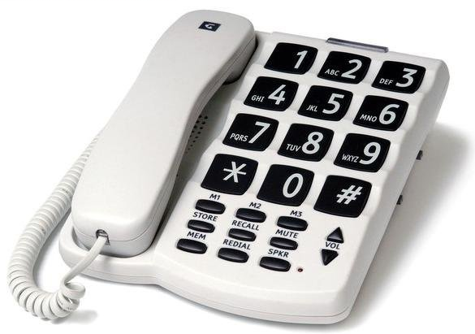
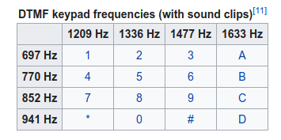
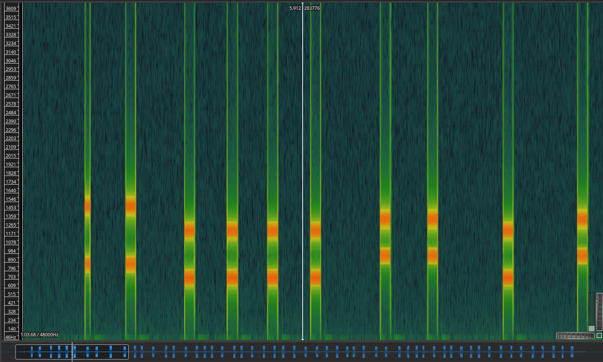

telephone was one of the forensics challenges in codefest ctf 2021.

The challenge has some forensics elements but is mostly stego.

We get a PNG image named telephone.png:



From here we run the usual stego tools, and find some hidden data with [zsteg](https://github.com/zed-0xff/zsteg):

```
root@5a2b4489da87:/data# zsteg telephone.png 
imagedata           .. text: "\r\r\rEFC43."
b1,bgr,lsb,xy       .. text: "Jhttps://mega.nz/file/wuQ1lKYD#nNT3WpsoYXH1z4fm3rsDkncbFae7Yn7FiO94TnYAxGo\n"
b2,r,lsb,xy         .. file: 5View capture file
b2,r,msb,xy         .. file: VISX image file
b2,g,lsb,xy         .. file: 5View capture file
b2,g,msb,xy         .. file: VISX image file
b2,b,lsb,xy         .. file: 5View capture file
b2,b,msb,xy         .. file: VISX image file
b2,rgb,lsb,xy       .. file: 5View capture file
b2,rgb,msb,xy       .. file: VISX image file
b2,bgr,lsb,xy       .. file: 5View capture file
b2,bgr,msb,xy       .. file: VISX image file
b4,r,msb,xy         .. text: ["w" repeated 10 times]
b4,g,msb,xy         .. text: ["w" repeated 12 times]
b4,b,msb,xy         .. text: ["w" repeated 9 times]
b4,rgb,msb,xy       .. text: ["w" repeated 29 times]
b4,bgr,msb,xy       .. text: ["w" repeated 28 times]
```

The hidden data is just a link to [mega.co.nz](https://mega.nz/file/wuQ1lKYD#nNT3WpsoYXH1z4fm3rsDkncbFae7Yn7FiO94TnYAxGo) containing the file `sound.m4a`.

Just listening to the file we can clearly hear someone dialing numbers on a phone. Based on some challenges from previous CTF's we know these sounds can be reversed to find what numbers were being dialed. This system is known as [*Dual-tone Multi-Frequency signaling*](https://en.wikipedia.org/wiki/Dual-tone_multi-frequency_signaling) and maps a pair of frequencies to a key in the telephone keypad:



We can decode it manually just looking at the spectrum (here we use Sonic Visualizer):



But as this would take a while and is easy to mess up we used [dtmf-decoder](https://github.com/ribt/dtmf-decoder) to make things easier.

Running the script on the sound file we get the numbers being dialed (or at least what the script could make out of the audio file):
`9911110001011021011151161213104529910751114114A114118433125`

Knowing the beginning of the flag (codefest{) we identified this numbers as the decimal representation of the flag, and by adding spaces in the right places we get:

`99 111 100 0101 102 101 115 116 123 104 52 99 107 51 114 114 114 114 33 125`

Which converted to ascii gives us the flag!:

`codefest{h4ck3rrrr!}`
