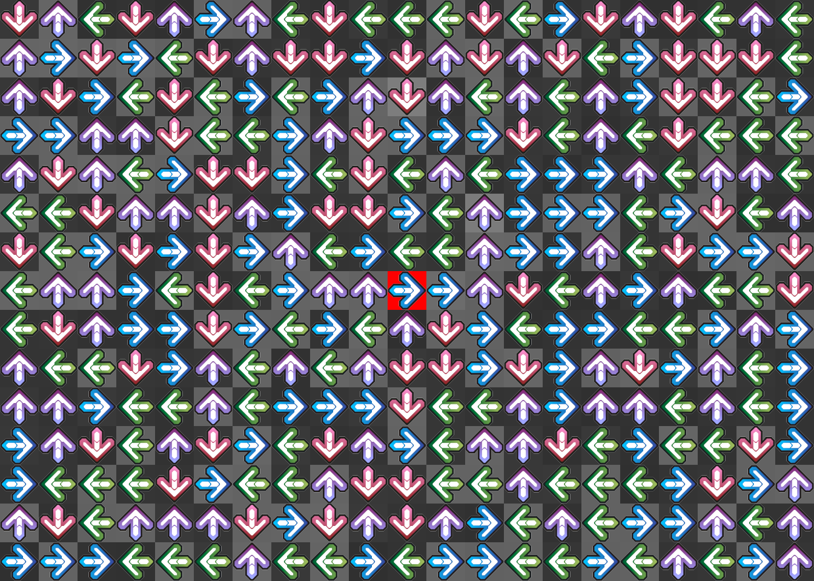
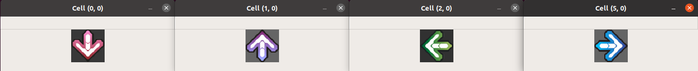
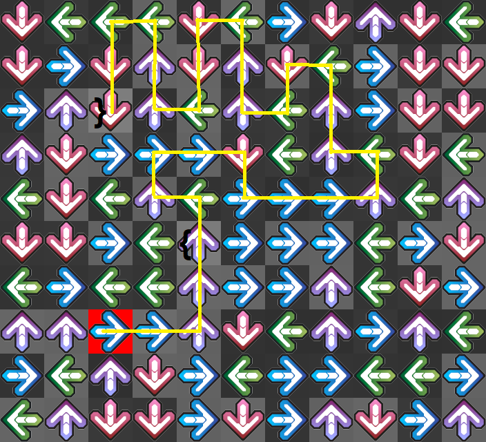

For this challenge we are given the following image and asked to find a flag with the format `flag{something_here}`:


Since is a scripting challenge, let's start parsing the image.
```python
import cv2
import numpy as np

CELL_SIZE = 64
img = cv2.imread('ddr.png')

# for x=1, y=1 --> returns img[64:128, 64:128, :]
# a 3D 64x64x3 matrix with height=64, width=64, layers of color=3  
def get_cell(img, x, y): return img[y*CELL_SIZE:(y+1)*CELL_SIZE, x*CELL_SIZE:(x+1)*CELL_SIZE]
def show_cells(img, pos):
    for x,y in pos:
        cell = get_cell(img, x, y)
        cv2.imshow(f'Cell ({x}, {y})', cell)
    cv2.waitKey()     # Press any key to close

show_cells(img, [(0,0), (1,0), (2,0), (5,0)])
```


For each cell, all the information must be encoded in the arrow color/direction and the background color.
- The background color can be extracted from the top-left pixel of each cell. Excluding the central cell, which have a red background `(0,0,255)`, the background of every other cell satisfies `b = g = r`.
- Since the color of the arrow is strictly related to the direction that it points to, the direction can be extracted based on the color. For each color layer, excluding the values that equal the background color, the mean value is calculated. The obtained 3-tuple is representative of the arrow's color and therefore its direction.

```python
def parse_cell(img, x, y):
    cell = get_cell(img, x, y)
    gray_level = cell[0,0,:]  # = (b, g, r)

    # cell[:,:,l] returns a 3D matrix with 64x64x1 pixels, corresponding to the color layer l
    # Since the image encoding is BGR, 0->blue, 1->green, 2->red.
    # .reshape([CELL_SIZE**2]) expands the matrix to a 1D array.
    blue_level = np.mean([px for px in cell[:,:,0].reshape([CELL_SIZE**2]) if px != gray_level[0]])
    green_level = np.mean([px for px in cell[:,:,1].reshape([CELL_SIZE**2]) if px != gray_level[1]])
    red_level = np.mean([px for px in cell[:,:,2].reshape([CELL_SIZE**2]) if px != gray_level[2]])
    return (gray_level, blue_level, green_level, red_level)

for x,y in [(0,0), (1,0), (2,0), (5,0)]: print(parse_cell(img, x, y))
```
```python
(array([56, 56, 56], dtype=uint8), 130.4276923076923, 117.01455668284076, 162.928164695576)         # Pink - down
(array([101, 101, 101], dtype=uint8), 161.97333916083917, 127.02364273204904, 143.3786620026235)    # Purple - up
(array([49, 49, 49], dtype=uint8), 106.83471797114123, 138.086500655308, 109.62556255625563)        # Green - right
(array([100, 100, 100], dtype=uint8), 168.0836252189142, 137.12917398945518, 94.51052631578948)     # Blue - left
```

Taking those values as references, let's proceed to encode the cells to its background level and direction. The central cell is addressed as a special case, since its background color can not be encoded as a single number and the color/direction of the arrow is known.   
```python
def encode_cell(img, x, y):
    gray,b,g,r = parse_cell(img, x, y)
    if gray[0] != gray[2]: return ('red', 'right')

    # Values taken from the reference cells
    pink_reference   = np.array([130.4276923076923, 117.01455668284076, 162.928164695576])
    purple_reference = np.array([161.97333916083917, 127.02364273204904, 143.3786620026235])
    green_reference  = np.array([106.83471797114123, 138.086500655308, 109.62556255625563])
    blue_reference   = np.array([168.0836252189142, 137.12917398945518, 94.51052631578948])

    bgr = np.array([b,g,r])
    diff = [
        np.sum(np.abs(bgr - pink_reference)),     # Sum of the absolute value of
        np.sum(np.abs(bgr - purple_reference)),   # element-wise differences.
        np.sum(np.abs(bgr - green_reference)),
        np.sum(np.abs(bgr - blue_reference))
    ]
    # argmin() is the same as min() but returns the index instead of the value
    direction = ['down', 'up', 'left', 'right'][np.argmin(diff)]  
    return (gray[0], direction)

for x,y in [(0,0), (1,0), (2,0), (5,0)]: print(encode_cell(img, x, y))
```
```python
(56, 'down')
(101, 'up')
(49, 'left')
(100, 'right')
```

Now the whole image can be parsed and encoded into a dictionary with `keys = (x, y)` and `values = (gray, direction)`.  
Once parsed, let's take a look at the gray levels.

```python
h,w,c = img.shape
W, H = w // CELL_SIZE, h // CELL_SIZE
d = {(x,y) : encode_cell(img, x, y) for y in range(H) for x in range(W)}
gray_levels = set(g for (x,y), (g,d) in d.items())
print(gray_levels)
```
```python
{'red', 48, 49, 50, 51, 52, 53, 54, 55, 56, 57, 97, 98, 99, 100, 101, 102, 103, 108, 123, 125}
```

What if those levels are interpreted as characters?
```python
print([chr(g) for g in gray_levels if g != 'red'])
```
```python
['0', '1', '2', '3', '4', '5', '6', '7', '8', '9', 'a', 'b', 'c', 'd', 'e', 'f', 'g', 'l', '{', '}']
```

Seems like everything it's needed to make a flag.  
Let's locate the cells whose gray levels correspond to `{` and `}`.

```python
print([(x,y) for (x,y),(g,d) in d.items() if g != 'red' and chr(g) == '{'])
print([(x,y) for (x,y),(g,d) in d.items() if g != 'red' and chr(g) == '}'])
```
```python
[(12, 5)]
[(10, 2)]
```


Given their location, it's a good sign that the path that starts from the central cell (the most obvious place to start) also goes through both cells.  

{:height="400px"}

Since the `{` character is the 5<sup>th</sup> cell in the path, we should assume that the cell with the red background is the `f` of  `flag{...` .  
All said, let get the flag!

```python
def get_next(x, y, dir):
    if dir == 'down': return (x, y+1)
    if dir == 'up': return (x, y-1)
    if dir == 'left': return (x-1, y)
    if dir == 'right': return (x+1, y)

x, y = 10, 7      # Position of the central cell
flag = 'f'
while flag[-1] != '}':
    x,y = get_next(x, y, d[(x,y)][1])
    flag = f'{flag}{chr(d[(x,y)][0])}'
print(flag)
```
```
flag{2a4c670674023b972f4ef2bc19224e25}
```
