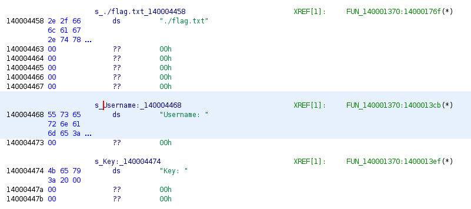

RUN! is a reversing challenge that got 15 solves. We are a provided a Windows PE binary called `wamup.exe` and the following description:
> keygenme now!
> 
> nc bin.q21.ctfsecurinets.com 2324

If we run the binary (inside of a Windows virtual machine), a terminal window appears and we are asked to input first an username and then a key.


If we introduce random values, the program exits. For some inputs, the program also displays a sad emoticon (`:(`) before exiting. Knowing which messages are shown, we can look for the function that processes our input in Ghidra. If these strings are not encoded, we just need to find them and look for cross-references.



Clearly, `FUN_140001370` contains the core logic of the program, as it also seems to access a `flag.txt` file.


Unfortunately, Ghidra's decompiled output is not great, but we can see that our input is being read into two variables. The rest is not very useful; after several checks are made, some processing is done by using SIMD instructions, which usually do not mesh well with Ghidra's decompiler. After this part, the pseudorandom number generator is seeded (`srand`) with some result derived from the previous computation. In particular, if we analyze the code, we notice that only the username is being used to generate the seed.

If we keep scrolling down, we will find these two loops:


The first one fills an array with random values (which depend on the seed used before), and the second one computes some value we named `s` from the integers stored in the array. If `s` is equal to 0xbcdb6 by the end of the loop, the flag is read. It is still unclear at this point what role the input key plays.

With all of this in mind, we continued with dynamic analysis. Ghidra places our `FUN_140001370` at offset 0x1370 from the base address, so we can easily find the corresponding address for the function in our debugger, once we have launched the binary:


In this case, the base address is `0x7FF7586D0000`, so our function is located at `0x7FF7586D1370`. A few instructions below, the function calls for printing and reading from the terminal are found:


Armed with our debugger, we can follow the sequence of instructions to better understand what these SIMD instructions are doing. In fact, we took the time to translate the whole logic to a small C program in order to better understand what was going on:

```c
int main(int argc, const char* argv[]) {
	size_t len;
	int i, j;
	unsigned int seed;
	unsigned int xmm0[4] = {0};
	unsigned int xmm1[4] = {0};
	unsigned int xmm2[4] = {0};

	if (argc < 2)
		exit(EXIT_FAILURE);

	const char* username = argv[1];	

	len = strlen(username);
	if (len < 8)
		exit(EXIT_FAILURE);

	/* For each group of 8 characters in `username` */
	for (j = 0; j<len/8; ++j) {

		/* First 4 characters of the group */
		for (i=0; i<4; ++i)
			xmm0[i] = username[j*8 + 3 - i];

		xmm_add(xmm0, xmm1);
		xmm_set(xmm1, xmm0);

		/* Last 4 characters of the group */
		for (i=0; i<4; ++i)
			xmm0[i] = username[j*8 + 7 - i];

		xmm_add(xmm0, xmm2);
		xmm_set(xmm2, xmm0);
	}

	xmm_add(xmm1, xmm0);

	xmm_set(xmm0, xmm1);
	xmm_rsh(xmm0, 2);
	xmm_add(xmm1, xmm0);

	xmm_set(xmm0, xmm1);
	xmm_rsh(xmm0, 1);
	xmm_add(xmm1, xmm0);

	seed = xmm1[3];

	/* Sum the rest of characters not in a group of 8 */
	for (i=(len/8)*8; i<len; ++i) {
		seed += (unsigned int) username[i];
	}

	srand(seed);
```

`xmm_add` adds the four elements of its second operand to the four elements of the first operand. `xmm_set` simply copies the values of the second operand into the first operand. `xmm_rsh` shifts the four elements of the first operand the amount of positions to the right specified by the second operand. This might seem complicated, but it is, in fact, just a sum of the values in `username`. For example, the input `AAAAAAAA` produces the seed 0x208, as `A` is represented as a byte with the value 0x41: 0x41 * 8 = 0x208. This is the first key to solving this challenge. We can control the seed for the pseudorandom number generator with the username. Since the sum is being done in groups of 8 characters, if our username has less than 8 characters, the program will exit.

The next part of the program is quite convoluted; there is a loop over the input key that takes the next two characters with two consecutive calls to `sprintf`, and then calls `sscanf` to parse those two caracters as a hex number. In other words, our key is being parsed as hexadecimal numbers, in groups of two characters. In fact, if our key has an uneven number of characters, the program will exit no matter what.


Later, there is a call to `malloc` with the greatest value parsed this way (which means a maximum of 0xFF, since characters are converted to hex integers in groups of two). Finally we reach the two loops seen during static analysis. Recall that the first one fills the array with random numbers modulo 0xcc07c9, and the second one performs some computation to derive a number we called `s`. If we can understand how `s` is calculated, knowing that we control the seed, we could force it to have the desired value.

If we name `nums` the array containing the parsed key values, and `arr` the array containing the random values, the aforementioned loop is equivalent to the following:

```c
int p = 0;
for (i=0; i<nums_len; ++i) {
	s = (arr[nums[i]] + p) % 0xcc07c9;
	p = s;
}
if (s == 0xbcdb6) {
	/* We get the flag! */
	/* ... */
}
```

We now have all the elements we need to solve the challenge. Now it is all a matter of finding a seed that will generate some known values, and then introducing an appropiate key that will result in `s` having the desired value. This is probably doable with a solver like z3, but we chose a simpler approach.

First, note that the pseudorandom number generator implementation in C is different in Linux and Windows. We wrote the following program to dump the first 255 random numbers for a set of seeds that can be generated with around 8 characters. The output is formatted to have the syntax of a Python dictionary that maps each seed to the list of values.

```c
#include <limits.h>
#include <stdlib.h>

void get_rands(int buf[256]) {
	int i;
	for (i=0; i<256; ++i) {
		buf[i] = rand() % 0xcc07c9;
	}
}

int main() {
	unsigned int i, j;
	unsigned int buf[256];
	
	printf("rnd = {\n");
	
	for (i=0x208; i<0x400; ++i) {
		srand(i);
		get_rands(buf);
		
		printf("\t%d: [", i);
		for (j=0; j<256; ++j)
			printf("%d,", buf[j]);
		printf("],\n");
	}
	
	printf("}\n");
}
```

After compiling the program with the `cl` compiler on Windows and running it, we imported the resulting file from a Python script. Next, we search for a divisor of 0xbcdb6 within the values of each seed. For example, the value 0x68e appears at index 0xb7 for the seed 0x25f (i.e., for the seed 0x25f, the 0xb7th value is 0x68e). 0x68e is a divisor of 0xbcdb6: 0xbcdb6 / 0x68e = 461. This means that if we supply a username that generates the seed 0x25f (`LLLLLLLK` accomplishes this), and a key formed by the caracters `b7` repeated 461 times, we will get the flag. In the line `s = (arr[nums[i]] + p) % 0xcc07c9;`, the value at index 0xb7 will be selected 461 times, summing up to the desired value.

```
$ nc bin.q21.ctfsecurinets.com 2324
LLLLLLLK
b7b7b7b7b7b7b7b7b7b7b7b7b7b7b7b7b7b7b7b7b7b7b7b7b7b7b7b7b7b7b7b7b7b7b7b7b7b7b7b7b7b7b7b7b7b7b7b7b7b7b7b7b7b7b7b7b7b7b7b7b7b7b7b7b7b7b7b7b7b7b7b7b7b7b7b7b7b7b7b7b7b7b7b7b7b7b7b7b7b7b7b7b7b7b7b7b7b7b7b7b7b7b7b7b7b7b7b7b7b7b7b7b7b7b7b7b7b7b7b7b7b7b7b7b7b7b7b7b7b7b7b7b7b7b7b7b7b7b7b7b7b7b7b7b7b7b7b7b7b7b7b7b7b7b7b7b7b7b7b7b7b7b7b7b7b7b7b7b7b7b7b7b7b7b7b7b7b7b7b7b7b7b7b7b7b7b7b7b7b7b7b7b7b7b7b7b7b7b7b7b7b7b7b7b7b7b7b7b7b7b7b7b7b7b7b7b7b7b7b7b7b7b7b7b7b7b7b7b7b7b7b7b7b7b7b7b7b7b7b7b7b7b7b7b7b7b7b7b7b7b7b7b7b7b7b7b7b7b7b7b7b7b7b7b7b7b7b7b7b7b7b7b7b7b7b7b7b7b7b7b7b7b7b7b7b7b7b7b7b7b7b7b7b7b7b7b7b7b7b7b7b7b7b7b7b7b7b7b7b7b7b7b7b7b7b7b7b7b7b7b7b7b7b7b7b7b7b7b7b7b7b7b7b7b7b7b7b7b7b7b7b7b7b7b7b7b7b7b7b7b7b7b7b7b7b7b7b7b7b7b7b7b7b7b7b7b7b7b7b7b7b7b7b7b7b7b7b7b7b7b7b7b7b7b7b7b7b7b7b7b7b7b7b7b7b7b7b7b7b7b7b7b7b7b7b7b7b7b7b7b7b7b7b7b7b7b7b7b7b7b7b7b7b7b7b7b7b7b7b7b7b7b7b7b7b7b7b7b7b7b7b7b7b7b7b7b7b7b7b7b7b7b7b7b7b7b7b7b7b7b7b7b7b7b7b7b7
flag{fda7a71c8778db5771fc176b0cb62247}
```
