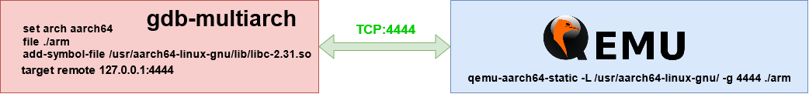
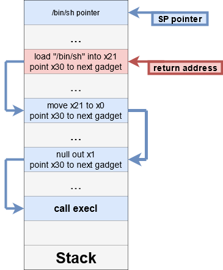

In this challenge we have an ELF binary that has been compiled for the aarch64 architecture. We do not need to reverse engineer the file because the source is already provided.

First of all, we execute `checksec` against the binary and we notice that the binary is only compiled with NX protection.

```
Checksec:

Arch:     aarch64-64-little
RELRO:    No RELRO
Stack:    No canary found
NX:       NX enabled
PIE:      No PIE (0x400000)
```

The `vulnerable` function calls `gets`, which introduces a buffer overflow vulnerability.

```c
#include <stdio.h>
#include <stdlib.h>
#include <unistd.h>

int vulnerable() {
	char buffer[128];

	printf("> ");
	fflush(stdout);

	gets(buffer);

	puts("Your Input: \n");
	puts(buffer);
	fflush(stdout);
}

int main(int argc, char** argv) {
	printf("print at %p\n", printf);
	vulnerable();

	return EXIT_SUCCESS;
}
```

All this program does is print the user's input. The program leaks `printf`'s address that we will use to bypass the ASLR protection.

```
$ qemu-aarch64-static -L /usr/aarch64-linux-gnu/ ./arm

print at 0x5500896080
> w00t
Your Input: 

w00t
```

If we input a long string we will exceed the expected buffer and we will cause a segfault, because we will overwrite the return address when the vulnerable function  returns. 

```
$ qemu-aarch64-static -L /usr/aarch64-linux-gnu/ ./arm

print at 0x5500896080
> AAAAAAAAAAAAAAAAAAAAAAAAAAAAAAAAAAAAAAAAAAAAAAAAAAAAAAAAAAAAAAAAAAAAAAAAAAAAAAAAAAAAAAAAAAAAAAAAAAAAAAAAaAAAAAAAAAAAAAAAAAAAAAAAAAAAAAAAAAAAAAAAAAAAAAAAAAAAAAAAAAAAAAAAAAAAAAAAAAAAAAAAAAAAAAAAAAAAAAAAAAAAAAAAAaAAAAAAAAAAAAAAAAAAAAAAAAAAAAAAAAAAAAAAAAAAAAAAAAAAAAAAAAAAAAAAAAAAAAAAAAAAAAAAAAAAAAAAAAAAAAAAAAAAAAAAAAaAAAAAAAAAAAAAAAAAAAAAAAAAAAAAAAAAAAAAAAAAAAAAAAAAAAAAAAAAAAAAAAAAAAAAAAAAAAAAAAAAAAAAAAAAAAAAAAAAAAAAAAAa
Your Input: 

AAAAAAAAAAAAAAAAAAAAAAAAAAAAAAAAAAAAAAAAAAAAAAAAAAAAAAAAAAAAAAAAAAAAAAAAAAAAAAAAAAAAAAAAAAAAAAAAAAAAAAAAaAAAAAAAAAAAAAAAAAAAAAAAAAAAAAAAAAAAAAAAAAAAAAAAAAAAAAAAAAAAAAAAAAAAAAAAAAAAAAAAAAAAAAAAAAAAAAAAAAAAAAAAAaAAAAAAAAAAAAAAAAAAAAAAAAAAAAAAAAAAAAAAAAAAAAAAAAAAAAAAAAAAAAAAAAAAAAAAAAAAAAAAAAAAAAAAAAAAAAAAAAAAAAAAAAaAAAAAAAAAAAAAAAAAAAAAAAAAAAAAAAAAAAAAAAAAAAAAAAAAAAAAAAAAAAAAAAAAAAAAAAAAAAAAAAAAAAAAAAAAAAAAAAAAAAAAAAAa
qemu: uncaught target signal 11 (Segmentation fault) - core dumped
```

We need to prepare the  debbuging enviroment to be able to interact with the binary. On one side we have the `qemu-aarch64-static`  emulator to be able to run it.  On the other side we have the `gdb-multiarch` debugger that connects to the emulator in order to debug the binary.



In aarch64 architecture the instruction pointer register is called `x30` and arguments are passed using first eight registers (`x0` to `x7`)

#### 1. Calculating offset
The first step is to calculate the offset at which our input buffer overwrites the return address. We use pwntools'  `cyclic` generator or a similar function to obtain it.  The number of bytes until we overwrite `x30` are 136.

#### 2. Leaking libc base address
We can use the `printf` leaked address to calculate the libc base address. This way we are able to locate the `execl` function address and the `/bin/sh` string during execution.

#### 3. Preparing the ropchain
Now we have all the addresses to perform a ret2libc. The `execl` function has to be called with two arguments. The first one is the pointer to a string indicating the path of the binary to execute, and the second one is the pointer to the arguments string.

In this case we want to execute the following:
```c
execl(ptr_to_binsh,NULL);
```

This is the high level diagram of the explotation:



Full exploit code it is available [here](https://gist.github.com/ikerl/c7e65052d3478ba1aae9bf546d31e71a "https://gist.github.com/ikerl/c7e65052d3478ba1aae9bf546d31e71a")

Running the previous exploit we receive a shell, which we use to get the flag:
**WPI{a1ARM3d\_arM315}**

