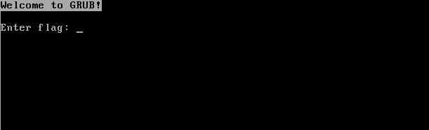

GRUB is a reversing challenge that got 20 solves. We are given a bootable GRUB file called `grub.iso`:
```
$ file grub.iso 
grub.iso: DOS/MBR boot sector; GRand Unified Bootloader, stage1 version 0x79, boot drive 0xbb, stage2 address 0x8e70, 1st sector stage2 0xb8db31c3, stage2 segment 0x201
```

If we try booting from it with virtualization software like VirtualBox we get the following screen:



If we input random text and press enter, the virtual machine will shut down. In order to understand what the correct input looks like, we need to reverse engineer the image.

## Extracting the GRUB script ##

If we use `strings` on the file and grep for any occurences of "flag" we find the following:

```
$ strings grub.iso | grep flag
echo -n "Enter flag: "
read flag
if ! regexp --set a "^p4\{([0-9A-Q]{54})\}\$" "$flag"; then halt; fi
...
```

This corresponds to the text we saw when booting the image. Clearly, there is some bash-like script checking our input. In order to cleanly dump the whole script we need to extract it from the image. We wrote [this quick Python script](https://gist.github.com/00xc/600d8514b931dd6b99242336dcf42ab3) to dump to disk every file identified by binwalk. Once that is done, we can grep the resulting files in order to find the full script, which turns out to be contained in the first extracted file:

```bash
echo -n "Enter flag: "
read flag

if ! regexp --set a "^p4\{([0-9A-Q]{54})\}\$" "$flag"; then halt; fi
while [ "$a" != "" ]; do
    if regexp --set a "^0(.*)\$" "$a"; then b="${b}aaa"; fi
    if regexp --set a "^1(.*)\$" "$a"; then b="${b}aab"; fi
    if regexp --set a "^2(.*)\$" "$a"; then b="${b}aac"; fi
    if regexp --set a "^3(.*)\$" "$a"; then b="${b}aba"; fi
    if regexp --set a "^4(.*)\$" "$a"; then b="${b}abb"; fi
    if regexp --set a "^5(.*)\$" "$a"; then b="${b}abc"; fi
    if regexp --set a "^6(.*)\$" "$a"; then b="${b}aca"; fi
    if regexp --set a "^7(.*)\$" "$a"; then b="${b}acb"; fi
    if regexp --set a "^8(.*)\$" "$a"; then b="${b}acc"; fi
    if regexp --set a "^9(.*)\$" "$a"; then b="${b}baa"; fi
    if regexp --set a "^A(.*)\$" "$a"; then b="${b}bab"; fi
    if regexp --set a "^B(.*)\$" "$a"; then b="${b}bac"; fi
    if regexp --set a "^C(.*)\$" "$a"; then b="${b}bba"; fi
    if regexp --set a "^D(.*)\$" "$a"; then b="${b}bbb"; fi
    if regexp --set a "^E(.*)\$" "$a"; then b="${b}bbc"; fi
    if regexp --set a "^F(.*)\$" "$a"; then b="${b}bca"; fi
    if regexp --set a "^G(.*)\$" "$a"; then b="${b}bcb"; fi
    if regexp --set a "^H(.*)\$" "$a"; then b="${b}bcc"; fi
    if regexp --set a "^I(.*)\$" "$a"; then b="${b}caa"; fi
    if regexp --set a "^J(.*)\$" "$a"; then b="${b}cab"; fi
    if regexp --set a "^K(.*)\$" "$a"; then b="${b}cac"; fi
    if regexp --set a "^L(.*)\$" "$a"; then b="${b}cba"; fi
    if regexp --set a "^M(.*)\$" "$a"; then b="${b}cbb"; fi
    if regexp --set a "^N(.*)\$" "$a"; then b="${b}cbc"; fi
    if regexp --set a "^O(.*)\$" "$a"; then b="${b}cca"; fi
    if regexp --set a "^P(.*)\$" "$a"; then b="${b}ccb"; fi
    if regexp --set a "^Q(.*)\$" "$a"; then b="${b}ccc"; fi
done

while [ "$b" != "" ]; do
    if regexp --set b "^aa(.*)\$" "$b"; then c="${c}R"; fi
    if regexp --set b "^ab(.*)\$" "$b"; then c="${c}S"; fi
    if regexp --set b "^ac(.*)\$" "$b"; then c="${c}T"; fi
    if regexp --set b "^ba(.*)\$" "$b"; then c="${c}U"; fi
    if regexp --set b "^bb(.*)\$" "$b"; then c="${c}V"; fi
    if regexp --set b "^bc(.*)\$" "$b"; then c="${c}W"; fi
    if regexp --set b "^ca(.*)\$" "$b"; then c="${c}X"; fi
    if regexp --set b "^cb(.*)\$" "$b"; then c="${c}Y"; fi
    if regexp --set b "^cc(.*)\$" "$b"; then c="${c}Z"; fi
done

function t {
    A=""
    B="$1"
    while [ "$B" != "" ]; do
        regexp --set 1:C --set 2:B "^([0-9]*),(.*)" "$B"
        regexp --set D "^.{$C}(.)" "$c"
        A="${A}${D}"
    done
    if ! regexp "^R?S?T?U?V?W?X?Y?Z?\$" "$A"; then halt; fi
}

function u {
    if ! regexp --set 1:R --set 2:S --set 3:T --set 4:U --set 5:V --set 6:W --set 7:X --set 8:Y --set 9:Z "$1" "$c"; then halt; fi
    A="$R$S$T$U$V$W$X$Y$Z"
    if ! regexp R $A; then halt; fi
    if ! regexp S $A; then halt; fi
    if ! regexp T $A; then halt; fi
    if ! regexp U $A; then halt; fi
    if ! regexp V $A; then halt; fi
    if ! regexp W $A; then halt; fi
    if ! regexp X $A; then halt; fi
    if ! regexp Y $A; then halt; fi
    if ! regexp Z $A; then halt; fi
}

t "27,18,9,0,1,2,11,10,"
t "59,50,41,32,40,48,"
t "51,50,49,48,"
t "6,7,8,17,26,"
t "54,64,74,66,76,"
t "79,80,70,"

u "^(.)(.)(.)(.)(.)(.)(.)(.)(.)"
u "^.{9}(.)(.)(.)(.)(.)(.)(.)(.)(.)"
u "^.{18}(.)(.)(.)(.)(.)(.)(.)(.)(.)"
u "^.{27}(.)(.)(.)(.)(.)(.)(.)(.)(.)"
u "^.{36}(.)(.)(.)(.)(.)(.)(.)(.)(.)"
u "^.{45}(.)(.)(.)(.)(.)(.)(.)(.)(.)"
u "^.{54}(.)(.)(.)(.)(.)(.)(.)(.)(.)"
u "^.{63}(.)(.)(.)(.)(.)(.)(.)(.)(.)"
u "^.{72}(.)(.)(.)(.)(.)(.)(.)(.)(.)"
u "^(.).{8}(.).{8}(.).{8}(.).{8}(.).{8}(.).{8}(.).{8}(.).{8}(.)"
u "^.{1}(.).{8}(.).{8}(.).{8}(.).{8}(.).{8}(.).{8}(.).{8}(.).{8}(.)"
u "^.{2}(.).{8}(.).{8}(.).{8}(.).{8}(.).{8}(.).{8}(.).{8}(.).{8}(.)"
u "^.{3}(.).{8}(.).{8}(.).{8}(.).{8}(.).{8}(.).{8}(.).{8}(.).{8}(.)"
u "^.{4}(.).{8}(.).{8}(.).{8}(.).{8}(.).{8}(.).{8}(.).{8}(.).{8}(.)"
u "^.{5}(.).{8}(.).{8}(.).{8}(.).{8}(.).{8}(.).{8}(.).{8}(.).{8}(.)"
u "^.{6}(.).{8}(.).{8}(.).{8}(.).{8}(.).{8}(.).{8}(.).{8}(.).{8}(.)"
u "^.{7}(.).{8}(.).{8}(.).{8}(.).{8}(.).{8}(.).{8}(.).{8}(.).{8}(.)"
u "^.{8}(.).{8}(.).{8}(.).{8}(.).{8}(.).{8}(.).{8}(.).{8}(.).{8}(.)"
u "^(.)(.)(.).{6}(.)(.)(.).{6}(.)(.)(.)"
u "^.{3}(.)(.)(.).{6}(.)(.)(.).{6}(.)(.)(.)"
u "^.{6}(.)(.)(.).{6}(.)(.)(.).{6}(.)(.)(.)"
u "^.{27}(.)(.)(.).{6}(.)(.)(.).{6}(.)(.)(.)"
u "^.{30}(.)(.)(.).{6}(.)(.)(.).{6}(.)(.)(.)"
u "^.{33}(.)(.)(.).{6}(.)(.)(.).{6}(.)(.)(.)"
u "^.{54}(.)(.)(.).{6}(.)(.)(.).{6}(.)(.)(.)"
u "^.{57}(.)(.)(.).{6}(.)(.)(.).{6}(.)(.)(.)"
u "^.{60}(.)(.)(.).{6}(.)(.)(.).{6}(.)(.)(.)"
u "^(.).{9}(.).{9}(.).{9}(.).{9}(.).{9}(.).{9}(.).{9}(.).{9}(.)"
u "^.{8}(.).{7}(.).{7}(.).{7}(.).{7}(.).{7}(.).{7}(.).{7}(.).{7}(.)"

echo
echo "That is correct."
sleep 30
```

The script is structured as follows:
* The first block of code makes sure the flag follows the specified format (`^p4\{([0-9A-Q]{54})\}$`) and transforms the input. Every character is translated to a 3-letter combination of the charactes "a", "b" and "c".
* The second block transforms every 2-letter group combination to one of the letters in `RSTUVWXYZ`.
For example the input "AB" would be first translated to "bab" + "bac",  and then, by grouping these letters in blocks of 2 ("ba", "bb", "ac"), into "UVT". The result of these two previous transformations is stored into the variable `c`.
* Next, two functions are defined, `t` and `u`.
	* `t` takes a list of numbers. It concatenates the characters in `c` at the offsets specified by the list of numbers, and verifies that they match the regular expression `^R?S?T?U?V?W?X?Y?Z?$`.
	* `u` takes a regular expression with 9 capture groups, which is applied to `c`. The results of each of these groups are concatenated into `A`; then, it is checked that `A` contains every letter in "RSTUVWXYZ" at least once.
* Finally, `t` and `u` are called several times in order to impose constraints on the input.

*NOTE: the script makes heavy use of the `regexp` command, which is not available in any regular shell, as it is specific to GRUB. The command's documentation can be found [here](https://www.gnu.org/software/grub/manual/grub/html_node/regexp.html), and its source code (at least in an old version) [here](https://github.com/lemenkov/grub2/blob/master/grub-core/commands/regexp.c). See the Annex at the end of this post for more on how to debug the use of this command.*

## Modeling the constraints ##

If an input passes all of the previous checks, it means that we have found the flag; whenever a regex match fails, `halt` is called, shutting down the machine. The intended solution, it seems, is to use a constraint problem solver. We could use z3, but we chose the [python-constraint](https://pypi.org/project/python-constraint/) module due to it being more familiar to us.

We need to model these constraints appropiately, as regular expressions usually do not mesh well with these solvers. In order to simplify the problem, we will search for such a string `c` that satisfies the constraints imposed by `t` and `u`, and then transform that string back by reversing the operations done in the first two blocks of code.

Note that, by the time we get to the first call to `t`, `c` is already limited to the characters in the set `RSTUVWXYZ`. Therefore, this will be our first constraint. We also know, by looking at the 4th line in the script, that the flag has exactly 54 characters. Each of these is expanded into groups of 3 characters, which then are shrinked back in groups of 2, which means that `c` will have (54 * 3) / 2 = **81** characters.

```python
all_chars = list("RSTUVWXYZ")
inp_len = 81
	
p = Problem()
p.addVariables(range(0, inp_len), all_chars)
```

The calls to `t` impose the next constraint. A string that matches the expression `^R?S?T?U?V?W?X?Y?Z?$` must contain only characters in the set `RSTUVWXYZ`, sorted in alphabetical order. Another way to express this is that the ASCII values of the characters in the string must be sorted in an ascending manner. As previously mentioned, the parameter passed to `t` indicates which characters in `c` must meet this criterion. As an example, the first call to `t` can be expressed in the following way:

```python
# t "27,18,9,0,1,2,11,10,"
p.addConstraint(lambda e: ord("R") <= ord(e), [27])
p.addConstraint(lambda *e: ord(e[0]) < ord(e[1]), [27, 18])
p.addConstraint(lambda *e: ord(e[0]) < ord(e[1]), [18, 9])
p.addConstraint(lambda *e: ord(e[0]) < ord(e[1]), [9, 0])
p.addConstraint(lambda *e: ord(e[0]) < ord(e[1]), [0, 1])
p.addConstraint(lambda *e: ord(e[0]) < ord(e[1]), [1, 2])
p.addConstraint(lambda *e: ord(e[0]) < ord(e[1]), [2, 11])
p.addConstraint(lambda *e: ord(e[0]) < ord(e[1]), [11, 10])
```

The calls to `u` impose the last constraint. The regular expressions here seem complicated at first glance, but they are simply used to select 9 characters in `c`. For example, `^(.)(.)(.)(.)(.)(.)(.)(.)(.)` matches the first 9 characters in `c`, `^(.).{8}(.).{8}(.).{8}(.).{8}(.).{8}(.).{8}(.).{8}(.).{8}(.)` matches the characters at indexes 0,  9, 18, 27, 36, 45, 54, 63 and 72, and so on. The 9-character string formed by concatenating the matched characters must contain at least one of the 9 characters in `RSTUVWXYZ`; in other words, no character can appear twice in that string. Fortunately, `python-constraint` provides an easy way to add this into our problem with `AllDifferentConstraint`:

```python
# u "^(.)(.)(.)(.)(.)(.)(.)(.)(.)"
p.addConstraint(AllDifferentConstraint(), range(0, 9))
# ...
# u ^(.).{8}(.).{8}(.).{8}(.).{8}(.).{8}(.).{8}(.).{8}(.).{8}(.)
p.addConstraint(AllDifferentConstraint(), [0,  9, 18, 27, 36, 45, 54, 63, 72])
```

With all of these constraints in place ([full script here](https://gist.github.com/00xc/a9eba349cdbcd737fb08ff2b988b6792)), we are ready to compute the flag. The script outputs the following string in around 6 seconds:
```
VWXZRYSTUUZYTSWXRVTRSVUXWZYSTWRZVYUXYVRSXUZWTXUZYWTRVSRYTWVSUXZWSUXTZVYRZXVUYRTSW
```

Once we reverse the translations in the first two blocks of code, it results in the flag:
```
p4{DOO73LBP6EI461D6HP3N2MM6M953PKJ8MK1A2BGAB8FCIQE9Q4B96E}
```

## Annex: debugging a GRUB script ##

Although by no means necessary to solve the challenge, it might be of interest to debug the original script. Since the `regexp` command is only available from a GRUB script, we need to create an image that can be booted as such.

The first thing we need to do is to get a functional GRUB installation. You can do this by downloading the appropiate packages for your distro, or by downloading and compiling GRUB by hand (not as tedious as it sounds). Once this is done, we should have the `grub-mkrescue` command available. We can then follow the instructions described [in this manual page](https://www.gnu.org/software/grub/manual/grub/html_node/Making-a-GRUB-bootable-CD_002dROM.html), and placing our script as the `grub.cfg` file described there. We can edit the script as we please in order to print the program variables, show which regular expressions match and fail, and so on.

```
$ mkdir -p iso/boot/grub
$ cp script.sh iso/boot/grub/grub.cfg
$ grub-mkrescue -o grub.iso iso
```

This generates a `grub.iso` file you can easily boot on a virtual machine.
