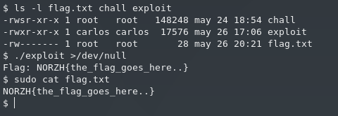

*NOTE: The following is a writeup for the solution we developed for this challenge after the end of the competition. Our thanks go to 0xShikoRuma for explaining the intended solution on Discord.*

S1de Ch4nnel is a challenge that got zero solves during NorzhCTF 2021. We are given a setuid ELF binary (`chall`), its source code (`main.c`) and a `flag.txt` file which we cannot read. The goal is to exploit `chall` in order to read `flag.txt`.

```
$ file chall 
chall: setuid ELF 64-bit LSB pie executable, x86-64, version 1 (SYSV), dynamically linked, interpreter /lib64/ld-linux-x86-64.so.2, for GNU/Linux 3.2.0, BuildID[sha1]=85df7f35b0cccb02d4339dae888ebe7a28dc95cd, not stripped
```

The source code reveals a short program. It takes digits of up to 4 characters, and accesses a global array (`the_array`) inside `victim_function` based on each input.

```c
#include <stdio.h>
#include <string.h>
#include <unistd.h>
#include <x86intrin.h>

#define PAGE_SIZE 512

#define FLAG_SIZE 28

#define DEBUG 0

const char the_array[] = { [0 ... 256 * PAGE_SIZE] = 1 };

const size_t baby_array_size = 16;

static char secret_value[64];

static char baby_array[] = {
    1, 2, 3, 4, 5, 6, 7, 8, 9, 10, 11, 12, 13, 14, 15, 16
};

int victim_function (size_t x) {
    int y = 0;
    if (x < 100) {
        y = the_array[baby_array[x] * PAGE_SIZE];
    }
    return y;
}

int main (void) {

    for (size_t i = 0; i < baby_array_size; i++) {
        baby_array[i] = i;
    }

    FILE *fp = fopen("./flag.txt", "r");
    if (fp == NULL) {
        perror("Error while opening the file.\n");
        exit(EXIT_FAILURE);
    }

    fgets(secret_value, FLAG_SIZE, fp);

    if (DEBUG){
        printf("Flag : %s\n", secret_value);
        printf("Baby_array to secret_value offset is %d\n", (size_t) (secret_value - baby_array));
    }

    char buffer[64];
    size_t x;
    int i;
    int nb_read;

    /* Make the access to the secret value faster*/
    __asm__ volatile("lea %0, %%rax\n"
                     "movb (%%rax), %%al\n" ::"m"(secret_value)
                     :);
    
    while (1) {
        memset (buffer, '\0', 64);
        printf ("Please give me an int : \n");

        i = 0;
        while (i < 4) {
            nb_read = read (STDIN_FILENO, &buffer[i], 1);
            if (nb_read == -1) {
                exit(1);
            }
            if (nb_read == 0) {
                return 0;
            }
            if (buffer[i] == '\n') {
                break;
            }
            i++;
        }
        x = (size_t) strtoul (buffer, NULL, 10);
        x = victim_function (x);
    }
    return 0;
}
```

The flag is read into another global array, `secret_value`. For each number we input, `x`, `the_array` will be accessed with offset `baby_array[x]`. However, there are no boundary checks when accessing this last array, other than the fact that `x` must be smaller than 100. If we input any number higher than 15 and smaller than 100 we will be accessing a different area of memory. In fact, if we inspect the binary file with any disassembler, we notice that `secret_value` is placed after `baby_array`, meaning that with a high enough value for `x`, we will access `secret_value`.

```
$ objdump -Mintel -s -D ./chall | fgrep -A20 baby
(snip...)
0000000000024070 <baby_array>:
   24070:       01 02                   add    DWORD PTR [rdx],eax
   24072:       03 04 05 06 07 08 09    add    eax,DWORD PTR [rax*1+0x9080706]
   24079:       0a 0b                   or     cl,BYTE PTR [rbx]
   2407b:       0c 0d                   or     al,0xd
   2407d:       0e                      (bad)  
   2407e:       0f                      .byte 0xf
   2407f:       10                      .byte 0x10

Disassembly of section .bss:

0000000000024080 <__bss_start>:
        ...

00000000000240a0 <secret_value>:
(snip...)
```

`baby_array` starts at address `0x24070` and `secret_value` starts at `0x240a0`, which means that they are placed 48 bytes apart. In other words, the following:

```c
the_array[baby_array[48] * PAGE_SIZE]
```

would overflow into:

```c
the_array[secret_value[0] * PAGE_SIZE]
```

At this point, we can deduce that we must exploit this lack of checks in order to access `the_array` with offsets equal to the values of the characters in the flag. For example, if the first character of the flag is `N`, ASCII value 78, we will access `the_array[78 * PAGE_SIZE]`.

When a certain offset of the array is accessed it is cached, and subsequent reads on it will be faster. If we are able to access `the_array[i * PAGE_SIZE]`, with i ranging from 0 to 255, and measure the time it takes to perform each read, we could detect which offset was accessed, and thus recovering the first character of the flag.

During the CTF we missed the key to perform this measurement, which are shared file-backed mappings. When the system loader reads a binary executable file, it parses its header in order to identify its sections. Then, it maps these regions into the new process' virtual memory, establishing a relationship between certain virtual memory addresses and the physical addresses of the file stored in the hard drive. These are usually mapped using Copy-on-Write, meaning that, unless the process writes to these virtual memory addresses, the contents of the physical memory are not actually copied into that process. This enables further optimization, such as page sharing. If two processes map the same physical location into their virtual space (and they do not perform any writes), they will end up sharing the mapped region, thus avoiding the need for a new mapping for each new process.

This enables for a cache timing attack called Flush + Reload. You can read more on the specifics of this attack [here](https://eprint.iacr.org/2013/448.pdf). The attack goes as follows:

1. A victim process launches and maps a file-backed memory region.
2. The attacker's proccess launches and maps that same region.
3. The attacker flushes the cache line corresponding to the memory area he or she wants to exfiltrate.
4. The victim reads from a certain offset in that memory region, and in doing so, the cache gets populated.
5. The attacker probes the mapped space. If a certain offset takes significantly less amount of time to read, it means that it was recently accessed by the victim.

Since `the_array` is hardcoded into the binary file, as it is a static and global array, we can mount this attack. Specifically, `the_array` starts at offset 0x2020 in the binary file:
```
$ objdump -s -D ./chall | fgrep the_array
(snip...)
0000000000002020 <the_array>:
(snip...)
```

Our exploit executes the steps mentioned above. The program forks and launches `chall`. Then, it maps the binary file and begins the character leak loop. For each iteration, a number is written to the forked process' stdin, and each offset in `the_array` is probed; this is done `NUM_ROUNDS` times (set to 10) for each character. Each time we probe the 255 offsets in the array, we record a hit for the offset which had the smallest read time. The offset with the largest amount of hits is considered to be the leaked character. You can find the full exploit [here](https://gist.github.com/00xc/b62e0fbe3c29e5a78782c622ed48568f).

Sadly, at the time of writing, the CTF insfrastructure is no longer up, so we cannot obtain the original flag. However, we can run the exploit locally:


