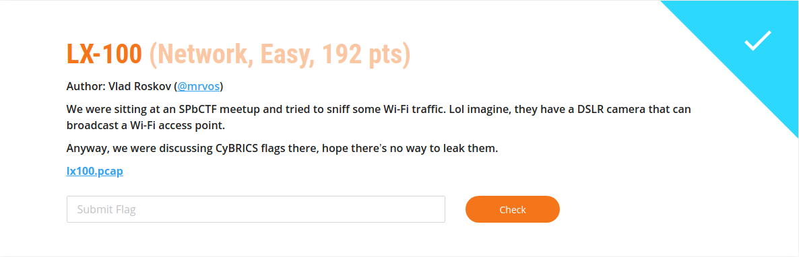
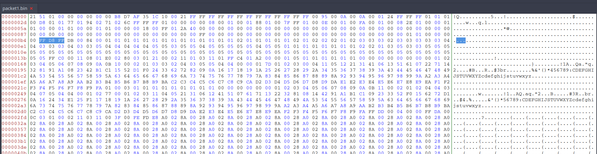
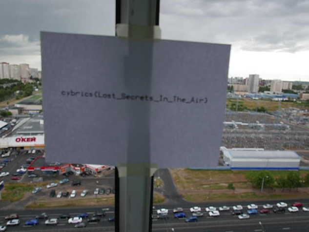

## LX100

LX100 was one of the NETWORK challenges in Cybrics 2021. It got 38 solves during the competition and was valued at 192 points.



The challenge consists of a network capture `lx100.pcap`

### Initial analysis

Inspecting the capture with wireshark it looks like traffic from a connection between a camera (LX100) and a device.

Upon further examination we confirm that indeed the capture consists of what seems like a control connection over HTTP and a data/media transfer over UDP.

Analyzing the HTTP connection we could only find XML files referencing settings and values from the camera.

Based on the amount of data transferred the UDP connection looked more interesting.

### UDP data inspection

With our focus on the UDP data, we extracted the first packet on the connection  and began analyzing it.

After the usual tests (`file, binwalk, etc`), we decided to inspect the data in a hex editor (`bless`) looking for common file headers.



As we can see in the image there are some bytes (which we assume to be metadata from the camera) and then what's seems to be a JPG image.

Removing the "camera metadata" left us with a valid JPG.

### Solve script

As there were over 400 UDP packets with individual JPG images we made a script for extracting the UDP data from the PCAP and removing the "camera metadata"

This left us with 455 JPGs that formed a video in which the flag was shown in a piece of paper:



`cybrics{Lost_Secrets_In_The_Air}`


solve script in python3:
```python
import pyshark

cap = pyshark.FileCapture('lx100.pcap')

count = 0  

for packet in cap:

if "UDP" in packet and int(packet['udp'].srcport) == 65415:

count = count + 1

udp_bytes = bytearray.fromhex(packet.data.data[packet.data.data.find('ffd8ffdb'):])

file_out = open('out_files/' + str(count) + '_packet.jpg', 'wb')

file_out.write(udp_bytes)
```
