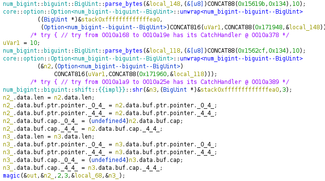

optimize me was a reversing challenge during RaRCTF 2021 that got 16 solves. We are given an ELF binary and the following sentence: `rust is fast, but not fast enough`.

```
$ file optimizeme
optimizeme: ELF 64-bit LSB shared object, x86-64, version 1 (SYSV), dynamically linked, interpreter /lib64/ld-linux-x86-64.so.2, BuildID[sha1]=7b13771cb4c35a775ffe152b0a6d35bef9cec9bd, for GNU/Linux 3.2.0, with debug_info, not stripped
```

Attempting to run the binary returns an error depending on the system, as it requires a specific glibc version:

```
$ ./optimizeme
./optimizeme: /lib/x86_64-linux-gnu/libm.so.6: version `GLIBC_2.29' not found (required by ./optimizeme)
```

We must download the [corresponding glibc tarball](https://ftp.gnu.org/gnu/libc/glibc-2.33.tar.xz), extract it and build it. Once this is done, we can run the binary by specifiying the path to `libm.so.6` with LD_PRELOAD.

```
$ LD_PRELOAD=/path_to_build/math/libm.so.6 ./optimizeme
```

Upon running the binary no output is given, but it does not exit either. Using strace or ltrace do not give any clues either, as the program enters what appears to be a computation-heavy loop. Going by the name of the challenge and the sentence at the beginning, we must optimize this computation to retrieve the flag.

In order to understand the problem, we turn to static analysis. The file includes debug symbols, but Ghidra has trouble with Rust's call convention.

Let us take the first call in the main function as an example. It is a call to [`num_bigint::biguint::BigUint::parse_bytes`](https://docs.rs/num-bigint/0.4.0/num_bigint/struct.BigUint.html#method.parse_bytes), which converts a byte string to a BigNum struct. The function takes two parameters: a byte string (of type `&[u8]`) and a radix (of type `u32`). If this were any regular C program, we would (according to the System V x64 call convention) expect to see a pointer to a byte string placed in the RDI register, the value for the radix in the RSI register, and then a CALL instruction. However, Rust does things a bit differently.

First, we need to understand that the type `&[u8]` in Rust is not simply a pointer to a byte string, but a struct that approximates to the following C statement:

```c
typedef struct {
	u8* data_ptr;
	usize length;
} &[u8];
```

Why is this important? Well, Rust does not pass a pointer to this struct in a single register, but rather it copies the entire object (16 bytes) into two registers (i.e., if this struct was the first parameter, it would copy `data_ptr` into RDI and `length` into RSI). This breaks Ghidra's known call conventions, as it assumes that any parameter bigger than the register size (8 bytes) is passed through the stack. Another point to take into account is that certain functions do not return a value through RAX, but rather copy the result into a callee-placed pointer in RDI.

We can manually edit the function signature to reflect these quirks, but it quickly becomes a tedious process. If we do not change the function signature, we get the following decompiled output:

```c
  num_bigint::biguint::BigUint::parse_bytes
            ((Option<num_bigint--biguint--BigUint> *)&stack0xfffffffffffffeb8,
             (&[u8])CONCAT88(in_stack_fffffffffffffe90,in_stack_fffffffffffffe88),0x15619b)
```

After modifying the function signature we get:

```c
num_bigint::biguint::BigUint::parse_bytes(&local_148,(&[u8])CONCAT88(0x15619b,0x134),10)
```

The output is not perfect, but it is much more readable. The input `&[u8]` struct is formed by the pointer `0x15619b` and the length `0x134`, while the radix is 10 and the output is placed into `local_148`. If we keep fixing the function calls eventually we get a semi-readable decompiled output.



At this point it is very clear that there is heavy usage of the [`num_bigint`](https://docs.rs/num-bigint/0.4.0/num_bigint/) Rust library, which allows for arithmetic with arbitrary size integers; this explains the heavy computation we suspected. The following is a simplified Rust translation of the decompiled main function:

```rust
fn main() {
	let n1 = num_bigint::biguint::BigUint::parse_bytes(g1, 10).unwrap();
	let mut n2 = num_bigint::biguint::BigUint::parse_bytes(g2, 10).unwrap();
	let n3 = n1 >> 3;

	magic(&mut n2, 2, 3, &n1, &n3);
}
```

Where `g1` and `g2` correspond to global `&[u8]` byte strings of length 0x134. The following is the simplified Rust equivalent for `magic`:

```rust
fn magic(state: &mut BigUint, a: u8, b: usize, p: &BigUint, rounds: &BigUint) {
	let mut i = num_bigint::ToBigUint::to_biguint(0);

	while i < rounds {
		state = state * a + b % p;
		i = i + 1;
	}
}
```

We are told that the final value of `state` converted to bytes is the flag. At this point, we are ready to solve the challenge. We know that `rounds` is a big number, so we must optimize the calculation. If we compute the value for `state` for each iteration, we get the following:

```
i = 0          (2 * state +  3) % p
i = 1          (4 * state +  9) % p
i = 2          (8 * state + 27) % p
...            (2^(i+1) * state + (2^(i+1) - 1) * 3) % p
i = rounds-1   (2^rounds * state + (2^rounds - 1) * 3) % p

               We simplify the expression with x = 2^rounds

               (x * state + x * 3 - 3) % p
               (x * (state + 3) - 3) % p
```

Now we can apply modular arithmetic properties:

```
               Apply: (A - B) % P = ((A % P) - (B % P)) % P
               (((x * (state + 3)) % p) - (3 % p)) % p

               3 % p simplifies to 3

               Apply: (A * B) % P = ((A % P) * (B % P)) % P
               (((x % p) * ((state + 3) % p)) % p - 3) % p
```

Within this final expression, all values are known except `x` (`2 ^ rounds`), which is astronomical. However, since it is computed modulo `p`, we can take advantage of [fast modular exponentiation](https://dev-notes.eu/2019/12/Fast-Modular-Exponentiation/). We can easily do this in Python, since its builtin `pow` function has a third parameter for modulo operations.

Finally, we obtain the flag with the following Python script:

```python
from Crypto.Util.number import long_to_bytes

def magic(state, a=2, b=3, p, rounds):
	# ((2^rounds)%p * (state+3)%p - 3) % p
	x = (pow(2, rounds, p) * ((state + 3) % p) - 3) % p
	print(long_to_bytes(x))

n1 = 0x452a631a5e6edd47b00482a6dcd6e210b1aa15557f0429eb5c131dfd92208768898045c6d54e6edd9f68c7c95720bc4aa2b8416d9317736b7cd35df1c0d4fd81df119d14311d1404db6c34bc96583bc2709b3b45460eab201c020b6300099ae00e5a6494984ac16a5f74c6b539fce59dd8528cf012b51a0b74971b676b3c070b
n2 = 0x1e252934d8a4d6c8c1803b2413671090cabf8603c50786303ffd635575df50db367089f5849b7450f3620e5eca7a8d31649e7e911166c94cba43d060aa5e8908e05be7244b9c0bf160bf2665f4e3de70c270b29e224ccd43db87c73f45085b800a5a57698ced219c79b873ff33223158a39ea086ec2c371a12f030079077f09b
n3 = n1 >> 3
magic(state=n2, p=n1, rounds=n3)
```

```
rarctf{wh4t_15-4-c4tg1rl5_f4v0ur1t3_RNG?4_l1ny4~c0ngru3nt14l-g3n3r4t0r!_f64a7b2066}
```