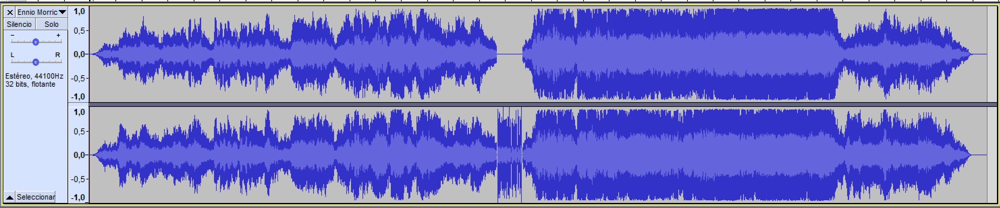
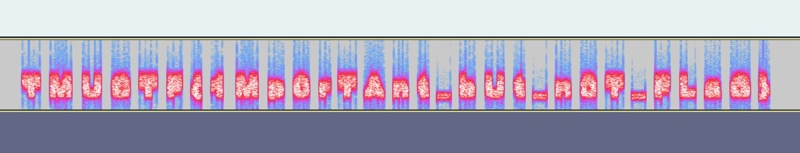

Symphony of Loss was one of the forensics challenges in TMU CTF 2021 that only got 3 solves.

The challenge description reads:
```
After monitoring our company's network, we found some suspicious traffic. 
It seems that some secret data was being transmitted through the network.
Can you inspect the dump of our network traffic and find the secret data?
```


We are given a pcap file (`traffic.pcapng`).


## PCAP Analysis

It is a very large trace with 29052 packets. After a quick analysys we were able to find the following interesting data:

```
Several HTTP GET requests to elizabethstreetpost.com :

GET/?s=pass+is+not_here
GET/?s=don't+look+any+further,+you+are+wasting+your+time
GET/?s=what+did+i+tell+you????
GET/?s=tmuctf
GET/?s=tmuctf{NOTSOEASYOK???}
```

A request to `http://169.254.248.88/oasjnrfou32r01230.zip` that downloads a zip file.

A request to `http://www.suzeorman.com/search/results?search=passwd+is+ZmHfPi8643012OrDn4n0`
 

We  extracted the `.zip` file from the pcap. Seeing it is password protected we tried to use the password found in the request to `suzeorman.com`   (`ZmHfPi8643012OrDn4n0`)

Yay! It works.

## ZIP/MP3 Analysis

The `.zip` contains a mp3 file named `Ennio Morricone - Tema D'amore.mp3`. 

Looking at the metadata (with `exiftools`) of the `mp3` we found there is a thumbnail image embeded in the exif data.

With foremost we were able to extract the album cover as a `jpg`.

```
$ foremost Ennio\ Morricone\ -\ Tema\ D\'amore.mp3 -v

Invocation: foremost Ennio Morricone - Tema D'amore.mp3 -v
Processing: Ennio Morricone - Tema D'amore.mp3

------------------------------------------------------------------
File: Ennio Morricone - Tema D'amore.mp3
Length: 6 MB (7048737 bytes)

Num      Name (bs=512)         Size      File Offset     Comment

0:      00000000.jpg         125 KB             204

1 FILES EXTRACTED

jpg:= 1
------------------------------------------------------------------
```


There doesn't seem to be anything useful in the `jpg` for now, so we moved on to analyze the `mp3` further.

Inspecting the mp3 file in Audacity we can clearly see there is something weird going on with one of the tracks:



Looking at the spectrogram of the weird part we are able to find what seems like a fake flag:



`TMUCTF{1Mp0rTAnt_bUt_n0T_FLaG}`

Looking for a place where this text could be useful, we thought of the extracted `jpg`.

The most common tool for hidding text inside `jpg` with a passphrase is `steghide` so we run the tool as follows:


```
$ steghide extract -sf cover.jpg
Enter passphrase: TMUCTF{1Mp0rTAnt_bUt_n0T_FLaG}
wrote extracted data to "flg.txt".


$ cat flg.txt
TMUCTF{7h3r3_4r3_50_M4ny_7h1n65_H1dd3n_D33p_1n51d3}
```

Giving us the final flag  :)

`TMUCTF{7h3r3_4r3_50_M4ny_7h1n65_H1dd3n_D33p_1n51d3}`
