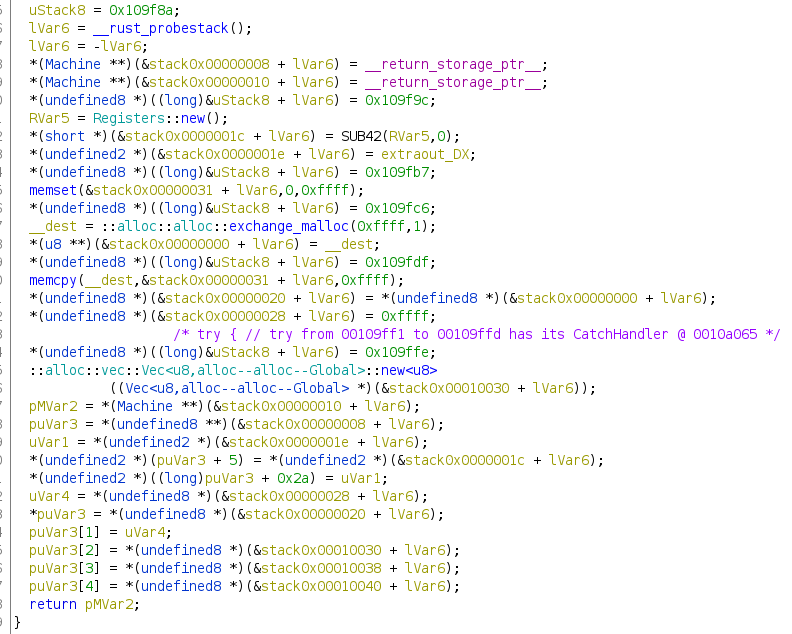
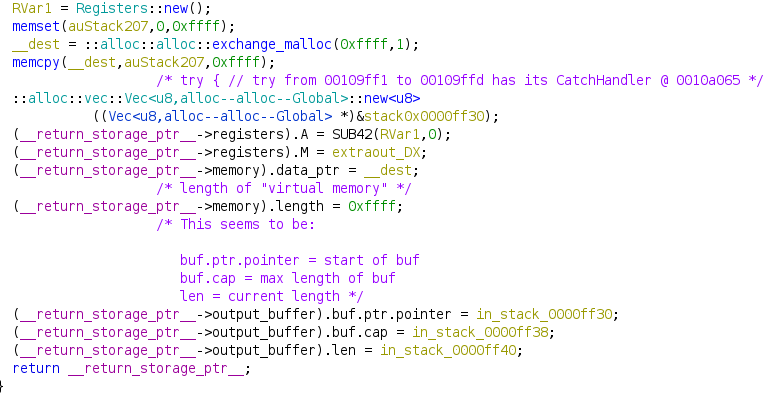
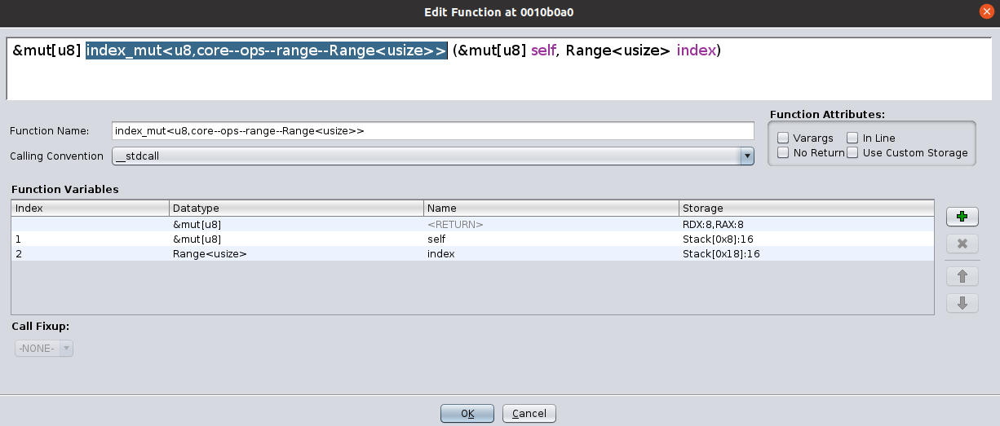
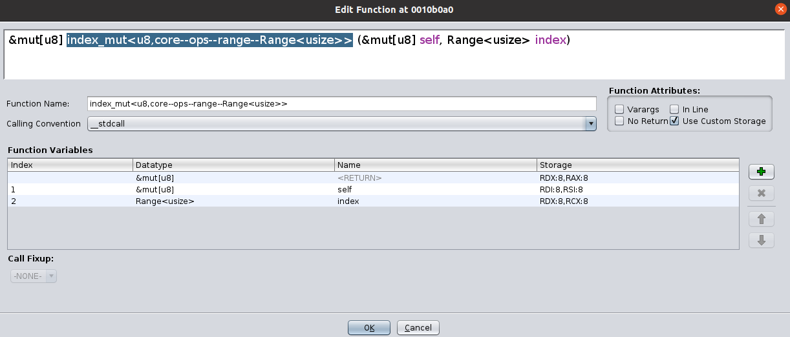

*NOTE: Original post at: [http://revpwn.com/Writeups/rev/SunshineCTF-UselessVM/](http://revpwn.com/Writeups/rev/SunshineCTF-UselessVM/).*

## Problem Description
```
I designed my own virtualized flag storage system a while back. Unfortunately, I think it may have gotten a bit... rusty.

Challenge contributed by Research Innovations, Inc (RII). Say hi to crandyman#5861 if you get a chance!

Note: ARM and Intel binaries available for convenient dynamic analysis. The hosted challenge is Intel, but the solution should be independent of architecture.
```
Useless VM was a reversing challenge during SunshineCTF that got 8 solves. I solved this along with my teammate [00xc](https://twitter.com/00xc1).

To start, we're provided with an option between either an ARM or Intel binary, but I prefer Intel so we'll stick with that.

```
rooted :: sunshine/uselessvm » file rust_vm_intel
rust_vm_intel: ELF 64-bit LSB shared object, x86-64, version 1 (SYSV), dynamically linked, interpreter /lib64/ld-linux-x86-64.so.2, for GNU/Linux 3.2.0, with debug_info, not stripped
```

Based on the name of the challenge and the name of the binary files it's safe to assume that we'll be reversing a VM that was implemented in Rust. Spoiler: turns out it's hard to reverse Rust when you barely know Rust.

Upon running the binary no output is given; however, after sending any input directly to the terminal we get the response `BadOpcode`. It may seem confusing, but even seeing this is good because it implies that there is a "GoodOpcode" of some sort. So thinking back to the type of problem we're doing it seems like a more well-defined goal is to figure out what the GoodOpcode's are and what they do. Obviously we can't know this without doing some reversing, so lets dive into ghidra.

## Tips for reversing Rust in Ghidra

Before we actually dive into reversing the problem itself I want to note some interesting things I learned about how to clean-up Rust decompilation in ghidra. There were significant improvements to how Rust gets decompiled in ghidra, but it's still lacking in a couple of the ways it handles Rust's calling conventions even with debug symbols.

The first was with the stack frame size being incorrect in the function . I found *a* solution to fix this [here](https://daniao.ws/inctf-20/jazz), but I will sum up the general idea. The Rust function `__rust_probestack`, which modifies rsp, was being called at the beginning of the function and ghidra was not able to detect the stack frame size. This then caused the decompilation to to be extremely messy as seen below



After replacing the `call __rust_probestack` with `sub esp, 0x100`, we get the following (much better) decompilation.



This small change has taken the code from basically unreadable to much more straighforward and helps us visualize this structure much easier.

It's worth noting that 00xc noticed that this same result occurs when inlining the function in Ghidra. I am unsure why this is though.

The second issue is with how Ghidra is misinterpreting Rust's calling convention. Lets look at a simple example in the `init_flag` function. Inside, there's function called `index_mut` that is called as follows:

```rust
self = core::slice::index::{{impl}}::index_mut<u8,core--ops--range--Range<usize>>
    ((&mut[u8])CONCAT88(in_stack_fffffffffffffeb0,in_stack_fffffffffffffea8),
     (Range<usize>)CONCAT88(in_stack_fffffffffffffec0,in_stack_fffffffffffffeb8));
```

In x64 C, according to the System V AMD64 ABI, the calling convention is to pass arguments to functions in the following order: `RDI, RSI, RDX, RCX, R8, R9, etc.`. In C, when arguments are bigger than the register size (8-bytes), the arguments will be passed on the stack. This is where Rust differs. Rather than passing >8 bytes arguments through the stack, it elects to continue using the registers and filling them with data in the same order as usual. As an example lets continue and take a look below at how the stack frame is structured when it's trying to pass the arguments via stack:



We just need to modify this in Ghidra's "Edit function signature" menu so that the arguments are passed via their specified registers.



After swapping the C calling convention with the Rust calling convention the function signature becomes the following:

```rust
self = core::slice::index::{{impl}}::index_mut<u8,core--ops--range--Range<usize>>
    ((&mut[u8])CONCAT88(puVar1,uVar2),(Range<usize>)CONCAT88(0xe080,local_38));
```

It's still messy, but it's at least an improvement as now we have local variables and can actually rename, change, and more easily verify the instructions operations.

## Reverse Reverse!

Okay, on to the actual reversing so we can attain a cool flag. Once again, for brevity, I will be skipping a lot of the minute details. It can be easy to get lost in the messy code, especially when reversing Rust. It's important to limit your scope when starting a reversing problem. Do a quick pass over of the program and try to get an idea of the general flow, in our case we could do that just based on some of the function names given in our main function.

First we call `new` and initialize a new portion of memory to act as our virtual machine's address space. We setup two registers (A and M), memory, and an output_buffer. Next, we call `init_flag`. We like flags around these parts, so this function was definitely of interest. However, the only real thing of interest here is that we see our flag is loaded in at address `0xe080` in our VM's memory. We then take some user input as bytes, convert that into an iterator, then start iterating. This tells us that we should be able to send our payload with all our opcodes in one line. Going down we run into what we will soon find out is the most interesting function `execute_instruction`.

`execute_instruction` will take the opcode we provide to determine where to jump in the switch statement to execute that specific instruction

..kind of..

The opcode we pass in is actually right-shifted by 5 (`val = opcode >> 5`), this means that if we want to jump into the first case in the switch statement we need to pass a value in the range 32-63. This is because for all values in that range `opcode >> 5 == 1`. The ranges for all 7 cases are:


|     opcode    |   range                       |
|---------------|-------------------------------|
|       1       |    32-64                      |
|       2       |    64-95                      |
|       3       |    96-127                     |
|       4       |    128-159                    |
|       5       |    160-191                    |
|       6       |    192-223                    |
|       7       |    222-255                    |
|    default    |    < 32 or > 255              |

We also have an operand that is generated based off of the number you choose for the opcode using `operand = opcode & 0x1f`. The reason they have this range is for instructions that allow you to variate the functionality. The only 2 instructions that use this operand are instructions 1 and 2. In other words, the highest 3 bits of the opcode select the instruction, while the lowest 5 select the operand.

After using the tricks to demangle the decompiled output above, most of the functions in the switch should be straight forward enough to at least mostly decompile. However, here is a list of the instructions, after reversing each case in the switch statement, converted to psuedo-assembly

```
    1: "INC A_LO"
    2: "INC A_HI"
    3: "BUF [M]"
    4: "PRINT"
    5: "MOV A, [M]"
    6: "MOV [M], A"
    7: "MOV M, A"
    8: "EXIT"
```

After having all of this information it is now time to construct our gameplan for how we can generate the proper opcodes to assemble what will yield us the flag.

## Game Plan

#### Step 1
Use the addition instructions that we have (1, 2) to add up the high and low byte of register A such that it equals the address of the flag that we saw earlier in `init_flag`, `0xe080`.

#### Step 2
Call the `MOV M,A` instruction (7) so that we can load M with the contents of A which is now `0xe080`

#### Step 3
Here we're going to call 3 functions in a row, then repeat. First, we call `BUF[M]` (3). All `BUF[M]` does is it appends the byte stored at memory[M] into `self->output_buffer`. Doing this loads the first byte of the flag into the buffer. Next,we need to increment A again by calling `INC A_LO` (1) and then write that result back to M with `MOV M,A`. Repeat this process for however the long the flag is (I didn't look I just put in like 0x40).

#### Step 4
Call the function that will print `self->output_buffer` (4) and obtain your flag!

The following hexdump contains the opcodes that were generated from the script to get the flag.
```
00000000: 3030 3030 3030 3030 5050 5050 5050 5050  00000000PPPPPPPP
00000010: 5050 5050 5050 e060 21e0 6021 e060 21e0  PPPPPP.`!.`!.`!.
00000020: 6021 e060 21e0 6021 e060 21e0 6021 e060  `!.`!.`!.`!.`!.`
00000030: 21e0 6021 e060 21e0 6021 e060 21e0 6021  !.`!.`!.`!.`!.`!
00000040: e060 21e0 6021 e060 21e0 6021 e060 21e0  .`!.`!.`!.`!.`!.
00000050: 6021 e060 21e0 6021 e060 21e0 6021 e060  `!.`!.`!.`!.`!.`
00000060: 21e0 6021 e060 21e0 6021 e060 21e0 6021  !.`!.`!.`!.`!.`!
00000070: e060 21e0 6021 e060 21e0 6021 e060 21e0  .`!.`!.`!.`!.`!.
00000080: 6021 e060 21e0 6021 e060 21e0 6021 80    `!.`!.`!.`!.`!.
```

flag: `sun{We_hire_RIIverse_engineers}`