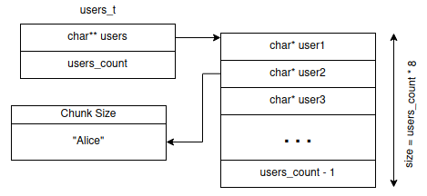
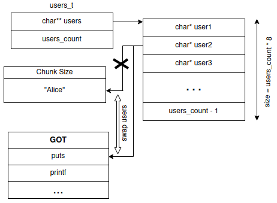
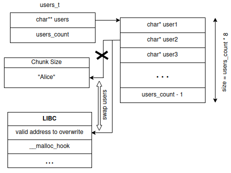

## Introduction
Sharp is the pwn challenge with the fewest solves in Hacktivitycon CTF 2021. We are given a 64-bit binary and a libc shared library. The program is a username manager programmed in C. It allows to create, delete, edit, list and swap usernames in a very simple way.

The description of the challenge is the following:

`I never really understood pointers. It seems like you just need to keep putting a * or & until it works.`

It is a joke about the use of pointers in C but it gives a hint about the structure of the given program.

Before reversing and analyzing the binary, it is important to check its memory protections. In this case it comes compiled with all protections except PIE. The base of the binary will not be randomized, so we will know the location of the different sections of the binary.

## The program

The program has the following functionalities:

1. Add: allocates a chunk of memory in the heap for the user's name and links it to the main user table.
2. Remove: deletes a user from the main user table and frees the memory associated with that user.
3. Edit: change the name of a user, but with a length limit, which will depend on the size of the original username. This size will be obtained from the chunk size header for the username in question.
4. Swap: allows the user to exchange the position in the user table of two different usernames.
5. List: prints all the users in the database.

The following diagram shows the username database structure:



Analyzing the source code we see a vulnerability in the swap functionality. In this function the user enters two user IDs and the pointers of those users in the list of users are swapped. The user ID input can be up to 24 bytes while the allocated buffer is 18. The pointer to user1 can be overwritten so we can control it.

```c
void swap_users(users_t *db)
{
    uint num_user1;
    uint num_user2;
    char input [16];
    char *user1;
  
    if (db->users_count < 2) {
        puts("Not enough users to swap.\n");
    }
    else {
        printf("Enter entry of user to swap: ");
        fgets(input,0x18,stdin);
        num_user1 = atoi(input);
        if (num_user1 < db->users_count) {
            user1 = db->users[num_user1];
            printf("Enter entry of user to swap with: ");
            fgets(input,0x18,stdin);
            num_user2 = atoi(input);
            if ((num_user2 < db->users_count) && (num_user1 != num_user2)) {
                db->users[num_user1] = db->users[num_user2];
                db->users[num_user2] = user1;
                puts("Swapped users.\n");
            }
            else {
                puts("Invalid entry.\n");
            }
        }
        else {
            puts("Invalid entry.\n");
        }
    }

    return;
}
```

By exploiting the buffer overflow we can point a user to any direction we want. We can use the `list` and `edit` commands to read and write wherever we want.

The steps we followed to achieve remote code execution are the following:

1. Read the address of one of the functions stored in the GOT to get libc's base address.
2. Calculate the address of the one_gadgets bypassing ASLR.
3. Overwrite `__malloc_hook` with the calculated address.
4. Trigger `__malloc_hook` calling the `add` command.

The following diagram shows how to leak the address of one of the GOT functions. First we will overwrite the pointer of one of the users to point to the GOT function, and read it with the `list` command.



We use the one_gadget tool to find possible gadgets to spawn a shell. We intend to overwrite `__malloc_hook` by overwriting a username pointer with its address, and calling the `edit` command to write at that address. However, `edit` limits the amount of writeable characters based on the chunk size, which is stored above the address at which we will write. Therefore, we need to find a location which has a valid chunk size above it.

Remember that our intention is to overwrite `__malloc_hook` and trigger it via the `add` command. However, `add` calls `realloc`, which will trigger `__realloc_hook` before `__malloc_hook`. We then need to null out `__realloc_hook` before overwriting `__malloc_hook`. Since `__realloc_hook` is located at a lower address than `__malloc_hook`, we just need to find a location before it that meets the chunk size criterion mentioned above.

```
libc_system + 0x196648  <--- chunk_size
libc_system + 0x196650  <--- start writing here
...
libc_system + 0x196750 __realloc_hook
libc_system + 0x196758 __malloc_hook
```



By following the above steps we will get shell and get the flag. The complete exploit can be found [here](https://gist.github.com/ikerl/2a4a4244993013752ff40569470ddab5).

`flag{3fa1eb611d994711964a9ee52b57b564}`
