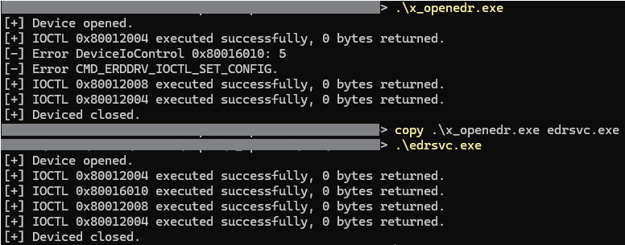
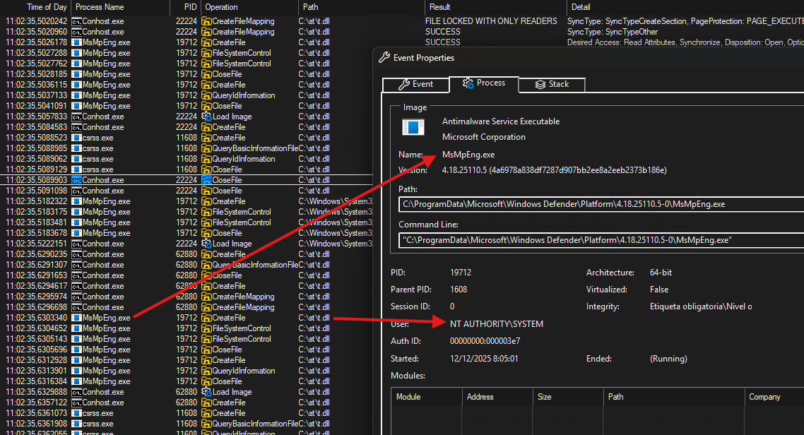

## Introduction

Last year, I spent some time experimenting with the open-source security tool OpenEDR, and during that process, I identified several poor security practices that could allow an attacker to misuse the EDR itself as if it were a rootkit.

OpenEDR implements many of the basic features commonly found in endpoint detection and response solutions:

- A kernel driver responsible for monitoring the file system, registry, and network activity.
- A user-mode injector that loads a monitoring DLL into selected processes to intercept dangerous calls to the Windows API. (This is the functionality I abused last year and the one I exploited to achieve an LPE.)
- Various anti-tampering mechanisms.

This year, I decided to delve deeper into this tool, performing a thorough analysis of the code and looking for vulnerabilities that could allow a local user to escalate privileges on any system that had this EDR installed. Fortunately, I was able to identify multiple critical vulnerabilities that allowed me to build a complete privilege escalation exploit.

In this post, I will explain the entire process, from the initial analysis of the application to the creation of a functional proof of concept that allows privilege escalation on any system that has this EDR installed.

## Abusing IOCTLs: Bypassing the Trusted Process Check by Renaming the Executable

One of the main components of OpenEDR is its kernel driver. This module is responsible for intercepting the kernel callbacks necessary to monitor interactions with the network, the registry, and the file system. It also manages the injection of the monitoring DLL into newly created processes.

To allow the service to communicate with the driver, OpenEDR implements an IOCTL interface. Since our goal is to abuse the driver to escalate privileges, this interface becomes one of the most critical points to review.

The following code snippet shows the function responsible for handling IOCTL requests received by the driver:

```c
// openedr/edrav2/iprj/edrdrv/src/ioctl.cpp
NTSTATUS processRequest(DeviceInputOutput &inOut, ULONG IoControl)
{
	switch (IoControl)
	{
		case CMD_ERDDRV_IOCTL_START:
		{
			IFERR_RET(startMonitoring());
			return STATUS_SUCCESS;
		}
		case CMD_ERDDRV_IOCTL_STOP:
		{
			stopMonitoring(true);
			return STATUS_SUCCESS;
		}
		case CMD_ERDDRV_IOCTL_SET_CONFIG:
		{
			if (!procmon::isCurProcessTrusted())
				return LOGERROR(STATUS_ACCESS_DENIED, "Can't access from process: %Iu.\r\n",
				(ULONG_PTR)PsGetCurrentProcessId());

			LOGINFO2("Update config.\r\n");
			bool fChanged = false;
			IFERR_RET(loadMainConfigFromBuffer(inOut.m_pInput, inOut.m_nInputSize, fChanged));
			if(fChanged)
				IFERR_LOG(saveMainConfigToRegistry());
			return STATUS_SUCCESS;
		}
		case CMD_ERDDRV_IOCTL_UPDATE_FILE_RULES:
		{
			if (!procmon::isCurProcessTrusted())
				return LOGERROR(STATUS_ACCESS_DENIED, "Can't access from process: %Iu.\r\n",
				(ULONG_PTR)PsGetCurrentProcessId());

			IFERR_RET(filemon::updateFileRules(inOut.m_pInput, inOut.m_nInputSize));
			return STATUS_SUCCESS;
		}
		case CMD_ERDDRV_IOCTL_UPDATE_REG_RULES:
		{
			if (!procmon::isCurProcessTrusted())
				return LOGERROR(STATUS_ACCESS_DENIED, "Can't access from process: %Iu.\r\n",
				(ULONG_PTR)PsGetCurrentProcessId());

			IFERR_RET(regmon::updateRegRules(inOut.m_pInput, inOut.m_nInputSize));
			return STATUS_SUCCESS;
		}
		case CMD_ERDDRV_IOCTL_UPDATE_PROCESS_RULES:
		{
			if (!procmon::isCurProcessTrusted())
				return LOGERROR(STATUS_ACCESS_DENIED, "Can't access from process: %Iu.\r\n",
				(ULONG_PTR)PsGetCurrentProcessId());

			IFERR_RET(procmon::updateProcessRules(inOut.m_pInput, inOut.m_nInputSize));
			IFERR_RET(procmon::reapplyRulesForAllProcesses());
			return STATUS_SUCCESS;
		}
		case CMD_ERDDRV_IOCTL_SET_PROCESS_INFO:
		{
			if (!procmon::isCurProcessTrusted())
				return LOGERROR(STATUS_ACCESS_DENIED, "Can't access from process: %Iu.\r\n",
				(ULONG_PTR)PsGetCurrentProcessId());

			// Create deserializer
			variant::BasicLbvsDeserializer<SetProcessInfoField> deserializer;
			if (!deserializer.reset(inOut.m_pInput, inOut.m_nInputSize))
				return LOGERROR(STATUS_DATA_ERROR, "Invalid data format.\r\n");

			IFERR_RET(procmon::setProcessInfo(deserializer));
			return STATUS_SUCCESS;
		}
	}
	return STATUS_NOT_SUPPORTED;
}
```

The most relevant findings observed here are:

The start and stop of the monitoring engine are not validated in any way. Any user or process can start or stop OpenEDR monitoring regardless of their privilege level.

Processes classified as trusted can modify the EDR configuration, change detection rules, and apply additional metadata to existing processes.

Delving deeper into the `isCurProcessTrusted()` function, which is used to determine whether the process interacting with the controller is considered trusted, we finally arrive at the following function:

```c
// edrv2/iprj/edrdrv/src/procmon.h

inline bool isCurProcessTrusted()
{
    if (g_pCommonData->fDisableSelfProtection)
        return true;

    ContextPtr pProcessCtx;
    (void)fillCurProcContext(pProcessCtx);
    return isProcessTrusted(pProcessCtx);
}


inline bool isProcessTrusted(Context* pProcessCtx)
{
    if (g_pCommonData->fDisableSelfProtection)
        return true;
    if (pProcessCtx == nullptr)
        return false;
    if (pProcessCtx->fIsTrusted)
        return true;
    return false;
}

// edrav2/iprj/edrdrv/src/procutils.cpp

static SpecialProcFlags g_specialProcFlags[] =
{
    { U_STAT(L"\\system32\\csrss.exe"), (UINT32)ProcessInfoFlags::CsrssProcess },
    { U_STAT(L"\\edrsvc.exe"), (UINT32)ProcessInfoFlags::ThisProductProcess },
    { U_STAT(L"\\edrcon.exe"), (UINT32)ProcessInfoFlags::ThisProductProcess },
};

```

As shown in the truncated code, a process must meet one of the following conditions to be classified as trusted and able to access privileged IOCTL functionality:

- Run as a `System` process.
- Use an executable whose full path contains `\System32\csrss.exe`, `\edrsvc.exe`, or `\edrcon.exe`.
- Have the self-protection feature disabled (it is enabled by default).

By simply renaming a malicious executable to one of the allowed names, we can fully interact with all the features of the OpenEDR controller.



## Interacting with the Driver to Modify the Configuration 

One of the most interesting IOCTL functions is `CMD_ERDDRV_IOCTL_SET_CONFIG`. This function allows you to modify the internal configuration of the controller at runtime. In the following code snippet, you can see the list of parameters that can be edited:

```c
enum class ConfigField : variant::lbvs::FieldId
{
    DisableSelfProtection = 0, //< bool
    MaxQueueSize = 1, //< int
    ConnectionTimeot = 2, //< int
    SendMsgTimeout = 3, //< int
    EnableDllInject = 4, //< bool
    LogLevel = 5, //< int
    LogFile = 6, //< str
    //WhiteList = 7, //< seq with str
    EventFlags = 8, //< int
    SentRegTypes = 9, //< int
    MaxRegValueSize = 10, //< int
    MinFullActFileSize = 11, //< int
    MaxFullActFileSize = 12, //< int
    FileMonNameMask = 13, //< str
    InjectedDll = 14, //< seq with str
    VerifyInjectedDll = 15, //< bool
    OpenProcessRepeatTimeout = 16, //< int
    RegEventRepeatTimeout = 17, //< int
};
```

Thanks to the bypass achieved in the previous section, we can now interact with this IOCTL from any process or user without privileges.

To modify the different configuration parameters, we need to send a buffer structured as follows:

```
+-------------------------------+
|            HEADER             |
+-------------------------------+

+-------------------------------+
| nMagic        | 4 bytes       |
| (Signature)                   |
+-------------------------------+

+-------------------------------+
| nVersion      | 1 byte        |
+-------------------------------+

+-------------------------------+
| nSize         | 4 bytes       |
| (Total struct size)           |
+-------------------------------+

+-------------------------------+
| nCount        | 1 byte        |
| (# of params)                 |
+-------------------------------+


+-------------------------------+
|         PARAMETERS[]          |
+-------------------------------+

     +----------------------------------------+
     | Param #1                               |
     +----------------------------------------+
     | VarID          | 2 bytes               |
     +----------------------------------------+
     | VarType        | 1 byte                |
     +----------------------------------------+
     | Payload        | variable size         |
     +----------------------------------------+

     +----------------------------------------+
     | Param #2                               |
     +----------------------------------------+
     | VarID          | 2 bytes               |
     +----------------------------------------+
     | VarType        | 1 byte                |
     +----------------------------------------+
     | Payload        | variable size         |
     +----------------------------------------+

              ...

```

The magic number to use is `SVBL`, and below is a list of the available data types:

```c
enum class FieldType : uint8_t
{
    Invalid = (uint8_t)-1,
    Null = 0,
    String = 1,
    WString = 2,
    Stream = 3,
    Bool = 4,
    Uint32 = 5,
    Uint64 = 6,
    SeqDict = 7,
    SeqSeq = 8
};
```

## Modifying the Injected DLL Path for LPE

The most interesting parameter is `InjectedDll,` which allows you to modify the DLL used by the driver injector to load it into the processes being monitored. If we manage to redirect this configuration to a DLL located in a path controlled by non-privileged users, the EDR will start injecting this dynamic library into the new processes that are created and, as soon as it is injected into a privileged process, it will result in a privilege escalation vector.

Unfortunately, modifying the DLL path is not easy due to several checks performed by the “addSystemDll” function during the configuration of new injection DLLs:

```c
NTSTATUS Injector::addSystemDll(const UNICODE_STRING& DllPath)
{
	UNICODE_STRING parentComponent = { 0 }, finalComponent = { 0 };
	IFERR_RET(tools::getObjectNamePathParentComponent(&DllPath, &parentComponent, &finalComponent), "Invalid Dll path <%wZ>\r\n", (PCUNICODE_STRING)&DllPath);

	DynUnicodeString fullDllPath;
	IFERR_RET(fullDllPath.assign(&DllPath), "Insufficient resources for Dll <%wZ>\r\n", (PCUNICODE_STRING)&DllPath);
	IFERR_RET(m_DllPathList.pushBack(std::move(fullDllPath)), "Insufficient resources for Dll <%wZ>\r\n", (PCUNICODE_STRING)&DllPath);

	if (tools::isNameInExpression(RTL_CONSTANT_STRING(L"*\\WINDOWS\\SYSTEM32"), parentComponent))
	{
#if defined (_WIN64)
		return this->addDll64(finalComponent);
#else
		return this->addDll32(finalComponent);
#endif
	}
#if defined (_WIN64)
	else if (tools::isNameInExpression(RTL_CONSTANT_STRING(L"*\\WINDOWS\\SYSWOW64"), parentComponent))
	{
		return this->addDll32(finalComponent);
	}
#endif
	return STATUS_OBJECT_NAME_INVALID;
}
```

The path must match one of the following regular expressions: `*\WINDOWS\SYSTEM32` or `*\WINDOWS\SYSWOW64`. Depending on which one it matches, the DLL will be used for 64-bit or 32-bit processes, respectively.

After experimenting with multiple bypass techniques, the following path was created. It satisfies the function's validation checks while allowing the DLL to reside in a directory that unprivileged users can write to:

- `c:\windows\system3\../../st/st.dll` -> `c:\st\st.dll`

Note that `path traversal` and `slash substitution` techniques have been applied to achieve filter evasion.

Once the path of the injected DLL has been modified, an attacker could create the referenced directory and place their controlled DLL there. When the OpenEDR driver begins monitoring a process, it loads that DLL, allowing the code to run in the context of the monitored (and potentially privileged) process. This behavior demonstrates how an incorrect configuration could enable persistence or even a privilege escalation scenario.

In the following screenshot, we can see that the driver has loaded our malicious DLL into a privileged process (in this case, the Windows Defender process):



# Conclusions

In the first post, `EDR as a rootkit,` I demonstrated that loading a DLL file without validating its integrity was a poor security practice. By combining this with newly identified vulnerabilities, it has been possible to build a complete exploit chain that allows privilege escalation on any system where OpenEDR is installed.

These are the aspects that should be patched by the manufacturer:

- Correctly limit the processes that can interact, via IOCTL, with the privileged functionalities of the driver.
- Fix the deficient checks during the configuration and use of injection DLLs.
- Implement integrity checks during DLL loading (reported in the previous post).

The complete exploit is available in the following repository:


[https://gist.github.com/ikerl/c3ec81f12ded44c2e0ae2dfdacb562ba](https://gist.github.com/ikerl/c3ec81f12ded44c2e0ae2dfdacb562ba)

